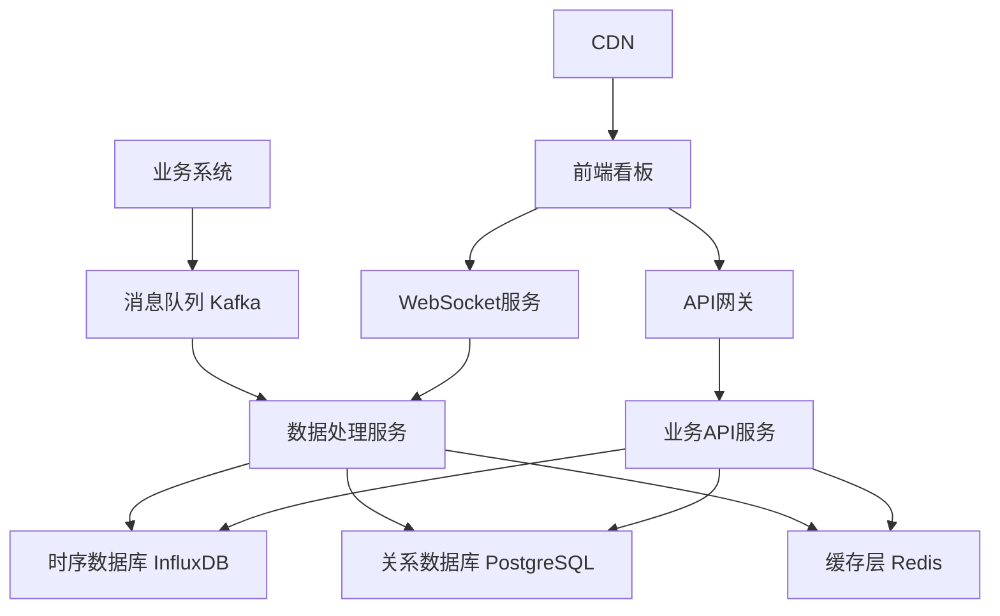

# 拼好拼业务数据看板设计文档

## 概述

本设计文档基于需求文档，为拼好拼业务数据看板提供详细的技术架构、组件设计和实现方案。看板将采用现代化的Web技术栈，提供实时、交互式的数据可视化体验。

## 技术架构

### 前端架构
- **核心技术**: HTML5 + CSS3 + Vanilla JavaScript (ES6+)
- **图表库**: Apache ECharts 5.x (丰富的图表类型和地图支持)
- **样式方案**: 原生CSS + CSS变量 + CSS Grid/Flexbox
- **模块化**: ES6 Modules + 组件化设计模式
- **构建工具**: 无需构建工具，直接运行 (或可选Vite用于开发服务器)

### 后端架构
- **API设计**: RESTful API + WebSocket (实时数据推送)
- **数据聚合**: 预计算关键指标，缓存热点数据
- **数据库**: 时序数据库(InfluxDB) + 关系数据库(PostgreSQL)
- **缓存策略**: Redis 多层缓存

### 实时数据流
```
业务系统 → 消息队列(Kafka) → 数据处理服务 → WebSocket → 前端看板
```

## 系统架构图



## 组件架构

### 页面布局结构
```
Dashboard Layout
├── Header (顶部导航栏)
│   ├── Logo
│   ├── 时间筛选器
│   ├── 刷新控制
│   └── 用户信息
├── Sidebar (左侧筛选面板)
│   ├── 地域筛选
│   ├── 角色筛选
│   ├── 轮次筛选
│   └── 高级筛选
├── Main Content (主内容区)
│   ├── KPI Overview (KPI概览区)
│   ├── Map Visualization (地图可视化区)
│   ├── Charts Section (图表分析区)
│   └── Data Tables (数据表格区)
└── Footer (底部状态栏)
```

### 核心组件设计

#### 1. KPI Overview Component
```typescript
interface KPIOverviewProps {
  data: {
    totalRevenue: number;
    activeStores: number;
    activeUsers: number;
    currentRound: number;
    dividendPool: number;
    nextDividendProgress: number;
  };
  loading: boolean;
  timeRange: TimeRange;
}
```

**功能特性:**
- 实时数据更新 (30秒刷新)
- 数据变化动画效果
- 同比环比显示
- 异常数据预警

#### 2. Interactive Map Component
```typescript
interface InteractiveMapProps {
  level: 'country' | 'province' | 'city' | 'district';
  data: RegionData[];
  onRegionClick: (region: RegionData) => void;
  selectedRegion?: string;
}
```

**功能特性:**
- 多级地图钻取 (全国→省→市→区县)
- 热力图展示业务密度
- 地区数据对比
- 自定义图例和颜色映射

#### 3. Real-time Chart Component
```typescript
interface RealTimeChartProps {
  chartType: 'line' | 'bar' | 'pie' | 'scatter';
  data: ChartData;
  config: ChartConfig;
  realTimeUpdate: boolean;
}
```

**功能特性:**
- 多种图表类型支持
- 实时数据流更新
- 交互式数据钻取
- 图表联动效果

#### 4. Data Filter Panel
```typescript
interface FilterPanelProps {
  filters: {
    timeRange: TimeRange;
    regions: string[];
    roles: UserRole[];
    rounds: number[];
  };
  onFilterChange: (filters: FilterState) => void;
}
```

**功能特性:**
- 多维度筛选组合
- 筛选条件持久化
- 快速筛选预设
- 筛选结果统计

## 数据模型设计

### 核心数据结构

#### 业务概览数据
```typescript
interface BusinessOverview {
  totalRevenue: number;           // 总交易金额
  platformRevenue: number;       // 平台抽成
  activeStores: number;          // 活跃商户数
  newStores: number;             // 新增商户数
  activeUsers: number;           // 活跃用户数
  newUsers: number;              // 新增用户数
  averageOrderValue: number;     // 平均客单价
  timestamp: string;             // 数据时间戳
}
```

#### 分红数据结构
```typescript
interface DividendData {
  currentRound: number;          // 当前轮次
  poolBalance: number;           // 分红池余额
  nextDividendProgress: number;  // 下次分红进度 (0-100)
  estimatedNextTime: string;     // 预计下次分红时间
  totalDistributed: number;      // 累计分红金额
  roleDistribution: {            // 各角色分红分配
    partners: number;            // 合伙人分红
    business: number;            // 商务分红
    stores: number;              // 商户分红
    users: number;               // 用户分红
  };
}
```

#### 地域数据结构
```typescript
interface RegionData {
  code: string;                  // 地区编码
  name: string;                  // 地区名称
  level: 'province' | 'city' | 'district';
  parentCode?: string;           // 父级地区编码
  revenue: number;               // 该地区收入
  storeCount: number;            // 商户数量
  userCount: number;             // 用户数量
  partnerCount: number;          // 合伙人数量
  coordinates: [number, number]; // 地理坐标
}
```

#### 角色数据结构
```typescript
interface PartnerData {
  id: string;
  name: string;
  level: '5GP' | '4GP' | '3GP' | '2GP' | 'LP';
  region: RegionData;
  revenue: number;
  dividendAmount: number;
  storeCount: number;
  businessCount: number;
}

interface BusinessData {
  id: string;
  name: string;
  partnerId: string;
  parentBusinessId?: string;     // 上级商务ID
  level: number;                 // 商务层级
  storeCount: number;            // 发展商户数
  revenue: number;               // 总收益
  directDividend: number;        // 直接分红
  indirectDividend: number;      // 间接分红
}
```

## 界面设计规范

### 设计原则
1. **数据优先**: 突出关键业务指标，减少视觉干扰
2. **层次清晰**: 通过颜色、大小、位置建立信息层级
3. **交互友好**: 提供直观的操作反馈和引导
4. **响应迅速**: 优化加载性能，提供流畅体验

### 色彩系统
```css
:root {
  /* 主色调 - 商务蓝 */
  --primary-color: #1890ff;
  --primary-light: #40a9ff;
  --primary-dark: #096dd9;
  
  /* 功能色彩 */
  --success-color: #52c41a;    /* 正向指标 */
  --warning-color: #faad14;    /* 预警状态 */
  --error-color: #ff4d4f;      /* 异常数据 */
  
  /* 中性色彩 */
  --text-primary: #262626;     /* 主要文字 */
  --text-secondary: #8c8c8c;   /* 次要文字 */
  --border-color: #f0f0f0;     /* 边框颜色 */
  --background: #fafafa;       /* 背景色 */
}
```

### 字体规范
```css
/* 数字字体 - 等宽字体便于对齐 */
.number-display {
  font-family: 'SF Mono', 'Monaco', 'Consolas', monospace;
  font-variant-numeric: tabular-nums;
}

/* 标题字体 */
.title {
  font-family: -apple-system, BlinkMacSystemFont, 'Segoe UI', sans-serif;
  font-weight: 600;
}
```

### 组件尺寸规范
- **KPI卡片**: 最小宽度 240px，高度 120px
- **图表容器**: 最小高度 300px，支持响应式调整
- **地图容器**: 最小尺寸 800x600px
- **数据表格**: 行高 48px，支持虚拟滚动

## 性能优化策略

### 前端优化
1. **代码分割**: 按路由和功能模块进行代码分割
2. **懒加载**: 图表组件和大数据表格懒加载
3. **虚拟化**: 大列表使用虚拟滚动
4. **缓存策略**: 静态资源CDN缓存，API数据内存缓存
5. **防抖节流**: 筛选操作防抖，滚动事件节流

### 数据优化
1. **预聚合**: 预计算常用指标，减少实时计算
2. **分页加载**: 大数据集分页或无限滚动加载
3. **增量更新**: WebSocket推送增量数据而非全量数据
4. **数据压缩**: 启用gzip压缩减少传输大小

### 渲染优化
```typescript
// 使用React.memo优化组件重渲染
const KPICard = React.memo(({ data, loading }: KPICardProps) => {
  return (
    <Card loading={loading}>
      <Statistic
        title="总收入"
        value={data.revenue}
        precision={2}
        valueStyle={{ color: '#3f8600' }}
        prefix={<ArrowUpOutlined />}
        suffix="元"
      />
    </Card>
  );
});

// 使用useMemo缓存计算结果
const chartData = useMemo(() => {
  return processChartData(rawData, filters);
}, [rawData, filters]);
```

## 错误处理策略

### 网络错误处理
1. **自动重试**: API请求失败自动重试3次
2. **降级显示**: 网络异常时显示缓存数据
3. **错误提示**: 友好的错误信息提示
4. **离线检测**: 检测网络状态，离线时提示用户

### 数据异常处理
1. **数据校验**: 前端数据格式校验
2. **异常标记**: 异常数据特殊标记显示
3. **容错机制**: 部分数据异常不影响整体展示
4. **日志记录**: 记录异常情况便于排查

## 测试策略

### 单元测试
- 组件渲染测试
- 数据处理函数测试
- 工具函数测试
- 覆盖率目标: 80%+

### 集成测试
- API接口集成测试
- WebSocket连接测试
- 数据流端到端测试

### 性能测试
- 页面加载性能测试
- 大数据量渲染性能测试
- 内存泄漏检测

### 兼容性测试
- 主流浏览器兼容性 (Chrome, Firefox, Safari, Edge)
- 不同分辨率适配测试
- 网络环境测试 (3G, 4G, WiFi)

## 部署和监控

### 部署策略
1. **容器化部署**: Docker + Kubernetes
2. **CDN加速**: 静态资源CDN分发
3. **负载均衡**: 多实例负载均衡
4. **灰度发布**: 新功能灰度发布验证

### 监控指标
1. **性能监控**: 页面加载时间、API响应时间
2. **错误监控**: JavaScript错误、API错误率
3. **用户行为**: 页面访问量、功能使用率
4. **业务监控**: 数据更新延迟、异常数据告警

这个设计文档涵盖了技术架构、组件设计、数据模型、界面规范、性能优化等各个方面，为开发团队提供了详细的实现指导。