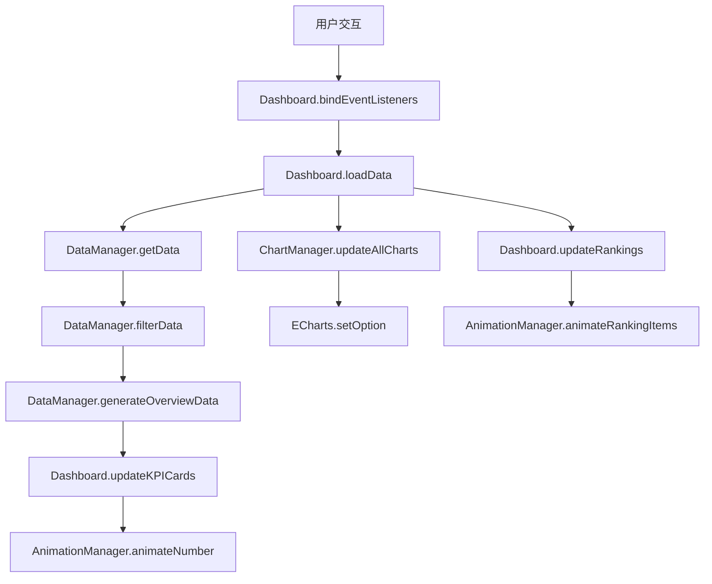

# JavaScript逻辑深度分析

## 文件概览

### JavaScript模块结构
- **main.js** (555行) - 主应用程序入口和控制器
- **charts.js** (648行) - 图表管理和ECharts集成
- **data.js** (587行) - 数据管理和模拟数据生成
- **animations.js** (489行) - 动画管理和视觉效果

## 架构设计分析

### 1. 模块化架构

#### ES6模块系统
```javascript
// main.js - 主入口
import { DataManager } from './data.js';
import { ChartManager } from './charts.js';
import { AnimationManager } from './animations.js';
```

#### 类设计模式
- **Dashboard类** - 主控制器，协调各个管理器
- **DataManager类** - 数据层，处理数据获取和缓存
- **ChartManager类** - 视图层，管理ECharts图表
- **AnimationManager类** - 表现层，处理动画效果

### 2. 依赖注入模式

#### 管理器实例化
```javascript
class Dashboard {
    constructor() {
        this.dataManager = new DataManager();
        this.chartManager = new ChartManager();
        this.animationManager = new AnimationManager();
    }
}
```

## 主应用程序分析 (main.js)

### 1. Dashboard类核心功能

#### 初始化流程
```javascript
async init() {
    // 1. 显示加载状态
    this.showLoading();
    
    // 2. 初始化数据管理器
    await this.dataManager.init();
    
    // 3. 初始化图表管理器
    this.chartManager.init();
    
    // 4. 初始化动画管理器
    this.animationManager.init();
    
    // 5. 绑定事件监听器
    this.bindEventListeners();
    
    // 6. 加载初始数据
    await this.loadData();
    
    // 7. 启动实时更新
    this.startRealTimeUpdate();
    
    // 8. 启动动画
    this.animationManager.startPageAnimations();
    
    // 9. 隐藏加载状态
    this.hideLoading();
}
```

#### 状态管理
```javascript
this.currentFilters = {
    timeRange: 'month',      // 时间范围筛选
    province: '',            // 省份筛选
    city: '',               // 城市筛选
    district: '',           // 区县筛选
    roles: ['partners', 'business', 'stores', 'users'], // 角色筛选
    round: 25               // 分红轮次
};
```

### 2. 事件处理系统

#### 筛选器事件绑定
```javascript
bindEventListeners() {
    // 时间范围筛选
    const timeRangeSelect = document.getElementById('timeRange');
    timeRangeSelect?.addEventListener('change', (e) => {
        this.currentFilters.timeRange = e.target.value;
        this.loadData();
    });

    // 地域筛选级联
    provinceSelect?.addEventListener('change', (e) => {
        this.currentFilters.province = e.target.value;
        this.currentFilters.city = '';
        this.currentFilters.district = '';
        this.updateCityOptions();
        this.loadData();
    });
}
```

#### 键盘快捷键支持
```javascript
document.addEventListener('keydown', (e) => {
    if (e.ctrlKey || e.metaKey) {
        switch (e.key) {
            case 'r':
                e.preventDefault();
                this.refreshData();
                break;
            case 'f':
                e.preventDefault();
                const filterPanel = document.querySelector('.filter-panel');
                filterPanel?.classList.toggle('collapsed');
                break;
        }
    }
});
```

### 3. 数据更新机制

#### KPI卡片更新
```javascript
updateKPICards(overview) {
    const kpiCards = document.querySelectorAll('.kpi-card');
    
    kpiCards.forEach(card => {
        const kpiType = card.dataset.kpi;
        const numberElement = card.querySelector('.number');
        
        if (numberElement && overview[kpiType]) {
            const targetValue = overview[kpiType].value;
            
            // 直接设置数字
            if (typeof targetValue === 'number') {
                numberElement.textContent = targetValue.toLocaleString();
            }
            
            // 添加更新动画
            card.classList.add('data-updated');
            setTimeout(() => card.classList.remove('data-updated'), 600);
        }
    });
}
```

#### 实时更新系统
```javascript
startRealTimeUpdate() {
    // 每30秒自动刷新数据
    this.refreshInterval = setInterval(() => {
        this.loadData();
    }, 30000);
}
```

## 图表管理分析 (charts.js)

### 1. ChartManager类设计

#### 图表实例管理
```javascript
class ChartManager {
    constructor() {
        this.charts = new Map();           // 图表实例存储
        this.theme = this.createDarkTheme(); // 暗色主题配置
    }
}
```

#### 暗色主题系统
```javascript
createDarkTheme() {
    return {
        backgroundColor: 'transparent',
        textStyle: { color: '#ffffff' },
        categoryAxis: {
            axisLine: { lineStyle: { color: 'rgba(255, 255, 255, 0.2)' } },
            axisLabel: { color: '#b8c5d6' },
            splitLine: { lineStyle: { color: 'rgba(255, 255, 255, 0.05)' } }
        },
        // ... 更多主题配置
    };
}
```

### 2. 图表类型实现

#### 中国地图可视化
```javascript
initChinaMap() {
    // 1. 获取地图JSON数据
    fetch('https://geo.datav.aliyun.com/areas_v3/bound/100000_full.json')
        .then(response => response.json())
        .then(geoJson => {
            echarts.registerMap('china', geoJson);
            
            const option = {
                visualMap: {
                    min: 0,
                    max: 1000000,
                    inRange: {
                        color: ['#0a1929', '#1565c0', /* ... 更多颜色 */]
                    }
                },
                geo: {
                    map: 'china',
                    roam: true,
                    scaleLimit: { min: 1, max: 3 }
                }
            };
        })
        .catch(error => {
            // 备用简化地图
            this.initSimpleMap(chart);
        });
}
```

#### 收入趋势图表
```javascript
initRevenueChart() {
    const option = {
        tooltip: {
            trigger: 'axis',
            formatter: function(params) {
                // 自定义tooltip格式化
                let result = `<div style="padding: 8px;">`;
                params.forEach(param => {
                    const value = param.seriesName === '收入' ? 
                        `¥${(param.value / 10000).toFixed(2)}万` : 
                        `${param.value}笔`;
                    result += `<div>${param.seriesName}: ${value}</div>`;
                });
                return result + `</div>`;
            }
        },
        series: [{
            type: 'line',
            smooth: true,
            lineStyle: {
                color: new echarts.graphic.LinearGradient(0, 0, 1, 0, [
                    { offset: 0, color: '#667eea' },
                    { offset: 1, color: '#764ba2' }
                ])
            },
            areaStyle: {
                color: new echarts.graphic.LinearGradient(0, 0, 0, 1, [
                    { offset: 0, color: 'rgba(102, 126, 234, 0.3)' },
                    { offset: 1, color: 'rgba(118, 75, 162, 0.1)' }
                ])
            }
        }]
    };
}
```

### 3. 动态数据更新

#### 时间周期数据生成
```javascript
generateMockRevenueData(period) {
    let dataPoints = [];
    const now = new Date();
    
    switch (period) {
        case 'week':
            // 生成7天数据
            for (let i = 6; i >= 0; i--) {
                const date = new Date(now);
                date.setDate(date.getDate() - i);
                dataPoints.push({
                    date: `${date.getMonth() + 1}月${date.getDate()}日`,
                    revenue: Math.floor(Math.random() * 200000) + 100000
                });
            }
            break;
        // ... 其他周期处理
    }
}
```

#### 响应式图表处理
```javascript
handleResize() {
    this.charts.forEach(chart => {
        chart.resize();
    });
}

// 全局窗口resize监听
window.addEventListener('resize', () => {
    if (window.dashboard && window.dashboard.chartManager) {
        window.dashboard.chartManager.handleResize();
    }
});
```

## 数据管理分析 (data.js)

### 1. DataManager类架构

#### 数据结构设计
```javascript
constructor() {
    this.mockData = {
        regions: [],      // 地区数据
        partners: [],     // 合伙人数据
        business: [],     // 商务数据
        stores: [],       // 商户数据
        users: [],        // 用户数据
        transactions: []  // 交易数据
    };
    
    this.cache = new Map();                    // 数据缓存
    this.cacheTimeout = 5 * 60 * 1000;        // 5分钟缓存
}
```

#### 缓存机制
```javascript
async getData(filters) {
    const cacheKey = JSON.stringify(filters);
    
    // 检查缓存
    if (this.cache.has(cacheKey)) {
        const cached = this.cache.get(cacheKey);
        if (Date.now() - cached.timestamp < this.cacheTimeout) {
            return cached.data;
        }
    }
    
    // 生成新数据并缓存
    const result = this.generateData(filters);
    this.cache.set(cacheKey, {
        data: result,
        timestamp: Date.now()
    });
    
    return result;
}
```

### 2. 模拟数据生成系统

#### 层级数据生成
```javascript
generatePartnerData() {
    const levels = ['5GP', '4GP', '3GP', '2GP', 'LP'];
    const provinces = this.mockData.regions.provinces;
    
    provinces.forEach(province => {
        levels.forEach(level => {
            const count = level === '5GP' ? 1 : 
                         level === '4GP' ? 2 : 
                         level === '3GP' ? 3 : 
                         level === '2GP' ? 5 : 8;
            
            for (let i = 0; i < count; i++) {
                this.mockData.partners.push({
                    id: `${province.code}_${level}_${i}`,
                    name: `${province.name}${level}合伙人${i + 1}`,
                    level,
                    region: province.code,
                    revenue: this.randomBetween(50000, 500000),
                    // ... 更多属性
                });
            }
        });
    });
}
```

#### 关联数据生成
```javascript
generateBusinessData() {
    const partners = this.mockData.partners;
    
    partners.forEach(partner => {
        const businessCount = partner.businessCount;
        
        for (let i = 0; i < businessCount; i++) {
            const business = {
                id: `${partner.id}_business_${i}`,
                partnerId: partner.id,
                region: partner.region,
                // ... 业务属性
            };
            
            // 生成下级商务（递归结构）
            if (business.level < 3 && Math.random() > 0.7) {
                // 创建子级商务
            }
            
            this.mockData.business.push(business);
        }
    });
}
```

### 3. 数据筛选和聚合

#### 多维度筛选
```javascript
filterData(filters) {
    let filteredStores = [...this.mockData.stores];
    let filteredUsers = [...this.mockData.users];
    let filteredTransactions = [...this.mockData.transactions];
    
    // 地域筛选
    if (filters.province) {
        filteredStores = filteredStores.filter(store => 
            store.region === filters.province);
    }
    
    // 时间筛选
    const startDate = this.getStartDate(filters.timeRange);
    filteredTransactions = filteredTransactions.filter(tx => 
        tx.timestamp >= startDate);
    
    return { stores: filteredStores, users: filteredUsers, transactions: filteredTransactions };
}
```

#### 数据聚合计算
```javascript
generateOverviewData(data) {
    const totalRevenue = data.transactions.reduce((sum, tx) => sum + tx.amount, 0);
    const platformRevenue = data.transactions.reduce((sum, tx) => sum + tx.platformAmount, 0);
    const activeStores = data.stores.filter(store => store.status === 'active').length;
    
    return {
        revenue: { value: totalRevenue || 12580000, trend: '+15.8%' },
        stores: { value: activeStores || 8642, trend: '+8.3%' },
        users: { value: activeUsers || 156789, trend: '+23.7%' },
        dividend: { value: (platformRevenue * 0.8) || 2516000, trend: '+12.5%' }
    };
}
```

## 动画管理分析 (animations.js)

### 1. AnimationManager类设计

#### 动画队列管理
```javascript
class AnimationManager {
    constructor() {
        this.animationQueue = [];      // 动画队列
        this.isAnimating = false;      // 动画状态
        this.observers = new Map();    // 观察器集合
    }
}
```

#### 交叉观察器实现
```javascript
setupIntersectionObserver() {
    const observer = new IntersectionObserver((entries) => {
        entries.forEach(entry => {
            if (entry.isIntersecting) {
                const element = entry.target;
                const animationType = element.dataset.animation;
                
                if (animationType) {
                    this.triggerAnimation(element, animationType);
                    observer.unobserve(element); // 只触发一次
                }
            }
        });
    }, {
        threshold: 0.1,
        rootMargin: '50px'
    });
}
```

### 2. 数字动画系统

#### 缓动函数实现
```javascript
animateNumber(element, start, end, duration = 2000, easing = 'easeOutCubic') {
    const easingFunctions = {
        linear: t => t,
        easeInQuad: t => t * t,
        easeOutQuad: t => t * (2 - t),
        easeInOutQuad: t => t < 0.5 ? 2 * t * t : -1 + (4 - 2 * t) * t,
        easeOutCubic: t => (--t) * t * t + 1,
        easeInOutCubic: t => t < 0.5 ? 4 * t * t * t : (t - 1) * (2 * t - 2) * (2 * t - 2) + 1
    };

    const animate = (currentTime) => {
        const elapsed = currentTime - startTime;
        const progress = Math.min(elapsed / duration, 1);
        const easedProgress = easingFunction(progress);
        
        const currentValue = Math.floor(start + difference * easedProgress);
        element.textContent = this.formatNumber(currentValue);
        
        if (progress < 1) {
            requestAnimationFrame(animate);
        }
    };
}
```

#### 数字格式化
```javascript
formatNumber(num) {
    if (num >= 10000) {
        return (num / 10000).toFixed(1) + 'w';
    }
    return num.toLocaleString();
}
```

### 3. 进度动画系统

#### 线性进度条
```javascript
animateProgress(element, targetPercent, duration = 1500) {
    const progressFill = element.querySelector('.progress-fill');
    
    progressFill.style.transition = `width ${duration}ms ease-out`;
    progressFill.style.width = `${targetPercent}%`;
    
    // 添加光晕效果
    progressFill.classList.add('glow');
    setTimeout(() => progressFill.classList.remove('glow'), duration);
}
```

#### 圆形进度条
```javascript
animateCircularProgress(element, targetPercent, duration = 2000) {
    const circle = element.querySelector('.progress-ring-progress');
    const radius = circle.r.baseVal.value;
    const circumference = 2 * Math.PI * radius;
    
    const animate = (currentTime) => {
        const progress = Math.min(elapsed / duration, 1);
        const currentPercent = targetPercent * this.easeOutCubic(progress);
        const offset = circumference - (currentPercent / 100) * circumference;
        
        circle.style.strokeDashoffset = offset;
        text.textContent = `${Math.floor(currentPercent)}%`;
    };
}
```

### 4. 交互动画效果

#### 波纹效果
```javascript
addRippleEffect(button, event) {
    const ripple = document.createElement('span');
    const rect = button.getBoundingClientRect();
    const size = Math.max(rect.width, rect.height);
    const x = event.clientX - rect.left - size / 2;
    const y = event.clientY - rect.top - size / 2;
    
    ripple.style.width = ripple.style.height = size + 'px';
    ripple.style.left = x + 'px';
    ripple.style.top = y + 'px';
    ripple.classList.add('ripple');
    
    button.appendChild(ripple);
    setTimeout(() => ripple.remove(), 600);
}
```

#### 通知动画
```javascript
showNotification(message, type = 'info', duration = 3000) {
    const notification = document.createElement('div');
    notification.className = `notification ${type}`;
    
    // 设置样式和动画
    Object.assign(notification.style, {
        position: 'fixed',
        top: '20px',
        right: '20px',
        transform: 'translateX(100%)',
        transition: 'transform 0.3s ease-out',
        background: this.getNotificationColor(type)
    });
    
    // 入场动画
    setTimeout(() => {
        notification.style.transform = 'translateX(0)';
    }, 10);
}
```

## 技术特性分析

### 1. 异步编程模式

#### Promise链式调用
```javascript
async init() {
    try {
        await this.dataManager.init();
        this.chartManager.init();
        await this.loadData();
    } catch (error) {
        console.error('初始化失败:', error);
        this.showFallbackData();
    }
}
```

#### 错误处理机制
```javascript
try {
    const data = await this.dataManager.getData(this.currentFilters);
    this.updateKPICards(data.overview);
} catch (error) {
    console.error('数据加载失败:', error);
    this.showError('数据加载失败，请稍后重试');
}
```

### 2. 性能优化策略

#### 数据缓存系统
```javascript
// 5分钟缓存机制
this.cacheTimeout = 5 * 60 * 1000;

// 缓存键生成
const cacheKey = JSON.stringify(filters);
```

#### 防抖和节流
```javascript
// 实时更新间隔控制
this.refreshInterval = setInterval(() => {
    this.loadData();
}, 30000); // 30秒间隔
```

#### 内存管理
```javascript
destroy() {
    // 清理定时器
    this.stopRealTimeUpdate();
    
    // 清理图表实例
    this.chartManager.destroy();
    
    // 清理观察器
    this.observers.forEach(observer => observer.disconnect());
}
```

### 3. 事件系统设计

#### 事件委托模式
```javascript
// 地图控制按钮事件委托
const mapControls = document.querySelectorAll('[data-map-type]');
mapControls.forEach(btn => {
    btn.addEventListener('click', (e) => {
        const mapType = e.target.dataset.mapType;
        this.chartManager.updateMapData(mapType);
    });
});
```

#### 自定义事件
```javascript
// 数据更新事件
card.classList.add('data-updated');
setTimeout(() => card.classList.remove('data-updated'), 600);
```

## 数据流分析

### 1. 数据流向



### 2. 状态管理

#### 全局状态
```javascript
// Dashboard类中的状态
this.currentFilters = { /* 筛选状态 */ };
this.refreshInterval = null; // 定时器状态

// ChartManager类中的状态
this.charts = new Map(); // 图表实例状态

// DataManager类中的状态
this.cache = new Map(); // 缓存状态
```

#### 状态同步
```javascript
// 筛选器变更触发数据更新
provinceSelect?.addEventListener('change', (e) => {
    this.currentFilters.province = e.target.value;
    this.currentFilters.city = '';
    this.currentFilters.district = '';
    this.updateCityOptions(); // 级联更新
    this.loadData(); // 数据重新加载
});
```

## 第三方库集成

### 1. ECharts集成

#### 图表主题定制
```javascript
createDarkTheme() {
    return {
        backgroundColor: 'transparent',
        textStyle: { color: '#ffffff' },
        // 完整的暗色主题配置
    };
}
```

#### 图表响应式处理
```javascript
window.addEventListener('resize', () => {
    if (window.dashboard && window.dashboard.chartManager) {
        window.dashboard.chartManager.handleResize();
    }
});
```

### 2. Web APIs使用

#### Intersection Observer API
```javascript
const observer = new IntersectionObserver((entries) => {
    // 元素进入视口时触发动画
}, { threshold: 0.1, rootMargin: '50px' });
```

#### RequestAnimationFrame API
```javascript
const animate = (currentTime) => {
    // 高性能动画实现
    if (progress < 1) {
        requestAnimationFrame(animate);
    }
};
```

## 错误处理和容错机制

### 1. 网络请求容错
```javascript
fetch('https://geo.datav.aliyun.com/areas_v3/bound/100000_full.json')
    .then(response => response.json())
    .then(geoJson => {
        // 正常处理
    })
    .catch(error => {
        console.error('地图数据加载失败:', error);
        // 使用备用简化地图
        this.initSimpleMap(chart);
    });
```

### 2. 数据验证和默认值
```javascript
generateOverviewData(data) {
    const totalRevenue = data.transactions.reduce((sum, tx) => sum + tx.amount, 0);
    
    return {
        revenue: { 
            value: totalRevenue || 12580000, // 提供默认值
            trend: '+15.8%' 
        }
    };
}
```

### 3. 备用数据显示
```javascript
showFallbackData() {
    // 直接设置KPI数据
    const kpiData = [
        { selector: '[data-kpi="revenue"] .number', value: '1,258.0w' },
        { selector: '[data-kpi="stores"] .number', value: '8,642' },
        // ... 更多备用数据
    ];
    
    kpiData.forEach(item => {
        const element = document.querySelector(item.selector);
        if (element) {
            element.textContent = item.value;
        }
    });
}
```

## 迁移关键点

### 1. 状态管理重构
- **当前**: 类实例属性存储状态
- **React**: 使用useState、useReducer或状态管理库
- **建议**: 使用Zustand或Redux Toolkit

### 2. 事件处理转换
- **当前**: DOM事件监听器
- **React**: JSX事件处理器和useEffect
- **建议**: 自定义hooks封装复杂事件逻辑

### 3. 动画系统迁移
- **当前**: 原生JavaScript动画
- **React**: Framer Motion或React Transition Group
- **建议**: 保持现有缓动函数，使用React动画库实现

### 4. 数据获取模式
- **当前**: 类方法和Promise链
- **React**: React Query或SWR
- **建议**: 使用React Query处理缓存和错误状态

### 5. 图表集成方式
- **当前**: 直接操作ECharts实例
- **React**: 使用echarts-for-react包装
- **建议**: 创建自定义Chart组件，封装ECharts逻辑

### 6. 模块化重构
- **当前**: ES6类和模块
- **React**: 函数组件和自定义hooks
- **建议**: 
  - DataManager → useData hook
  - ChartManager → useChart hook  
  - AnimationManager → useAnimation hook

### 7. 生命周期管理
- **当前**: 手动初始化和清理
- **React**: useEffect处理副作用
- **建议**: 使用useEffect的清理函数替代destroy方法