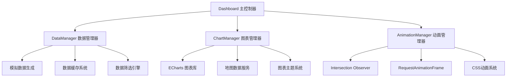

# 技术规格文档

## 项目概述

### 系统名称
拼好拼业务数据看板系统

### 系统版本
HTML版本 v1.0 (当前分析版本)

### 技术架构
- **前端框架**: 原生HTML5 + CSS3 + ES6 JavaScript
- **图表库**: ECharts 5.4.3
- **图标库**: FontAwesome 6.4.0
- **模块系统**: ES6 Modules
- **样式架构**: CSS变量 + 组件化样式

## 系统架构规格

### 1. 整体架构设计

#### 分层架构
```
┌─────────────────────────────────────┐
│           表现层 (Presentation)      │
│  ┌─────────────┬─────────────────┐   │
│  │   HTML      │    CSS          │   │
│  │   结构层     │    样式层        │   │
│  └─────────────┴─────────────────┘   │
├─────────────────────────────────────┤
│           业务逻辑层 (Business)       │
│  ┌─────────────┬─────────────────┐   │
│  │ Dashboard   │ AnimationManager│   │
│  │ 主控制器     │ 动画管理器       │   │
│  └─────────────┴─────────────────┘   │
├─────────────────────────────────────┤
│           数据层 (Data)              │
│  ┌─────────────┬─────────────────┐   │
│  │ DataManager │ ChartManager    │   │
│  │ 数据管理器   │ 图表管理器       │   │
│  └─────────────┴─────────────────┘   │
└─────────────────────────────────────┘
```

#### 模块依赖关系


### 2. 核心类设计规格

#### Dashboard类 (主控制器)
```typescript
interface DashboardConfig {
    currentFilters: FilterState;
    refreshInterval: number | null;
    dataManager: DataManager;
    chartManager: ChartManager;
    animationManager: AnimationManager;
}

interface FilterState {
    timeRange: 'realtime' | 'today' | 'week' | 'month' | 'quarter' | 'year';
    province: string;
    city: string;
    district: string;
    roles: ('partners' | 'business' | 'stores' | 'users')[];
    round: number;
}
```

#### DataManager类 (数据管理器)
```typescript
interface DataManagerConfig {
    mockData: MockDataStructure;
    cache: Map<string, CacheEntry>;
    cacheTimeout: number; // 5分钟 = 300000ms
}

interface MockDataStructure {
    regions: RegionData;
    partners: PartnerData[];
    business: BusinessData[];
    stores: StoreData[];
    users: UserData[];
    transactions: TransactionData[];
}

interface CacheEntry {
    data: any;
    timestamp: number;
}
```

#### ChartManager类 (图表管理器)
```typescript
interface ChartManagerConfig {
    charts: Map<string, EChartsInstance>;
    theme: EChartsTheme;
}

interface EChartsTheme {
    backgroundColor: string;
    textStyle: TextStyle;
    categoryAxis: AxisStyle;
    valueAxis: AxisStyle;
    // ... 更多主题配置
}
```

#### AnimationManager类 (动画管理器)
```typescript
interface AnimationManagerConfig {
    animationQueue: AnimationTask[];
    isAnimating: boolean;
    observers: Map<string, Observer>;
}

interface AnimationTask {
    element: HTMLElement;
    type: AnimationType;
    duration: number;
    easing: EasingFunction;
}
```

## 数据模型规格

### 1. 业务数据模型

#### KPI概览数据
```typescript
interface OverviewData {
    revenue: KPIItem;      // 总交易金额
    stores: KPIItem;       // 活跃商户
    users: KPIItem;        // 活跃用户
    business: KPIItem;     // 认证商务
    dividend: KPIItem;     // 分红池余额
}

interface KPIItem {
    value: number;
    trend: string;         // 如: "+15.8%"
    todayNew?: {
        value: number;
        unit: string;
    };
}
```

#### 业务数据模型
```typescript
interface BusinessData {
    pointsIssued: KPIItem;        // 消费点发放
    voucherConsumed: KPIItem;     // 抵用券消费
    goodPointsConsumed: KPIItem;  // 好点消费
    voucherWithdrawal: KPIItem;   // 抵用券提现
}
```

#### 分红数据模型
```typescript
interface DividendData {
    currentRound: number;         // 当前轮次
    progress: number;             // 进度百分比
    poolBalance: number;          // 分红池余额
    estimatedTime: string;        // 预计时间
    estimatedAmount: number;      // 预计金额
    distribution: {
        partners: number;         // 合伙人分红比例
        business: number;         // 商务分红比例
        stores: number;           // 商户分红比例
        users: number;            // 用户分红比例
    };
}
```

### 2. 地理数据模型

#### 地区数据结构
```typescript
interface RegionData {
    provinces: ProvinceData[];
    cities: Record<string, CityData[]>;
    districts: Record<string, DistrictData[]>;
}

interface ProvinceData {
    code: string;
    name: string;
    coordinates: [number, number]; // [经度, 纬度]
}

interface CityData {
    code: string;
    name: string;
    parentCode: string;
}

interface DistrictData {
    code: string;
    name: string;
    parentCode: string;
}
```

### 3. 用户数据模型

#### 合伙人数据
```typescript
interface PartnerData {
    id: string;
    name: string;
    level: '5GP' | '4GP' | '3GP' | '2GP' | 'LP';
    region: string;
    revenue: number;
    dividendAmount: number;
    storeCount: number;
    businessCount: number;
    joinDate: Date;
    status: 'active' | 'inactive';
}
```

#### 商务数据
```typescript
interface BusinessData {
    id: string;
    name: string;
    partnerId: string;
    parentBusinessId?: string;
    region: string;
    level: number;
    storeCount: number;
    revenue: number;
    directDividend: number;
    indirectDividend: number;
    joinDate: Date;
    status: 'active' | 'inactive';
}
```

#### 商户数据
```typescript
interface StoreData {
    id: string;
    name: string;
    businessId: string;
    partnerId: string;
    region: string;
    type: string;
    address: string;
    revenue: number;
    dividendAmount: number;
    discountRate: number;
    transactionCount: number;
    averageOrderValue: number;
    joinDate: Date;
    status: 'active' | 'inactive';
    qrCodeId: string;
}
```

#### 用户数据
```typescript
interface UserData {
    id: string;
    name: string;
    phone: string;
    region: string;
    totalConsumption: number;
    totalDividend: number;
    consumptionPoints: number;
    dividendCount: number;
    lastActiveDate: Date;
    joinDate: Date;
    status: 'active' | 'inactive';
}
```

### 4. 交易数据模型

```typescript
interface TransactionData {
    id: string;
    storeId: string;
    userId: string;
    amount: number;
    discountAmount: number;
    platformAmount: number;
    merchantAmount: number;
    consumptionPoints: number;
    timestamp: Date;
    status: 'completed' | 'pending' | 'failed';
    qrCodeId: string;
}
```

## 接口规格

### 1. 数据获取接口

#### getData方法
```typescript
interface GetDataParams {
    filters: FilterState;
}

interface GetDataResponse {
    overview: OverviewData;
    dividend: DividendData;
    charts: ChartData;
    rankings: RankingData;
    map: MapData;
}

// 使用示例
const data = await dataManager.getData({
    timeRange: 'month',
    province: 'sichuan',
    city: '',
    district: '',
    roles: ['partners', 'business', 'stores', 'users'],
    round: 25
});
```

### 2. 图表更新接口

#### updateAllCharts方法
```typescript
interface ChartData {
    revenue: RevenueChartData[];
    dividend: DividendChartData[];
    region: RegionChartData[];
}

interface RevenueChartData {
    date: string;
    revenue: number;
    transactions: number;
}

// 使用示例
chartManager.updateAllCharts(data);
```

### 3. 动画控制接口

#### animateNumber方法
```typescript
interface AnimateNumberParams {
    element: HTMLElement;
    start: number;
    end: number;
    duration?: number;
    easing?: EasingFunction;
}

// 使用示例
animationManager.animateNumber(element, 0, 12580000, 2000, 'easeOutCubic');
```

## 样式规格

### 1. CSS变量系统

#### 颜色系统
```css
:root {
    /* 主色调 */
    --primary-color: #00d4ff;
    --primary-dark: #0099cc;
    --primary-light: #33ddff;
    
    /* 背景色 */
    --bg-primary: #0a0a0f;
    --bg-secondary: #1a1a2e;
    --bg-tertiary: #16213e;
    
    /* 玻璃效果 */
    --glass-bg: rgba(255, 255, 255, 0.05);
    --glass-border: rgba(255, 255, 255, 0.1);
    --glass-shadow: 0 8px 32px rgba(0, 0, 0, 0.3);
    
    /* 文字颜色 */
    --text-primary: #ffffff;
    --text-secondary: #b8c5d6;
    --text-muted: #6b7280;
}
```

#### 间距系统
```css
:root {
    --spacing-xs: 0.25rem;    /* 4px */
    --spacing-sm: 0.5rem;     /* 8px */
    --spacing-md: 1rem;       /* 16px */
    --spacing-lg: 1.5rem;     /* 24px */
    --spacing-xl: 2rem;       /* 32px */
    --spacing-2xl: 3rem;      /* 48px */
}
```

#### 动画系统
```css
:root {
    --transition-fast: 0.2s;
    --transition-normal: 0.3s;
    --transition-slow: 0.5s;
}
```

### 2. 组件样式规格

#### 玻璃卡片组件
```css
.glass-card {
    background: var(--glass-bg);
    backdrop-filter: blur(20px);
    -webkit-backdrop-filter: blur(20px);
    border: 1px solid var(--glass-border);
    border-radius: var(--radius-lg);
    box-shadow: var(--glass-shadow);
    position: relative;
    overflow: hidden;
}
```

#### KPI卡片组件
```css
.kpi-card {
    padding: var(--spacing-xl);
    display: flex;
    align-items: center;
    gap: var(--spacing-lg);
    transition: all var(--transition-normal) ease;
}

.kpi-card:hover {
    transform: translateY(-2px);
    box-shadow: var(--glass-shadow), 0 0 20px rgba(0, 212, 255, 0.2);
}
```

### 3. 响应式设计规格

#### 断点系统
```css
/* 大屏幕断点 */
@media (max-width: 1200px) {
    .viz-grid,
    .charts-grid {
        grid-template-columns: 1fr;
    }
}

/* 移动端断点 */
@media (max-width: 768px) {
    .dashboard-main {
        flex-direction: column;
    }
    
    .kpi-grid,
    .business-grid {
        grid-template-columns: 1fr;
    }
}
```

## 性能规格

### 1. 加载性能指标

#### 资源加载时间
- **HTML文档**: < 500ms
- **CSS样式**: < 200ms
- **JavaScript模块**: < 300ms
- **ECharts库**: < 1000ms
- **FontAwesome**: < 500ms

#### 首屏渲染时间
- **First Contentful Paint (FCP)**: < 1.5s
- **Largest Contentful Paint (LCP)**: < 2.5s
- **Cumulative Layout Shift (CLS)**: < 0.1

### 2. 运行时性能指标

#### 动画性能
- **帧率**: 60 FPS
- **动画延迟**: < 16ms
- **内存使用**: < 50MB

#### 数据处理性能
- **数据获取**: < 500ms
- **数据筛选**: < 100ms
- **图表更新**: < 200ms

### 3. 缓存策略

#### 数据缓存
```javascript
// 缓存配置
const cacheTimeout = 5 * 60 * 1000; // 5分钟

// 缓存键生成
const cacheKey = JSON.stringify(filters);

// 缓存存储
this.cache.set(cacheKey, {
    data: result,
    timestamp: Date.now()
});
```

#### 资源缓存
- **静态资源**: 浏览器缓存 24小时
- **CDN资源**: 浏览器缓存 7天
- **API数据**: 内存缓存 5分钟

## 兼容性规格

### 1. 浏览器兼容性

#### 现代浏览器支持
- **Chrome**: 90+
- **Firefox**: 88+
- **Safari**: 14+
- **Edge**: 90+

#### 功能兼容性
- **ES6 Modules**: 必需
- **CSS Grid**: 必需
- **CSS Variables**: 必需
- **Intersection Observer**: 必需
- **RequestAnimationFrame**: 必需

### 2. 设备兼容性

#### 桌面设备
- **最小分辨率**: 1024x768
- **推荐分辨率**: 1920x1080
- **最大分辨率**: 4K (3840x2160)

#### 移动设备
- **最小宽度**: 320px
- **断点宽度**: 768px, 1200px
- **触摸支持**: 是

## 安全规格

### 1. 数据安全

#### 数据传输
- **协议**: HTTPS
- **加密**: TLS 1.2+
- **CORS**: 配置允许的域名

#### 数据存储
- **本地存储**: 仅缓存非敏感数据
- **会话存储**: 临时数据存储
- **Cookie**: 仅必要的会话信息

### 2. 代码安全

#### XSS防护
```javascript
// 数据显示时进行转义
element.textContent = userInput; // 使用textContent而非innerHTML
```

#### CSP策略
```html
<meta http-equiv="Content-Security-Policy" 
      content="default-src 'self'; 
               script-src 'self' 'unsafe-inline' https://cdn.jsdelivr.net https://cdnjs.cloudflare.com;
               style-src 'self' 'unsafe-inline' https://cdnjs.cloudflare.com;">
```

## 部署规格

### 1. 环境要求

#### 开发环境
- **Node.js**: 16+
- **Web服务器**: 支持ES6模块的HTTP服务器
- **浏览器**: 现代浏览器开发者工具

#### 生产环境
- **Web服务器**: Nginx/Apache
- **HTTPS**: 必需
- **CDN**: 推荐使用
- **压缩**: Gzip/Brotli

### 2. 构建配置

#### 文件结构
```
html-dashboard/
├── index.html              # 简化版看板
├── dashboard.html          # 完整版看板
├── styles/
│   ├── main.css           # 主样式
│   ├── components.css     # 组件样式
│   └── animations.css     # 动画样式
├── js/
│   ├── main.js           # 主控制器
│   ├── data.js           # 数据管理器
│   ├── charts.js         # 图表管理器
│   └── animations.js     # 动画管理器
└── test/
    ├── test.html         # 功能测试
    ├── test-business-cards.html
    └── test-revenue-chart.html
```

#### 优化配置
- **CSS压缩**: 生产环境启用
- **JS压缩**: 生产环境启用
- **图片优化**: WebP格式支持
- **字体优化**: 字体子集化

## 监控规格

### 1. 性能监控

#### 关键指标
- **页面加载时间**
- **API响应时间**
- **内存使用情况**
- **错误率统计**

#### 监控工具
```javascript
// 性能监控示例
const observer = new PerformanceObserver((list) => {
    for (const entry of list.getEntries()) {
        console.log('Performance:', entry.name, entry.duration);
    }
});
observer.observe({ entryTypes: ['measure', 'navigation'] });
```

### 2. 错误监控

#### 错误捕获
```javascript
// 全局错误处理
window.addEventListener('error', (event) => {
    console.error('Global error:', event.error);
    // 发送错误报告
});

// Promise错误处理
window.addEventListener('unhandledrejection', (event) => {
    console.error('Unhandled promise rejection:', event.reason);
    // 发送错误报告
});
```

## 维护规格

### 1. 代码维护

#### 代码规范
- **命名规范**: camelCase for JavaScript, kebab-case for CSS
- **注释规范**: JSDoc for functions, inline comments for complex logic
- **文件组织**: 模块化结构，单一职责原则

#### 版本控制
- **Git工作流**: Feature branches + Pull requests
- **提交规范**: Conventional Commits
- **标签管理**: 语义化版本控制

### 2. 文档维护

#### 技术文档
- **API文档**: 接口规格说明
- **组件文档**: 组件使用指南
- **部署文档**: 环境配置说明

#### 更新频率
- **技术规格**: 每次重大更新
- **API文档**: 接口变更时更新
- **用户文档**: 功能变更时更新

这份技术规格文档为HTML Dashboard项目提供了完整的技术标准和实现细节，为React迁移提供了精确的参考依据。