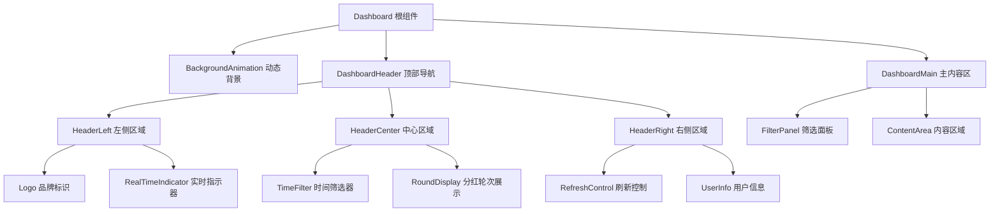
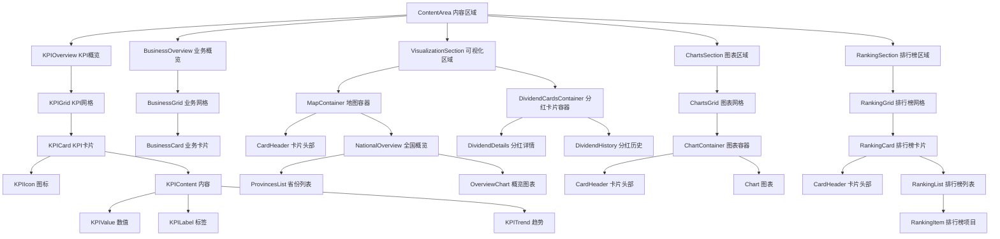

# 组件树结构图

## 整体组件架构

### 1. 页面级组件结构



### 2. 主内容区组件结构



## 详细组件分析

### 1. 布局组件

#### Dashboard (根组件)
```typescript
interface DashboardProps {
    // 根组件通常不需要props
}

interface DashboardState {
    currentFilters: FilterState;
    isLoading: boolean;
    error: string | null;
}
```

**职责：**
- 整体布局管理
- 全局状态管理
- 数据获取协调
- 错误边界处理

#### DashboardHeader (顶部导航)
```typescript
interface DashboardHeaderProps {
    onFilterChange: (filters: FilterState) => void;
    onRefresh: () => void;
    isLoading: boolean;
}
```

**子组件：**
- `Logo` - 品牌标识
- `RealTimeIndicator` - 实时数据指示器
- `TimeFilter` - 时间范围筛选
- `RoundDisplay` - 分红轮次展示
- `RefreshControl` - 刷新按钮
- `UserInfo` - 用户信息

#### DashboardMain (主内容区)
```typescript
interface DashboardMainProps {
    data: DashboardData;
    filters: FilterState;
    onFilterChange: (filters: FilterState) => void;
}
```

**子组件：**
- `FilterPanel` - 左侧筛选面板
- `ContentArea` - 右侧内容区域

### 2. 筛选组件

#### FilterPanel (筛选面板)
```typescript
interface FilterPanelProps {
    filters: FilterState;
    onFilterChange: (filters: FilterState) => void;
    isCollapsed: boolean;
    onToggleCollapse: () => void;
}
```

**子组件：**
- `RegionFilter` - 地域筛选
- `RoleFilter` - 角色筛选
- `RoundFilter` - 分红轮次筛选

#### RegionFilter (地域筛选)
```typescript
interface RegionFilterProps {
    selectedProvince: string;
    selectedCity: string;
    selectedDistrict: string;
    onProvinceChange: (province: string) => void;
    onCityChange: (city: string) => void;
    onDistrictChange: (district: string) => void;
}
```

**组件结构：**
```html
<div class="filter-group">
    <h4>地域筛选</h4>
    <div class="region-filter">
        <select id="provinceSelect">省份选择</select>
        <select id="citySelect">城市选择</select>
        <select id="districtSelect">区县选择</select>
    </div>
</div>
```

### 3. 数据展示组件

#### KPIOverview (KPI概览)
```typescript
interface KPIOverviewProps {
    data: OverviewData;
    isAnimating: boolean;
}
```

**组件树：**
```
KPIOverview
├── KPIGrid
    ├── KPICard (revenue)
    ├── KPICard (stores)
    ├── KPICard (users)
    ├── KPICard (business)
    └── KPICard (dividend)
```

#### KPICard (KPI卡片)
```typescript
interface KPICardProps {
    type: 'revenue' | 'stores' | 'users' | 'business' | 'dividend';
    icon: string;
    value: number;
    unit: string;
    label: string;
    trend?: {
        value: string;
        type: 'positive' | 'negative';
    };
    todayNew?: {
        value: number;
        unit: string;
    };
    progress?: number;
}
```

**组件结构：**
```html
<div class="kpi-card glass-card" data-kpi="{type}">
    <div class="kpi-icon">
        <i class="fas fa-{icon}"></i>
    </div>
    <div class="kpi-content">
        <div class="kpi-value">
            <span class="number">{value}</span>
            <span class="unit">{unit}</span>
        </div>
        <div class="kpi-label">{label}</div>
        <div class="kpi-trend {trend.type}">
            {trend.value}
        </div>
        {progress && (
            <div class="kpi-progress">
                <div class="progress-bar">
                    <div class="progress-fill" style="width: {progress}%"></div>
                </div>
            </div>
        )}
    </div>
</div>
```

#### BusinessOverview (业务概览)
```typescript
interface BusinessOverviewProps {
    data: BusinessData;
}
```

**组件树：**
```
BusinessOverview
├── BusinessGrid
    ├── BusinessCard (points-issued)
    ├── BusinessCard (voucher-consumed)
    ├── BusinessCard (good-points-consumed)
    └── BusinessCard (voucher-withdrawal)
```

### 4. 可视化组件

#### VisualizationSection (可视化区域)
```typescript
interface VisualizationSectionProps {
    mapData: MapData[];
    dividendData: DividendData;
    onMapTypeChange: (type: string) => void;
}
```

**组件树：**
```
VisualizationSection
├── VizGrid
    ├── MapContainer
    │   ├── CardHeader
    │   └── NationalOverview
    │       ├── ProvincesList
    │       └── OverviewChart
    └── DividendCardsContainer
        ├── DividendDetails
        └── DividendHistory
```

#### MapContainer (地图容器)
```typescript
interface MapContainerProps {
    data: MapData[];
    activeType: 'revenue' | 'stores' | 'users';
    onTypeChange: (type: string) => void;
}
```

**子组件：**
- `CardHeader` - 带控制按钮的头部
- `NationalOverview` - 全国业绩概览
  - `ProvincesList` - 省份列表
  - `OverviewChart` - 概览图表 (ECharts)

#### DividendCardsContainer (分红卡片容器)
```typescript
interface DividendCardsContainerProps {
    currentRound: DividendRoundData;
    previousRound: DividendRoundData;
}
```

**子组件：**
- `DividendDetails` - 当前分红详情
- `DividendHistory` - 历史分红记录

#### DividendDetails (分红详情)
```typescript
interface DividendDetailsProps {
    round: number;
    data: DividendRoundData;
}
```

**组件结构：**
```html
<div class="dividend-details glass-card compact-card">
    <div class="card-header">
        <h3>第{round}次分红详情</h3>
    </div>
    <div class="dividend-details-content">
        <div class="dividend-grid">
            <div class="dividend-row">
                <DividendItem type="store" />
                <DividendItem type="user" />
            </div>
            <DividendItem type="total" />
            <DividendItem type="countdown" />
        </div>
    </div>
</div>
```

#### DividendItem (分红项目)
```typescript
interface DividendItemProps {
    type: 'store' | 'user' | 'partner' | 'business' | 'total' | 'countdown';
    icon: string;
    label: string;
    value: string;
    isHighlight?: boolean;
}
```

### 5. 图表组件

#### ChartsSection (图表区域)
```typescript
interface ChartsSectionProps {
    data: ChartData;
    onPeriodChange: (chartId: string, period: string) => void;
}
```

**组件树：**
```
ChartsSection
├── ChartsGrid
    ├── ChartContainer (revenue)
    ├── ChartContainer (dividend-round)
    └── ChartContainer (dividend-count)
```

#### ChartContainer (图表容器)
```typescript
interface ChartContainerProps {
    id: string;
    title: string;
    icon: string;
    data: any[];
    type: 'line' | 'pie' | 'bar';
    controls?: ChartControl[];
    onControlChange?: (value: string) => void;
}

interface ChartControl {
    label: string;
    value: string;
    active?: boolean;
}
```

**子组件：**
- `CardHeader` - 带控制按钮的头部
- `Chart` - ECharts图表实例

### 6. 排行榜组件

#### RankingSection (排行榜区域)
```typescript
interface RankingSectionProps {
    data: RankingData;
    onPeriodChange: (rankingId: string, period: string) => void;
}
```

**组件树：**
```
RankingSection
├── RankingGrid
    ├── RankingCard (store)
    ├── RankingCard (business)
    └── RankingCard (user-consumption)
```

#### RankingCard (排行榜卡片)
```typescript
interface RankingCardProps {
    id: string;
    title: string;
    icon: string;
    data: RankingItem[];
    controls?: RankingControl[];
    onControlChange?: (value: string) => void;
}
```

**子组件：**
- `CardHeader` - 带控制下拉框的头部
- `RankingList` - 排行榜列表
  - `RankingItem[]` - 排行榜项目数组

#### RankingItem (排行榜项目)
```typescript
interface RankingItemProps {
    rank: number;
    name: string;
    details: string[];
    amount: number;
    change?: number;
    animationDelay?: number;
}
```

**组件结构：**
```html
<div class="ranking-item">
    <div class="ranking-number {rankClass}">{rank}</div>
    <div class="ranking-info">
        <div class="ranking-name">{name}</div>
        <div class="ranking-details">
            {details.map(detail => <span>{detail}</span>)}
        </div>
    </div>
    <div class="ranking-value">
        <div class="ranking-amount">¥{amount.toLocaleString()}</div>
        {change && (
            <div class="ranking-change {changeType}">
                <i class="fas fa-arrow-{direction}"></i>
                {Math.abs(change)}%
            </div>
        )}
    </div>
</div>
```

### 7. 通用UI组件

#### GlassCard (玻璃卡片)
```typescript
interface GlassCardProps {
    children: React.ReactNode;
    className?: string;
    onClick?: () => void;
}
```

#### GlassButton (玻璃按钮)
```typescript
interface GlassButtonProps {
    children: React.ReactNode;
    onClick: () => void;
    disabled?: boolean;
    loading?: boolean;
    variant?: 'primary' | 'secondary';
}
```

#### GlassSelect (玻璃选择器)
```typescript
interface GlassSelectProps {
    options: SelectOption[];
    value: string;
    onChange: (value: string) => void;
    placeholder?: string;
    disabled?: boolean;
    size?: 'small' | 'medium' | 'large';
}

interface SelectOption {
    label: string;
    value: string;
}
```

#### ControlButton (控制按钮)
```typescript
interface ControlButtonProps {
    children: React.ReactNode;
    active?: boolean;
    onClick: () => void;
    dataAttribute?: string;
}
```

### 8. 动画组件

#### BackgroundAnimation (背景动画)
```typescript
interface BackgroundAnimationProps {
    particleCount?: number;
}
```

**组件结构：**
```html
<div class="background-animation">
    {Array.from({length: particleCount}).map((_, i) => (
        <div key={i} class="particle"></div>
    ))}
</div>
```

#### AnimatedNumber (动画数字)
```typescript
interface AnimatedNumberProps {
    value: number;
    duration?: number;
    easing?: EasingFunction;
    formatter?: (value: number) => string;
}
```

#### ProgressBar (进度条)
```typescript
interface ProgressBarProps {
    value: number;
    max?: number;
    animated?: boolean;
    showText?: boolean;
    variant?: 'primary' | 'success' | 'warning' | 'error';
}
```

#### CircularProgress (圆形进度)
```typescript
interface CircularProgressProps {
    value: number;
    size?: number;
    strokeWidth?: number;
    color?: string;
    backgroundColor?: string;
    showText?: boolean;
}
```

## 组件复用模式

### 1. 卡片容器模式

所有主要内容区域都使用统一的卡片容器模式：

```typescript
interface CardContainerProps {
    title: string;
    icon?: string;
    controls?: React.ReactNode;
    children: React.ReactNode;
    className?: string;
}
```

**使用示例：**
- `KPICard` - KPI数据卡片
- `ChartContainer` - 图表容器卡片
- `RankingCard` - 排行榜卡片
- `MapContainer` - 地图容器卡片

### 2. 网格布局模式

多个相似组件使用网格布局：

```typescript
interface GridContainerProps {
    children: React.ReactNode;
    columns?: number | 'auto-fit';
    gap?: string;
    className?: string;
}
```

**使用示例：**
- `KPIGrid` - KPI卡片网格
- `BusinessGrid` - 业务卡片网格
- `ChartsGrid` - 图表网格
- `RankingGrid` - 排行榜网格

### 3. 头部控制模式

带控制元素的卡片头部：

```typescript
interface CardHeaderProps {
    title: string;
    icon?: string;
    controls?: React.ReactNode;
}
```

**控制元素类型：**
- 按钮组 (地图类型切换)
- 下拉选择 (时间周期选择)
- 范围滑块 (分红轮次选择)

## 状态管理模式

### 1. 全局状态

```typescript
interface GlobalState {
    filters: FilterState;
    data: DashboardData;
    loading: boolean;
    error: string | null;
}
```

### 2. 组件本地状态

```typescript
// KPI卡片动画状态
interface KPICardState {
    isAnimating: boolean;
    currentValue: number;
}

// 图表交互状态
interface ChartState {
    activePeriod: string;
    isLoading: boolean;
}

// 排行榜状态
interface RankingState {
    activePeriod: string;
    sortBy: string;
    sortOrder: 'asc' | 'desc';
}
```

### 3. 事件处理模式

```typescript
// 筛选器变更事件
interface FilterChangeEvent {
    type: 'timeRange' | 'region' | 'role' | 'round';
    value: any;
}

// 图表交互事件
interface ChartInteractionEvent {
    chartId: string;
    type: 'periodChange' | 'dataPointClick';
    value: any;
}
```

## React迁移映射

### 1. HTML到JSX转换

```html
<!-- HTML -->
<div class="kpi-card glass-card" data-kpi="revenue">
    <div class="kpi-icon">
        <i class="fas fa-chart-line"></i>
    </div>
    <div class="kpi-content">
        <div class="kpi-value">
            <span class="number">0</span>
            <span class="unit">元</span>
        </div>
        <div class="kpi-label">总交易金额</div>
    </div>
</div>
```

```jsx
// JSX
<div className="kpi-card glass-card" data-kpi="revenue">
    <div className="kpi-icon">
        <i className="fas fa-chart-line"></i>
    </div>
    <div className="kpi-content">
        <div className="kpi-value">
            <span className="number">{value}</span>
            <span className="unit">元</span>
        </div>
        <div className="kpi-label">总交易金额</div>
    </div>
</div>
```

### 2. 事件处理转换

```javascript
// 原生JavaScript
document.getElementById('refreshBtn').addEventListener('click', () => {
    this.refreshData();
});
```

```jsx
// React
<button onClick={handleRefresh}>
    刷新
</button>
```

### 3. 状态管理转换

```javascript
// 原生JavaScript
this.currentFilters = {
    timeRange: 'month',
    province: '',
    // ...
};
```

```jsx
// React
const [filters, setFilters] = useState({
    timeRange: 'month',
    province: '',
    // ...
});
```

这个组件树结构图为React迁移提供了清晰的组件划分和层次关系，确保迁移后的代码结构清晰、可维护。