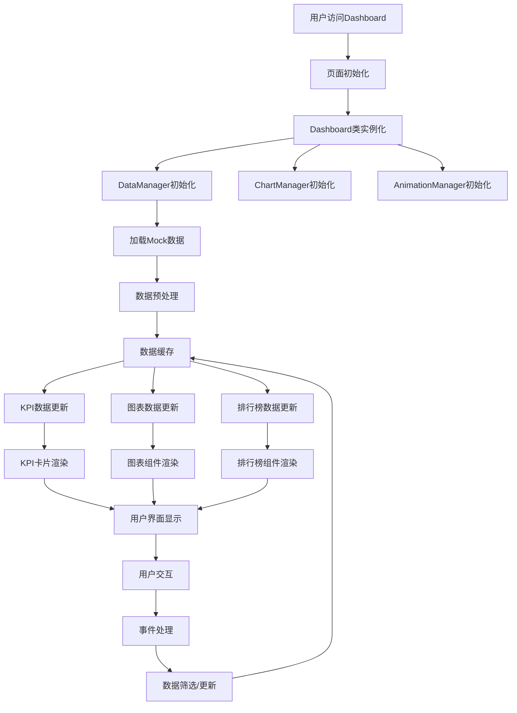
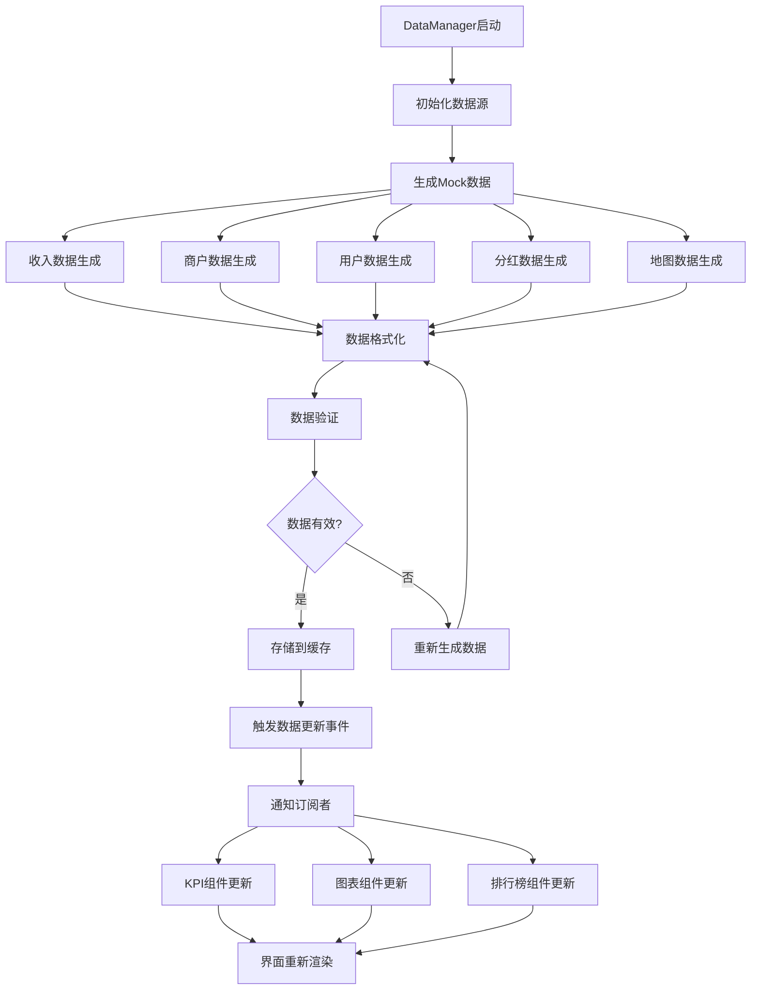
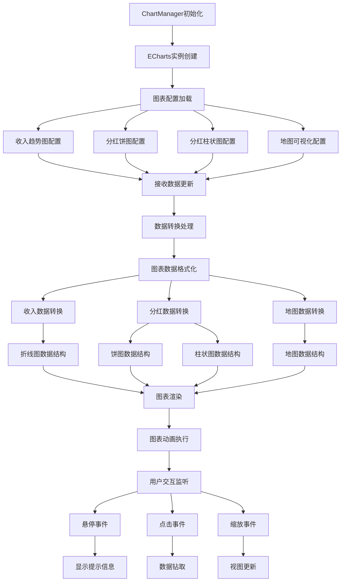
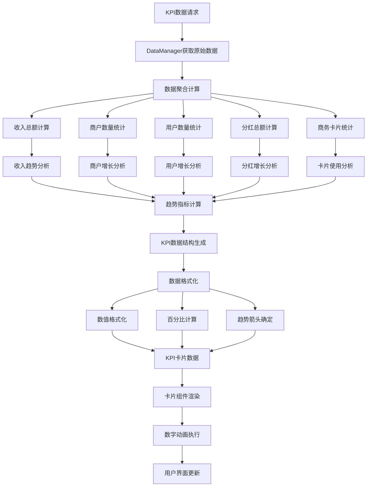
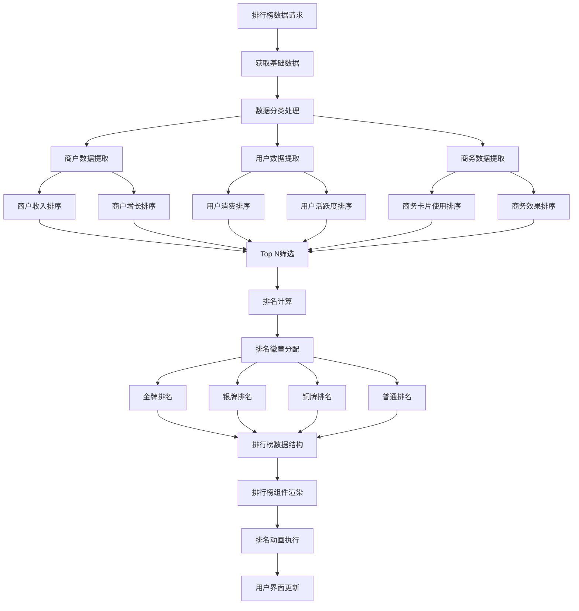
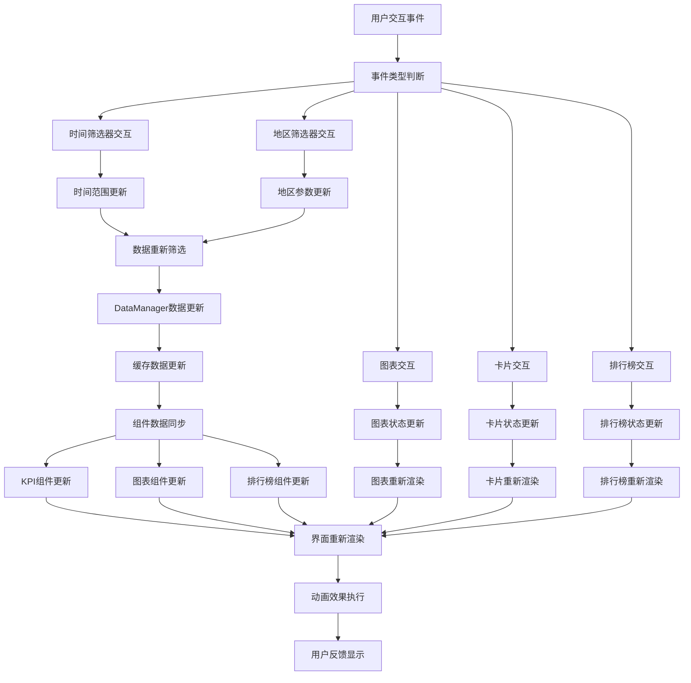
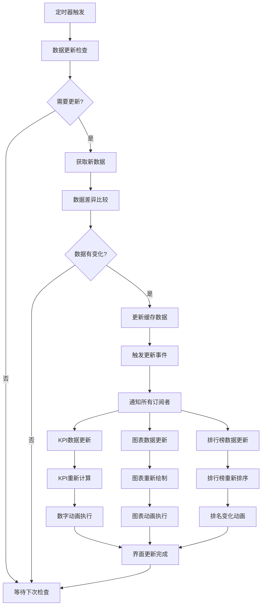
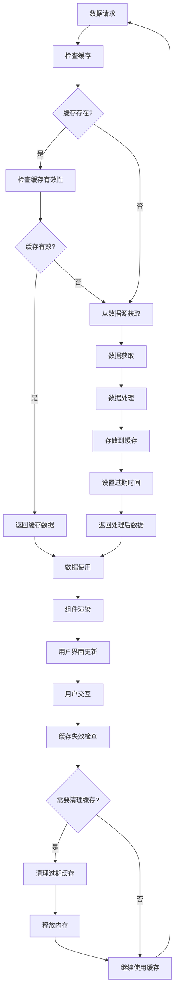
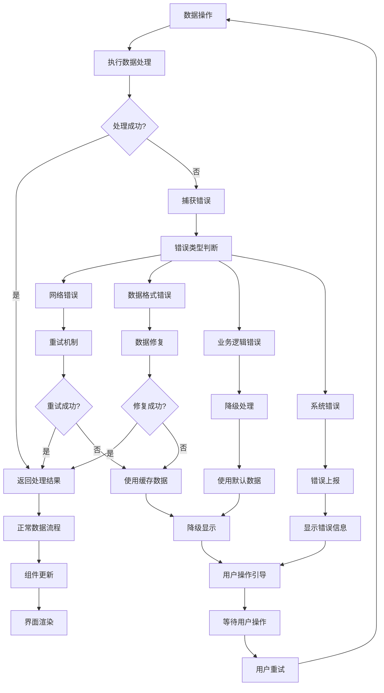
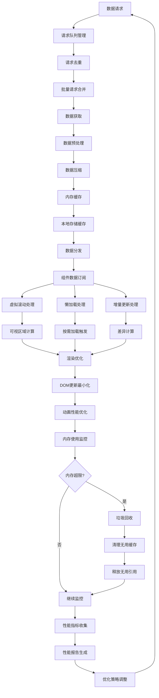

# 数据流程图

## 系统整体数据流程图

## 数据管理器流程图

## 图表管理器数据流程

## KPI数据处理流程

## 排行榜数据处理流程

## 用户交互数据流程

## 实时数据更新流程

## 数据缓存管理流程

## 错误处理数据流程

## 性能优化数据流程

这些数据流程图详细展示了HTML Dashboard项目中数据的流动、处理、缓存、错误处理和性能优化等各个方面的流程，为React迁移提供了清晰的数据架构参考。