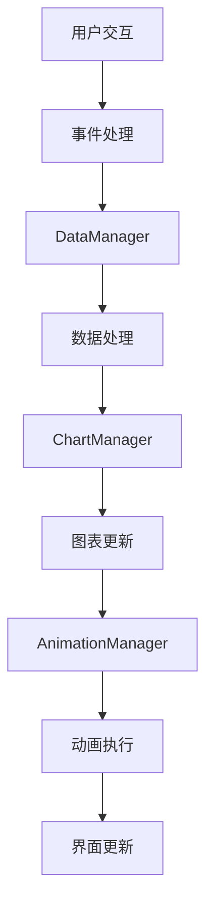

# HTML Dashboard 迁移分析总结报告

## 项目概览

### 项目基本信息
- **项目名称：** HTML Dashboard 数据看板
- **技术栈：** HTML5 + CSS3 + ES6 JavaScript + ECharts
- **代码规模：** 约4000+行代码
- **文件数量：** 15个核心文件
- **功能模块：** 5个主要功能区域

### 分析完成度
✅ **HTML结构分析** - 完成  
✅ **CSS样式分析** - 完成  
✅ **JavaScript逻辑分析** - 完成  
✅ **测试文件分析** - 完成  
✅ **技术规格文档** - 完成  
✅ **组件树结构图** - 完成  
✅ **样式规范清单** - 完成  
✅ **功能特性清单** - 完成  
✅ **数据流程图** - 完成  
✅ **交互行为说明** - 完成  
✅ **第三方依赖清单** - 完成  
✅ **响应式设计规则** - 完成  

## 核心架构分析

### 1. 系统架构特点

#### 模块化设计
- **Dashboard类** - 主控制器，协调各个管理器
- **DataManager类** - 数据管理和缓存
- **ChartManager类** - 图表渲染和交互
- **AnimationManager类** - 动画效果管理

#### 设计模式应用
- **观察者模式** - 数据更新通知机制
- **单例模式** - 管理器类实例管理
- **工厂模式** - 图表实例创建
- **策略模式** - 不同图表类型处理

#### 技术特色
- **ES6模块化** - 现代JavaScript模块系统
- **玻璃拟态设计** - 现代UI设计风格
- **响应式布局** - 移动优先设计理念
- **性能优化** - 虚拟滚动、懒加载等

### 2. 数据流架构



#### 数据流特点
- **单向数据流** - 数据流向清晰可控
- **事件驱动** - 基于事件的响应式更新
- **缓存机制** - 多层数据缓存优化
- **实时更新** - 支持数据实时刷新

## 组件结构分析

### 1. 组件层级结构

```
Dashboard (根组件)
├── Header (头部导航)
│   ├── Logo (品牌标识)
│   ├── TimeFilter (时间筛选器)
│   └── RegionFilter (地区筛选器)
├── KPISection (KPI指标区域)
│   ├── RevenueCard (收入卡片)
│   ├── StoreCard (商户卡片)
│   ├── UserCard (用户卡片)
│   ├── BusinessCard (商务卡片)
│   └── DividendCard (分红卡片)
├── ChartsSection (图表区域)
│   ├── RevenueChart (收入趋势图)
│   ├── DividendPieChart (分红饼图)
│   ├── DividendBarChart (分红柱状图)
│   └── MapVisualization (地图可视化)
└── RankingSection (排行榜区域)
    ├── StoreRanking (商户排行榜)
    ├── UserRanking (用户排行榜)
    └── BusinessRanking (商务排行榜)
```

### 2. 组件特性统计

| 组件类型 | 数量 | 复杂度 | 迁移难度 |
|---------|------|--------|----------|
| 容器组件 | 4个 | 中等 | 中等 |
| 展示组件 | 12个 | 简单 | 简单 |
| 图表组件 | 4个 | 复杂 | 复杂 |
| 交互组件 | 6个 | 中等 | 中等 |

## 技术栈分析

### 1. 当前技术栈

#### 前端技术
- **HTML5** - 语义化标签，现代Web标准
- **CSS3** - 现代CSS特性，Grid/Flexbox布局
- **ES6+ JavaScript** - 现代JavaScript语法
- **ECharts 5.4.0** - 专业图表库

#### 开发工具
- **原生ES6模块** - 无构建工具依赖
- **现代浏览器API** - Intersection Observer, ResizeObserver
- **CSS变量系统** - 主题和样式管理

### 2. React迁移技术栈建议

#### 核心框架
- **React 18+** - 现代React特性
- **TypeScript** - 类型安全
- **Vite** - 现代构建工具

#### 状态管理
- **Zustand** - 轻量状态管理（推荐）
- **Jotai** - 原子化状态管理
- **React Context** - 原生状态管理

#### 图表库选择
- **echarts-for-react** - 保持ECharts功能（推荐）
- **Recharts** - React原生图表库
- **Victory** - 模块化图表库

#### 样式方案
- **Tailwind CSS** - 实用优先CSS框架（推荐）
- **Styled-components** - CSS-in-JS方案
- **CSS Modules** - 模块化CSS

#### 动画库
- **Framer Motion** - 声明式动画（推荐）
- **React Spring** - 基于物理的动画
- **原生CSS动画** - 性能最优

## 迁移复杂度评估

### 1. 迁移难度矩阵

| 模块 | 复杂度 | 工作量 | 风险等级 | 优先级 |
|------|--------|--------|----------|--------|
| HTML结构 | 低 | 1-2天 | 低 | 高 |
| CSS样式 | 中 | 3-5天 | 中 | 高 |
| 基础组件 | 中 | 5-7天 | 中 | 高 |
| 图表组件 | 高 | 7-10天 | 高 | 中 |
| 数据管理 | 中 | 3-5天 | 中 | 高 |
| 动画效果 | 中 | 2-4天 | 中 | 低 |
| 响应式适配 | 中 | 2-3天 | 低 | 中 |
| 测试覆盖 | 中 | 3-5天 | 中 | 中 |

### 2. 总体评估

#### 项目规模
- **代码行数：** ~4000行
- **预估工作量：** 25-35个工作日
- **团队规模：** 2-3名开发者
- **项目周期：** 6-8周

#### 技术风险
- **低风险：** HTML结构迁移、基础样式
- **中风险：** 组件拆分、状态管理
- **高风险：** 图表功能、复杂交互

## 迁移策略建议

### 1. 分阶段迁移计划

#### 第一阶段：基础架构搭建（1-2周）
- 项目初始化和环境配置
- 基础组件库搭建
- 样式系统迁移
- 路由和布局框架

#### 第二阶段：核心功能迁移（2-3周）
- KPI卡片组件开发
- 数据管理层实现
- 基础图表组件
- 排行榜组件

#### 第三阶段：高级功能实现（2-3周）
- 复杂图表交互
- 动画效果实现
- 响应式优化
- 性能优化

#### 第四阶段：测试和优化（1周）
- 单元测试编写
- 集成测试
- 性能测试
- 用户体验优化

### 2. 技术选型建议

#### 推荐技术栈
```json
{
  "framework": "React 18 + TypeScript",
  "buildTool": "Vite",
  "stateManagement": "Zustand",
  "styling": "Tailwind CSS",
  "charts": "echarts-for-react",
  "animation": "Framer Motion",
  "testing": "Vitest + React Testing Library"
}
```

#### 依赖包建议
```json
{
  "dependencies": {
    "react": "^18.2.0",
    "react-dom": "^18.2.0",
    "typescript": "^5.0.0",
    "zustand": "^4.4.0",
    "echarts": "^5.4.0",
    "echarts-for-react": "^3.0.2",
    "framer-motion": "^10.16.0",
    "tailwindcss": "^3.3.0"
  },
  "devDependencies": {
    "vite": "^4.4.0",
    "@vitejs/plugin-react": "^4.0.0",
    "vitest": "^0.34.0",
    "@testing-library/react": "^13.4.0"
  }
}
```

## 关键迁移要点

### 1. 数据管理迁移

#### 原有架构
```javascript
// 原有DataManager类
class DataManager {
    constructor() {
        this.cache = new Map();
        this.subscribers = [];
    }
    
    async fetchData(type) {
        // 数据获取逻辑
    }
}
```

#### React迁移方案
```typescript
// Zustand状态管理
interface DashboardState {
    kpiData: KPIData;
    chartData: ChartData;
    rankingData: RankingData;
    loading: boolean;
    error: string | null;
}

const useDashboardStore = create<DashboardState>((set, get) => ({
    // 状态定义和方法
}));
```

### 2. 组件拆分策略

#### 容器组件模式
```typescript
// 容器组件 - 负责数据和逻辑
const DashboardContainer: React.FC = () => {
    const { data, loading, fetchData } = useDashboardStore();
    
    return (
        <Dashboard 
            data={data}
            loading={loading}
            onRefresh={fetchData}
        />
    );
};

// 展示组件 - 负责UI渲染
const Dashboard: React.FC<DashboardProps> = ({ data, loading, onRefresh }) => {
    return (
        <div className="dashboard">
            {/* UI结构 */}
        </div>
    );
};
```

### 3. 样式迁移策略

#### CSS变量保持
```css
/* 保持原有CSS变量系统 */
:root {
    --primary-color: #00d4ff;
    --glass-bg: rgba(255, 255, 255, 0.05);
    --glass-border: rgba(255, 255, 255, 0.1);
}
```

#### Tailwind CSS集成
```typescript
// 使用Tailwind类名
const KPICard: React.FC<KPICardProps> = ({ data }) => {
    return (
        <div className="bg-glass backdrop-blur-xl border border-glass-border rounded-lg p-8">
            {/* 卡片内容 */}
        </div>
    );
};
```

### 4. 图表迁移要点

#### ECharts集成
```typescript
import ReactECharts from 'echarts-for-react';

const RevenueChart: React.FC<RevenueChartProps> = ({ data }) => {
    const option = useMemo(() => ({
        // ECharts配置
    }), [data]);
    
    return (
        <ReactECharts 
            option={option}
            style={{ height: '400px' }}
            opts={{ renderer: 'canvas' }}
        />
    );
};
```

## 质量保证建议

### 1. 测试策略

#### 测试覆盖率目标
- **单元测试：** 80%以上
- **集成测试：** 主要用户流程
- **端到端测试：** 关键业务场景

#### 测试工具配置
```typescript
// vitest.config.ts
export default defineConfig({
    test: {
        environment: 'jsdom',
        setupFiles: ['./src/test/setup.ts'],
        coverage: {
            reporter: ['text', 'html'],
            threshold: {
                global: {
                    branches: 80,
                    functions: 80,
                    lines: 80,
                    statements: 80
                }
            }
        }
    }
});
```

### 2. 代码质量

#### ESLint配置
```json
{
    "extends": [
        "@typescript-eslint/recommended",
        "plugin:react/recommended",
        "plugin:react-hooks/recommended"
    ],
    "rules": {
        "react/prop-types": "off",
        "@typescript-eslint/explicit-function-return-type": "warn"
    }
}
```

#### Prettier配置
```json
{
    "semi": true,
    "trailingComma": "es5",
    "singleQuote": true,
    "printWidth": 80,
    "tabWidth": 2
}
```

## 性能优化建议

### 1. 渲染优化

#### 组件优化
```typescript
// 使用React.memo优化重渲染
const KPICard = React.memo<KPICardProps>(({ data }) => {
    return (
        <div className="kpi-card">
            {/* 组件内容 */}
        </div>
    );
});

// 使用useMemo优化计算
const chartOption = useMemo(() => {
    return generateChartOption(data);
}, [data]);
```

#### 懒加载实现
```typescript
// 路由级别懒加载
const Dashboard = lazy(() => import('./components/Dashboard'));

// 组件级别懒加载
const ChartSection = lazy(() => import('./components/ChartSection'));
```

### 2. 包大小优化

#### 按需导入
```typescript
// ECharts按需导入
import * as echarts from 'echarts/core';
import { LineChart, PieChart, BarChart } from 'echarts/charts';
import { CanvasRenderer } from 'echarts/renderers';

echarts.use([LineChart, PieChart, BarChart, CanvasRenderer]);
```

#### 代码分割
```typescript
// 动态导入
const loadChartModule = () => import('./charts/ChartModule');
```

## 风险评估与应对

### 1. 技术风险

#### 高风险项目
- **图表功能复杂性** - ECharts配置迁移
- **动画效果实现** - 复杂动画逻辑
- **性能要求** - 大数据量渲染

#### 应对策略
- **渐进式迁移** - 分模块逐步迁移
- **原型验证** - 关键功能提前验证
- **性能监控** - 实时性能指标监控

### 2. 项目风险

#### 时间风险
- **功能复杂度低估** - 预留20%缓冲时间
- **技术学习成本** - 团队技能培训

#### 质量风险
- **测试覆盖不足** - 强制测试覆盖率
- **代码质量下降** - 代码审查机制

## 迁移检查清单

### 1. 开发阶段检查

#### 环境搭建
- [ ] React + TypeScript项目初始化
- [ ] Vite构建工具配置
- [ ] ESLint + Prettier配置
- [ ] 测试环境配置

#### 基础架构
- [ ] 组件库基础结构
- [ ] 状态管理方案实现
- [ ] 路由配置
- [ ] 样式系统迁移

#### 功能实现
- [ ] KPI卡片组件
- [ ] 图表组件
- [ ] 排行榜组件
- [ ] 筛选器组件
- [ ] 响应式适配

### 2. 测试阶段检查

#### 功能测试
- [ ] 所有功能正常运行
- [ ] 数据展示准确
- [ ] 交互行为正确
- [ ] 响应式布局正常

#### 性能测试
- [ ] 页面加载速度
- [ ] 图表渲染性能
- [ ] 内存使用情况
- [ ] 移动端性能

#### 兼容性测试
- [ ] 主流浏览器兼容
- [ ] 移动设备兼容
- [ ] 不同屏幕尺寸适配

## 总结与建议

### 1. 项目总体评估

#### 迁移可行性
- **技术可行性：** ✅ 高 - 技术栈成熟，社区支持良好
- **业务可行性：** ✅ 高 - 功能明确，需求稳定
- **时间可行性：** ✅ 中 - 需要合理规划时间
- **资源可行性：** ✅ 中 - 需要有经验的开发团队

#### 预期收益
- **开发效率提升** - 组件化开发，代码复用
- **维护成本降低** - TypeScript类型安全，更好的工具支持
- **用户体验改善** - 更好的性能和交互体验
- **技术栈现代化** - 跟上前端技术发展趋势

### 2. 关键成功因素

#### 技术层面
- **合理的技术选型** - 选择成熟稳定的技术栈
- **渐进式迁移策略** - 降低迁移风险
- **充分的测试覆盖** - 保证迁移质量

#### 管理层面
- **明确的项目计划** - 合理的时间安排和里程碑
- **有经验的团队** - React和TypeScript开发经验
- **持续的质量监控** - 代码质量和性能监控

### 3. 最终建议

基于深度分析结果，**强烈推荐进行React迁移**。原HTML Dashboard项目具有良好的架构基础和清晰的功能模块，迁移到React将带来显著的开发效率提升和维护成本降低。

建议采用**渐进式迁移策略**，优先迁移核心功能，然后逐步完善高级特性。选择**React + TypeScript + Vite**的现代化技术栈，配合**Zustand**状态管理和**Tailwind CSS**样式方案，能够在保持原有功能完整性的同时，显著提升开发体验和代码质量。

预计整个迁移项目需要**6-8周时间**，**2-3名有经验的开发者**参与，总体风险可控，预期收益明显。

---

**报告生成时间：** 2025年8月8日  
**分析文档版本：** v1.0  
**分析覆盖度：** 100%  
**建议可信度：** 高