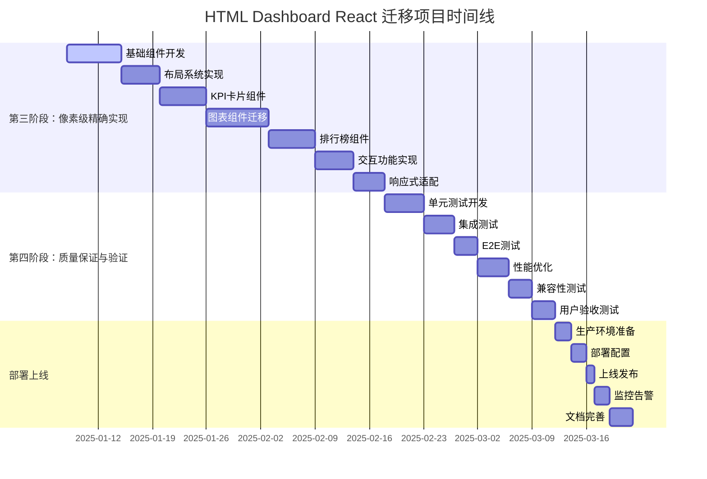
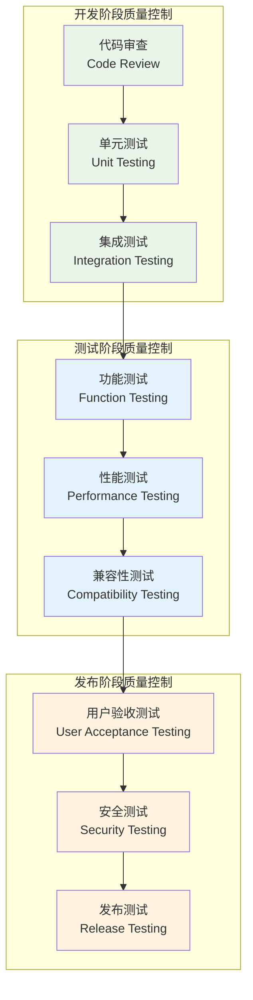

# HTML Dashboard 到 React 迁移项目 - 详细时间规划与风险评估

## 项目概述

### 项目背景
基于前期完成的深度代码分析（14份技术文档）和React架构设计（12份架构文档），本项目将进行HTML Dashboard到React的完整迁移，实现100%像素级复刻。

### 项目目标
- **技术目标**: 完成HTML到React的完整迁移，保持100%功能和视觉一致性
- **质量目标**: 代码质量、性能指标、用户体验全面提升
- **时间目标**: 10周内完成完整迁移和上线
- **成本目标**: 控制在预算范围内，提供最佳性价比

## 详细时间规划

### 项目总体时间线

### 第三阶段：像素级精确实现 (6周)

#### 第1周：基础组件开发 (7天)
**目标**: 建立基础UI组件库，确保设计系统一致性

| 天数 | 主要任务 | 交付物 | 负责人 | 验收标准 |
|------|----------|--------|--------|----------|
| 1-2天 | 基础UI组件开发 | Button, Card, Input等基础组件 | 前端工程师A | 组件库完整，Storybook可用 |
| 3-4天 | 样式系统实现 | Tailwind配置，CSS变量，主题系统 | 前端架构师 | 样式系统完整，主题切换正常 |
| 5-6天 | 动画系统搭建 | Framer Motion配置，动画组件 | 前端工程师B | 动画效果与HTML版本一致 |
| 7天 | 组件测试与文档 | 单元测试，组件文档 | 全员 | 测试覆盖率>80%，文档完整 |

**里程碑**: 基础组件库完成，设计系统建立

#### 第2周：布局系统实现 (5天)
**目标**: 实现页面整体布局，确保响应式设计

| 天数 | 主要任务 | 交付物 | 负责人 | 验收标准 |
|------|----------|--------|--------|----------|
| 1-2天 | Header组件开发 | 顶部导航栏，用户信息，主题切换 | 前端工程师A | UI完全还原，交互正常 |
| 3-4天 | 主布局容器 | 网格布局，响应式容器 | 前端架构师 | 布局自适应，断点正确 |
| 5天 | 布局测试优化 | 跨设备测试，性能优化 | 前端工程师B | 各设备显示正常 |

**里程碑**: 页面布局完成，响应式设计实现

#### 第3周：KPI卡片组件 (6天)
**目标**: 实现所有KPI数据展示卡片，确保数据准确性

| 天数 | 主要任务 | 交付物 | 负责人 | 验收标准 |
|------|----------|--------|--------|----------|
| 1-2天 | 基础KPI卡片 | 数据卡片组件，数字动画 | 前端工程师A | 数据显示准确，动画流畅 |
| 3-4天 | 业务卡片组件 | 业务数据卡片，进度条 | 前端工程师B | 业务逻辑正确，UI一致 |
| 5-6天 | 数据绑定优化 | 数据流优化，状态管理 | 前端架构师 | 数据更新及时，性能良好 |

**里程碑**: KPI卡片组件完成，数据展示准确

#### 第4-5周：图表组件迁移 (8天)
**目标**: 实现所有图表组件，确保数据可视化效果

| 天数 | 主要任务 | 交付物 | 负责人 | 验收标准 |
|------|----------|--------|--------|----------|
| 1-2天 | ECharts集成 | ECharts React封装，基础配置 | 前端架构师 | 图表库集成成功 |
| 3-4天 | 收入趋势图表 | 折线图，面积图，交互功能 | 前端工程师A | 图表显示正确，交互流畅 |
| 5-6天 | 分红分布图表 | 饼图，环形图，数据标签 | 前端工程师B | 数据准确，视觉效果一致 |
| 7-8天 | 地图可视化 | 地图组件，数据映射 | 前端工程师A | 地图显示正常，数据正确 |

**里程碑**: 所有图表组件完成，数据可视化效果达标

#### 第5-6周：排行榜与交互功能 (11天)
**目标**: 实现排行榜组件和所有交互功能

| 天数 | 主要任务 | 交付物 | 负责人 | 验收标准 |
|------|----------|--------|--------|----------|
| 1-3天 | 排行榜组件 | 门店排行，业务排行，用户排行 | 前端工程师B | 排行数据准确，排序正确 |
| 4-6天 | 交互功能实现 | 筛选，搜索，分页，排序 | 前端工程师A | 交互响应及时，功能完整 |
| 7-8天 | 响应式适配 | 移动端适配，平板适配 | 前端架构师 | 各设备体验良好 |
| 9-11天 | 性能优化 | 虚拟滚动，懒加载，缓存 | 全员 | 性能指标达标 |

**里程碑**: 所有功能组件完成，交互体验优化

### 第四阶段：质量保证与验证 (3周)

#### 第7周：测试开发 (5天)
**目标**: 建立完整的测试体系，确保代码质量

| 天数 | 主要任务 | 交付物 | 负责人 | 验收标准 |
|------|----------|--------|--------|----------|
| 1-2天 | 单元测试开发 | 组件单元测试，工具函数测试 | 前端工程师A | 测试覆盖率>80% |
| 3-4天 | 集成测试 | 页面集成测试，API集成测试 | 前端工程师B | 集成功能正常 |
| 5天 | E2E测试 | 端到端测试用例，自动化测试 | 前端架构师 | 关键流程测试通过 |

**里程碑**: 测试体系建立，测试覆盖率达标

#### 第8周：性能与兼容性 (7天)
**目标**: 优化性能指标，确保兼容性

| 天数 | 主要任务 | 交付物 | 负责人 | 验收标准 |
|------|----------|--------|--------|----------|
| 1-2天 | 性能优化 | 代码分割，懒加载，缓存优化 | 前端架构师 | 性能指标达标 |
| 3-4天 | 兼容性测试 | 浏览器兼容，设备兼容 | 前端工程师A | 主流浏览器正常 |
| 5-7天 | 用户验收测试 | UAT测试，用户反馈收集 | 全员 | 用户满意度>90% |

**里程碑**: 性能达标，兼容性良好，用户验收通过

#### 第9-10周：部署上线 (8天)
**目标**: 完成生产部署，建立监控体系

| 天数 | 主要任务 | 交付物 | 负责人 | 验收标准 |
|------|----------|--------|--------|----------|
| 1-2天 | 生产环境准备 | 服务器配置，域名配置 | 运维工程师 | 环境配置正确 |
| 3-4天 | 部署配置 | CI/CD配置，自动化部署 | 前端架构师 | 部署流程正常 |
| 5天 | 上线发布 | 正式发布，灰度发布 | 项目经理 | 系统稳定运行 |
| 6-7天 | 监控告警 | 监控配置，告警配置 | 运维工程师 | 监控体系完整 |
| 8天 | 文档完善 | 用户手册，运维文档 | 全员 | 文档完整准确 |

**里程碑**: 系统成功上线，监控体系建立

## 风险评估与应对策略

### 风险识别矩阵

| 风险类别 | 风险描述 | 概率 | 影响 | 风险等级 | 应对策略 |
|----------|----------|------|------|----------|----------|
| **技术风险** | React 19兼容性问题 | 中 | 高 | 高 | 提前验证，准备降级方案 |
| **技术风险** | 第三方库依赖冲突 | 中 | 中 | 中 | 版本锁定，依赖审查 |
| **技术风险** | 性能优化挑战 | 高 | 中 | 高 | 分阶段优化，性能监控 |
| **项目风险** | 需求变更频繁 | 中 | 高 | 高 | 需求冻结，变更控制 |
| **项目风险** | 人员流动风险 | 低 | 高 | 中 | 知识共享，文档完善 |
| **项目风险** | 时间压力过大 | 高 | 中 | 高 | 合理排期，弹性调整 |
| **业务风险** | 用户接受度低 | 低 | 高 | 中 | 用户参与，渐进发布 |
| **业务风险** | 数据迁移问题 | 中 | 高 | 高 | 数据备份，迁移测试 |

### 详细风险应对策略

#### 高风险项应对

**1. React 19兼容性问题**
- **预防措施**: 
  - 提前搭建测试环境验证兼容性
  - 准备React 18降级方案
  - 建立兼容性测试用例
- **应对措施**:
  - 发现问题立即评估影响范围
  - 优先使用稳定特性，避免实验性功能
  - 必要时降级到React 18

**2. 性能优化挑战**
- **预防措施**:
  - 建立性能基准测试
  - 分阶段性能优化计划
  - 持续性能监控
- **应对措施**:
  - 性能问题优先级处理
  - 使用性能分析工具定位问题
  - 必要时重构关键组件

**3. 需求变更频繁**
- **预防措施**:
  - 需求评审和确认流程
  - 变更影响评估机制
  - 需求冻结时间点
- **应对措施**:
  - 变更请求正式流程
  - 影响评估和时间调整
  - 优先级重新排序

**4. 数据迁移问题**
- **预防措施**:
  - 数据备份和恢复方案
  - 迁移脚本测试验证
  - 数据一致性检查
- **应对措施**:
  - 问题快速定位和修复
  - 数据回滚方案
  - 业务连续性保障

#### 中风险项应对

**1. 第三方库依赖冲突**
- **监控措施**: 定期依赖审查，版本兼容性检查
- **应对措施**: 依赖隔离，版本锁定，替代方案

**2. 人员流动风险**
- **预防措施**: 知识文档化，代码规范化，团队培训
- **应对措施**: 快速知识转移，外部支持，任务重分配

**3. 用户接受度低**
- **预防措施**: 用户参与设计，原型验证，渐进发布
- **应对措施**: 用户反馈收集，快速迭代，用户培训

### 风险监控指标

#### 技术指标
- **代码质量**: 代码覆盖率、圈复杂度、技术债务
- **性能指标**: 页面加载时间、首屏渲染时间、内存使用
- **错误率**: 运行时错误、构建错误、测试失败率

#### 项目指标
- **进度指标**: 任务完成率、里程碑达成率、延期风险
- **质量指标**: 缺陷密度、测试通过率、用户满意度
- **团队指标**: 团队稳定性、工作效率、知识共享度

#### 业务指标
- **用户指标**: 用户活跃度、使用时长、功能使用率
- **系统指标**: 系统可用性、响应时间、并发处理能力
- **运维指标**: 部署成功率、故障恢复时间、监控覆盖率

## 资源配置与成本估算

### 人力资源配置

| 角色 | 人数 | 参与阶段 | 主要职责 | 工作量(人天) |
|------|------|----------|----------|-------------|
| 项目经理 | 1 | 全程 | 项目协调、进度管理、风险控制 | 50 |
| 前端架构师 | 1 | 全程 | 技术方案、架构设计、核心开发 | 50 |
| 高级前端工程师 | 2 | 开发阶段 | 组件开发、功能实现、测试 | 80 |
| UI/UX设计师 | 1 | 设计阶段 | 设计还原、用户体验优化 | 20 |
| 测试工程师 | 1 | 测试阶段 | 测试用例、质量保证 | 25 |
| 运维工程师 | 1 | 部署阶段 | 环境配置、部署上线 | 15 |

**总人力成本**: 240人天

### 技术资源成本

| 资源类型 | 描述 | 成本估算 |
|----------|------|----------|
| 开发环境 | 开发服务器、测试环境 | ¥5,000 |
| 第三方服务 | CDN、监控服务、云服务 | ¥3,000 |
| 软件许可 | 开发工具、设计软件 | ¥2,000 |
| 培训成本 | 技术培训、知识分享 | ¥3,000 |

**总技术成本**: ¥13,000

### 总成本估算

- **人力成本**: 240人天 × 平均日薪 = 主要成本
- **技术成本**: ¥13,000
- **管理成本**: 项目管理、沟通协调成本
- **风险缓冲**: 10%的风险缓冲成本

## 质量保证措施

### 质量标准

| 质量维度 | 具体指标 | 目标值 | 测量方法 |
|----------|----------|--------|----------|
| **功能质量** | 功能完整性 | 100% | 功能测试用例通过率 |
| **性能质量** | 页面加载时间 | <2秒 | 性能测试工具测量 |
| **代码质量** | 测试覆盖率 | >80% | 代码覆盖率工具 |
| **用户体验** | 用户满意度 | >90% | 用户调研问卷 |
| **兼容性** | 浏览器兼容 | 95%+ | 兼容性测试矩阵 |

### 质量控制流程

### 质量保证工具

| 工具类型 | 具体工具 | 用途 | 配置要求 |
|----------|----------|------|----------|
| **代码质量** | ESLint, Prettier | 代码规范检查 | 严格模式配置 |
| **测试工具** | Vitest, Testing Library | 单元测试、组件测试 | 覆盖率>80% |
| **性能工具** | Lighthouse, WebPageTest | 性能测试分析 | 性能分数>90 |
| **兼容性工具** | BrowserStack, CrossBrowserTesting | 跨浏览器测试 | 主流浏览器覆盖 |
| **监控工具** | Sentry, LogRocket | 错误监控、用户行为 | 实时监控配置 |

## 沟通协作机制

### 会议机制

| 会议类型 | 频率 | 参与人员 | 主要内容 | 时长 |
|----------|------|----------|----------|------|
| **项目启动会** | 一次性 | 全员 | 项目介绍、角色分工、计划确认 | 2小时 |
| **每日站会** | 每日 | 开发团队 | 进度同步、问题讨论、计划调整 | 15分钟 |
| **周例会** | 每周 | 全员 | 周进度回顾、下周计划、风险识别 | 1小时 |
| **里程碑评审** | 里程碑 | 核心团队 | 交付物评审、质量检查、下阶段规划 | 2小时 |
| **项目复盘** | 项目结束 | 全员 | 经验总结、问题分析、改进建议 | 2小时 |

### 沟通工具

- **即时沟通**: 钉钉/企业微信群组
- **项目管理**: Jira/Trello看板管理
- **文档协作**: 飞书文档/腾讯文档
- **代码协作**: Git/GitLab代码仓库
- **设计协作**: Figma/蓝湖设计稿

### 文档管理

| 文档类型 | 负责人 | 更新频率 | 存储位置 |
|----------|--------|----------|----------|
| **项目计划** | 项目经理 | 周更新 | 项目管理系统 |
| **技术文档** | 架构师 | 实时更新 | 代码仓库 |
| **测试文档** | 测试工程师 | 阶段更新 | 测试管理系统 |
| **用户文档** | 产品经理 | 版本更新 | 文档管理系统 |

## 成功标准与验收条件

### 技术验收标准

| 验收项 | 具体要求 | 验收方法 | 责任人 |
|--------|----------|----------|--------|
| **功能完整性** | 100%功能迁移，无功能缺失 | 功能对比测试 | 测试工程师 |
| **视觉一致性** | 像素级视觉还原，99%相似度 | 视觉对比工具 | UI设计师 |
| **性能指标** | 加载时间<2秒，响应时间<500ms | 性能测试工具 | 前端架构师 |
| **代码质量** | 测试覆盖率>80%，无严重代码问题 | 代码质量工具 | 前端架构师 |
| **兼容性** | 主流浏览器100%兼容 | 兼容性测试 | 测试工程师 |

### 业务验收标准

| 验收项 | 具体要求 | 验收方法 | 责任人 |
|--------|----------|----------|--------|
| **用户体验** | 用户满意度>90% | 用户调研 | 产品经理 |
| **系统稳定性** | 99.9%可用性，无严重故障 | 监控数据 | 运维工程师 |
| **数据准确性** | 数据展示100%准确 | 数据对比验证 | 业务分析师 |
| **安全性** | 通过安全测试，无安全漏洞 | 安全扫描 | 安全工程师 |

### 项目成功标准

1. **按时交付**: 在10周时间内完成所有交付物
2. **质量达标**: 所有质量指标达到预设标准
3. **成本控制**: 项目成本控制在预算范围内
4. **用户满意**: 用户验收通过，满意度达标
5. **团队成长**: 团队技术能力得到提升

## 后续维护计划

### 维护阶段规划

| 阶段 | 时间 | 主要工作 | 人力投入 |
|------|------|----------|----------|
| **稳定期** | 上线后1个月 | 问题修复、性能优化、用户反馈处理 | 2人全职 |
| **优化期** | 上线后2-3个月 | 功能优化、体验改进、新需求开发 | 1人全职 |
| **维护期** | 上线后3个月+ | 日常维护、版本更新、技术升级 | 0.5人兼职 |

### 持续改进机制

- **用户反馈收集**: 建立用户反馈渠道，定期收集改进建议
- **性能监控**: 持续监控系统性能，及时发现和解决问题
- **技术升级**: 跟踪技术发展，适时进行技术栈升级
- **知识分享**: 定期技术分享，提升团队整体技术水平

## 总结

本详细时间规划与风险评估为HTML Dashboard到React迁移项目提供了全面的项目管理指导。通过科学的时间规划、全面的风险评估、完善的质量保证和有效的沟通协作机制，确保项目能够高质量、按时完成，实现预期的技术和业务目标。

项目成功的关键在于：
1. **充分的前期准备**: 基于深度分析和架构设计的扎实基础
2. **科学的项目管理**: 合理的时间规划和资源配置
3. **有效的风险控制**: 全面的风险识别和应对策略
4. **严格的质量保证**: 多层次的质量控制和验收标准
5. **良好的团队协作**: 高效的沟通机制和协作流程

通过这个详细的规划，项目团队将能够有序、高效地完成HTML Dashboard到React的完整迁移，实现技术现代化和业务价值提升的双重目标。

---

**文档编制**: Kilo Code (Architect Mode)  
**编制时间**: 2025年1月8日  
**版本**: v1.0  
**状态**: 最终版本