# React组件架构设计

## 架构设计原则

### 1. 组件设计原则
- **单一职责原则**: 每个组件只负责一个明确的功能
- **组合优于继承**: 通过组件组合实现复杂功能
- **Props向下，事件向上**: 清晰的数据流向
- **容器与展示分离**: 逻辑组件与UI组件分离

### 2. 架构分层策略
```
┌─────────────────────────────────────┐
│           页面层 (Pages)             │  路由级别组件
├─────────────────────────────────────┤
│          容器层 (Containers)         │  业务逻辑封装
├─────────────────────────────────────┤
│          组件层 (Components)         │  可复用UI组件
├─────────────────────────────────────┤
│           基础层 (UI)               │  原子级UI组件
└─────────────────────────────────────┘
```

## 完整组件架构图

```mermaid
graph TB
    A[App 应用根组件] --> B[DashboardPage 仪表板页面]
    A --> C[ComponentsDemo 组件演示页面]
    
    B --> D[MainLayout 主布局]
    D --> E[Header 顶部导航]
    D --> F[FilterPanel 筛选面板]
    D --> G[ContentArea 内容区域]
    
    E --> E1[Logo 品牌标识]
    E --> E2[RealTimeIndicator 实时指示器]
    E --> E3[TimeFilter 时间筛选器]
    E --> E4[RoundDisplay 分红轮次展示]
    E --> E5[RefreshControl 刷新控制]
    E --> E6[UserInfo 用户信息]
    
    F --> F1[RegionFilter 地域筛选]
    F --> F2[RoleFilter 角色筛选]
    F --> F3[RoundFilter 分红轮次筛选]
    
    G --> G1[KPISection KPI概览区域]
    G --> G2[BusinessSection 业务概览区域]
    G --> G3[VisualizationSection 可视化区域]
    G --> G4[ChartsSection 图表区域]
    G --> G5[RankingSection 排行榜区域]
    
    G1 --> G11[KPIContainer KPI容器]
    G11 --> G111[KPIGrid KPI网格]
    G111 --> G1111[KPICard KPI卡片]
    
    G2 --> G21[BusinessContainer 业务容器]
    G21 --> G211[BusinessGrid 业务网格]
    G211 --> G2111[BusinessCard 业务卡片]
    
    G3 --> G31[MapContainer 地图容器]
    G3 --> G32[DividendContainer 分红容器]
    G31 --> G311[MapVisualization 地图可视化]
    G31 --> G312[ProvincesList 省份列表]
    G32 --> G321[DividendDetails 分红详情]
    G32 --> G322[DividendHistory 分红历史]
    
    G4 --> G41[ChartsContainer 图表容器]
    G41 --> G411[RevenueChart 收入图表]
    G41 --> G412[DividendRoundChart 分红轮次图表]
    G41 --> G413[DividendCountChart 分红次数图表]
    G41 --> G414[DividendDistribution 分红分布图表]
    
    G5 --> G51[RankingContainer 排行榜容器]
    G51 --> G511[BusinessRanking 商务排行榜]
    G51 --> G512[StoreRanking 商户排行榜]
    G51 --> G513[UserConsumptionRanking 用户消费排行榜]
```



## 核心组件设计

### 1. 页面级组件

#### DashboardPage (仪表板页面)
```typescript
interface DashboardPageProps {
  // 页面级组件通常不需要props
}

interface DashboardPageState {
  currentView: 'dashboard' | 'components';
  isLoading: boolean;
  error: string | null;
}

// 职责：
// - 页面路由管理
// - 全局错误处理
// - 页面级状态管理
// - 数据预加载
```

### 2. 布局组件

#### MainLayout (主布局)
```typescript
interface MainLayoutProps {
  children: React.ReactNode;
  showSidebar?: boolean;
  sidebarCollapsed?: boolean;
  onSidebarToggle?: () => void;
}

// 职责：
// - 整体布局结构
// - 响应式布局适配
// - 侧边栏状态管理
// - 背景动画渲染
```

#### Header (顶部导航)
```typescript
interface HeaderProps {
  currentRound: number;
  isRealTime: boolean;
  lastUpdateTime: Date;
  onRefresh: () => void;
  onTimeRangeChange: (range: TimeRange) => void;
  onRegionChange: (region: RegionFilter) => void;
}

// 职责：
// - 品牌标识展示
// - 全局筛选控制
// - 实时状态指示
// - 用户信息展示
```

#### FilterPanel (筛选面板)
```typescript
interface FilterPanelProps {
  filters: FilterState;
  onFilterChange: (filters: Partial<FilterState>) => void;
  isCollapsed: boolean;
  onToggleCollapse: () => void;
  availableRegions: RegionData[];
  availableRoles: RoleOption[];
}

// 职责：
// - 筛选条件管理
// - 筛选状态持久化
// - 筛选器联动逻辑
// - 筛选面板展开/收起
```

### 3. 容器组件 (Container Components)

#### KPIContainer (KPI容器)
```typescript
interface KPIContainerProps {
  className?: string;
}

// 职责：
// - KPI数据获取和处理
// - 加载状态管理
// - 错误处理
// - 数据格式化
// - 向子组件传递处理后的数据
```

#### ChartsContainer (图表容器)
```typescript
interface ChartsContainerProps {
  className?: string;
  chartTypes?: ChartType[];
  onChartInteraction?: (event: ChartInteractionEvent) => void;
}

// 职责：
// - 图表数据统一管理
// - 图表交互事件处理
// - 图表主题配置
// - 响应式图表尺寸管理
```

#### RankingContainer (排行榜容器)
```typescript
interface RankingContainerProps {
  className?: string;
  rankingTypes?: RankingType[];
  defaultSortBy?: string;
  defaultSortOrder?: 'asc' | 'desc';
}

// 职责：
// - 排行榜数据获取
// - 排序逻辑处理
// - 分页功能实现
// - 排行榜切换管理
```

### 4. 展示组件 (Presentational Components)

#### KPICard (KPI卡片)
```typescript
interface KPICardProps {
  id: string;
  title: string;
  value: number;
  unit: string;
  trend: TrendData;
  icon: string;
  loading?: boolean;
  delay?: number;
  showProgress?: boolean;
  progress?: number;
  onClick?: () => void;
  className?: string;
}

// 职责：
// - KPI数据展示
// - 数字动画效果
// - 趋势指示器
// - 进度条展示
// - 交互反馈
```

#### ChartCard (图表卡片)
```typescript
interface ChartCardProps {
  id: string;
  title: string;
  icon: string;
  data: any[];
  chartType: 'line' | 'bar' | 'pie' | 'map';
  loading?: boolean;
  error?: string | null;
  controls?: ChartControl[];
  onControlChange?: (controlId: string, value: any) => void;
  onDataPointClick?: (dataPoint: any) => void;
  className?: string;
}

// 职责：
// - 图表渲染
// - 图表交互处理
// - 控制器展示
// - 加载和错误状态
// - 图表主题应用
```

#### RankingCard (排行榜卡片)
```typescript
interface RankingCardProps {
  id: string;
  title: string;
  icon: string;
  data: RankingItem[];
  loading?: boolean;
  showPagination?: boolean;
  pageSize?: number;
  sortBy?: string;
  sortOrder?: 'asc' | 'desc';
  onSortChange?: (sortBy: string, sortOrder: 'asc' | 'desc') => void;
  onItemClick?: (item: RankingItem) => void;
  className?: string;
}

// 职责：
// - 排行榜列表展示
// - 排序控制
// - 分页功能
// - 排名徽章显示
// - 项目点击处理
```

### 5. 基础UI组件

#### GlassCard (玻璃卡片)
```typescript
interface GlassCardProps {
  children: React.ReactNode;
  className?: string;
  variant?: 'default' | 'compact' | 'elevated';
  interactive?: boolean;
  loading?: boolean;
  onClick?: () => void;
}

// 职责：
// - 玻璃拟态样式
// - 卡片变体支持
// - 交互状态管理
// - 加载状态展示
```

#### GlassButton (玻璃按钮)
```typescript
interface GlassButtonProps {
  children: React.ReactNode;
  variant?: 'primary' | 'secondary' | 'control';
  size?: 'sm' | 'md' | 'lg';
  isActive?: boolean;
  loading?: boolean;
  disabled?: boolean;
  onClick: () => void;
  className?: string;
}

// 职责：
// - 按钮样式变体
// - 交互状态反馈
// - 加载和禁用状态
// - 无障碍访问支持
```

#### LoadingSpinner (加载指示器)
```typescript
interface LoadingSpinnerProps {
  size?: 'sm' | 'md' | 'lg';
  color?: string;
  className?: string;
}

// 职责：
// - 加载动画展示
// - 尺寸和颜色定制
// - 性能优化
```

## 组件通信模式

### 1. Props传递模式
```typescript
// 父组件向子组件传递数据
<KPICard
  value={data.revenue.value}
  trend={data.revenue.trend}
  loading={loading}
  onCardClick={handleCardClick}
/>
```

### 2. 事件回调模式
```typescript
// 子组件向父组件传递事件
const handleFilterChange = (newFilters: Partial<FilterState>) => {
  setFilters(prev => ({ ...prev, ...newFilters }));
  onFiltersChange?.(newFilters);
};
```

### 3. Context共享模式
```typescript
// 跨层级组件状态共享
const DashboardContext = createContext<DashboardContextValue>();

const useDashboardContext = () => {
  const context = useContext(DashboardContext);
  if (!context) {
    throw new Error('useDashboardContext must be used within DashboardProvider');
  }
  return context;
};
```

### 4. 状态管理模式
```typescript
// 全局状态管理
const { data, loading, error, fetchData, setFilters } = useDashboardStore();
```

## 组件复用策略

### 1. 高阶组件 (HOC)
```typescript
// 数据获取HOC
const withDataFetching = <P extends object>(
  Component: React.ComponentType<P>,
  dataKey: string
) => {
  return (props: P) => {
    const { data, loading, error } = useDashboardStore();
    return (
      <Component
        {...props}
        data={data?.[dataKey]}
        loading={loading}
        error={error}
      />
    );
  };
};

// 使用示例
const KPIContainerWithData = withDataFetching(KPIContainer, 'overview');
```

### 2. 自定义Hook复用
```typescript
// 图表通用逻辑Hook
const useChart = (chartId: string, options: ChartOptions) => {
  const [chartInstance, setChartInstance] = useState<EChartsInstance | null>(null);
  const [loading, setLoading] = useState(false);
  const [error, setError] = useState<string | null>(null);

  const updateChart = useCallback((option: EChartsOption) => {
    if (chartInstance) {
      chartInstance.setOption(option, true);
    }
  }, [chartInstance]);

  return {
    chartInstance,
    setChartInstance,
    loading,
    error,
    updateChart
  };
};
```

### 3. 组件组合模式
```typescript
// 卡片组合组件
const CardWithHeader: React.FC<CardWithHeaderProps> = ({
  title,
  icon,
  controls,
  children,
  ...cardProps
}) => {
  return (
    <GlassCard {...cardProps}>
      <CardHeader title={title} icon={icon} controls={controls} />
      <CardContent>
        {children}
      </CardContent>
    </GlassCard>
  );
};
```

## 性能优化策略

### 1. 组件懒加载
```typescript
// 路由级懒加载
const DashboardPage = lazy(() => import('./pages/DashboardPage'));
const ComponentsDemo = lazy(() => import('./pages/ComponentsDemo'));

// 组件级懒加载
const ChartsSection = lazy(() => import('./components/charts/ChartsSection'));
```

### 2. 记忆化优化
```typescript
// React.memo优化
const KPICard = React.memo<KPICardProps>(({ value, trend, loading, ...props }) => {
  // 组件实现
}, (prevProps, nextProps) => {
  // 自定义比较逻辑
  return prevProps.value === nextProps.value &&
         prevProps.loading === nextProps.loading;
});

// useMemo优化计算
const chartOption = useMemo(() => {
  return generateChartOption(data, theme);
}, [data, theme]);

// useCallback优化函数
const handleCardClick = useCallback((cardId: string) => {
  onCardClick?.(cardId);
}, [onCardClick]);
```

### 3. 虚拟滚动
```typescript
// 大列表虚拟滚动
const VirtualRankingList: React.FC<VirtualRankingListProps> = ({
  items,
  itemHeight,
  containerHeight
}) => {
  const [startIndex, setStartIndex] = useState(0);
  const [endIndex, setEndIndex] = useState(0);

  const visibleItems = useMemo(() => {
    return items.slice(startIndex, endIndex + 1);
  }, [items, startIndex, endIndex]);

  return (
    <div className="virtual-list" style={{ height: containerHeight }}>
      {visibleItems.map((item, index) => (
        <RankingItem
          key={item.id}
          data={item}
          style={{
            position: 'absolute',
            top: (startIndex + index) * itemHeight,
            height: itemHeight
          }}
        />
      ))}
    </div>
  );
};
```

## 错误边界设计

### 1. 全局错误边界
```typescript
class GlobalErrorBoundary extends React.Component<
  { children: React.ReactNode },
  { hasError: boolean; error: Error | null }
> {
  constructor(props: { children: React.ReactNode }) {
    super(props);
    this.state = { hasError: false, error: null };
  }

  static getDerivedStateFromError(error: Error) {
    return { hasError: true, error };
  }

  componentDidCatch(error: Error, errorInfo: React.ErrorInfo) {
    console.error('Global error caught:', error, errorInfo);
    // 错误上报逻辑
  }

  render() {
    if (this.state.hasError) {
      return <ErrorFallback error={this.state.error} />;
    }

    return this.props.children;
  }
}
```

### 2. 组件级错误边界
```typescript
const ChartErrorBoundary: React.FC<{ children: React.ReactNode }> = ({ children }) => {
  return (
    <ErrorBoundary
      FallbackComponent={ChartErrorFallback}
      onError={(error, errorInfo) => {
        console.error('Chart error:', error, errorInfo);
      }}
    >
      {children}
    </ErrorBoundary>
  );
};
```

## 无障碍访问设计

### 1. 键盘导航支持
```typescript
const NavigableCard: React.FC<NavigableCardProps> = ({ onActivate, children, ...props }) => {
  const handleKeyDown = (event: React.KeyboardEvent) => {
    if (event.key === 'Enter' || event.key === ' ') {
      event.preventDefault();
      onActivate?.();
    }
  };

  return (
    <div
      {...props}
      tabIndex={0}
      role="button"
      onKeyDown={handleKeyDown}
      aria-label="可点击卡片"
    >
      {children}
    </div>
  );
};
```

### 2. 屏幕阅读器支持
```typescript
const AccessibleChart: React.FC<AccessibleChartProps> = ({ data, title, description }) => {
  const chartDescription = useMemo(() => {
    return `${title}图表，包含${data.length}个数据点。${description}`;
  }, [data, title, description]);

  return (
    <div role="img" aria-label={chartDescription}>
      <Chart data={data} />
      <div className="sr-only">
        {data.map((item, index) => (
          <span key={index}>
            {item.name}: {item.value}
          </span>
        ))}
      </div>
    </div>
  );
};
```

## 组件测试策略

### 1. 单元测试
```typescript
// KPICard组件测试
describe('KPICard', () => {
  it('should render with correct value and unit', () => {
    render(
      <KPICard
        id="revenue"
        title="总收入"
        value={1000000}
        unit="元"
        trend={{ value: 1000, unit: '元' }}
        icon="fas fa-chart-line"
      />
    );

    expect(screen.getByText('1,000,000')).toBeInTheDocument();
    expect(screen.getByText('元')).toBeInTheDocument();
    expect(screen.getByText('总收入')).toBeInTheDocument();
  });

  it('should show loading state', () => {
    render(
      <KPICard
        id="revenue"
        title="总收入"
        value={1000000}
        unit="元"
        trend={{ value: 1000, unit: '元' }}
        icon="fas fa-chart-line"
        loading={true}
      />
    );

    expect(screen.getByText('0')).toBeInTheDocument();
  });
});
```

### 2. 集成测试
```typescript
// 容器组件集成测试
describe('KPIContainer', () => {
  it('should fetch and display KPI data', async () => {
    const mockData = {
      overview: {
        revenue: { value: 1000000, todayNew: { value: 1000, unit: '元' } }
      }
    };

    jest.mocked(useDashboardStore).mockReturnValue({
      data: mockData,
      loading: false,
      error: null,
      fetchData: jest.fn()
    });

    render(<KPIContainer />);

    await waitFor(() => {
      expect(screen.getByText('1,000,000')).toBeInTheDocument();
    });
  });
});
```

## 总结

React组件架构设计遵循以下核心原则：

### 设计优势
1. **清晰的层次结构**: 页面 → 容器 → 组件 → UI的四层架构
2. **职责分离**: 容器组件处理逻辑，展示组件负责UI
3. **高度复用**: 通过HOC、Hook和组合模式实现组件复用
4. **性能优化**: 懒加载、记忆化、虚拟滚动等优化策略
5. **可访问性**: 完整的无障碍访问支持
6. **可测试性**: 完善的测试策略和工具支持

### 实施建议
1. **渐进式重构**: 从容器组件开始，逐步优化展示组件
2. **类型安全**: 确保所有组件都有完整的TypeScript类型定义
3. **文档完善**: 为每个组件编写详细的使用文档和示例
4. **性能监控**: 建立组件性能监控和优化机制

这个架构设计为React Dashboard项目提供了清晰的组件组织结构和开发指导，确保代码的可维护性、可扩展性和高性能。