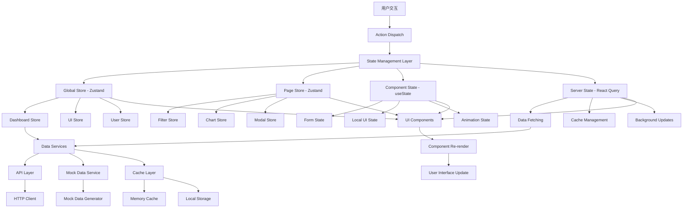
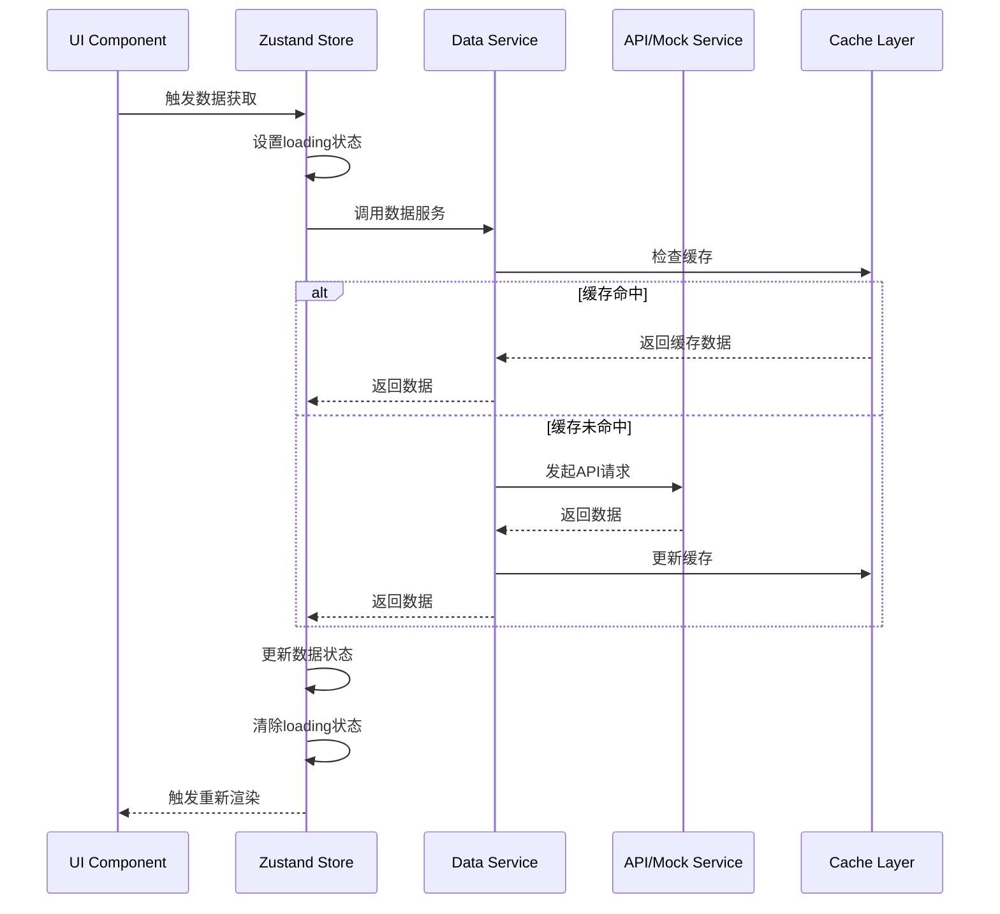
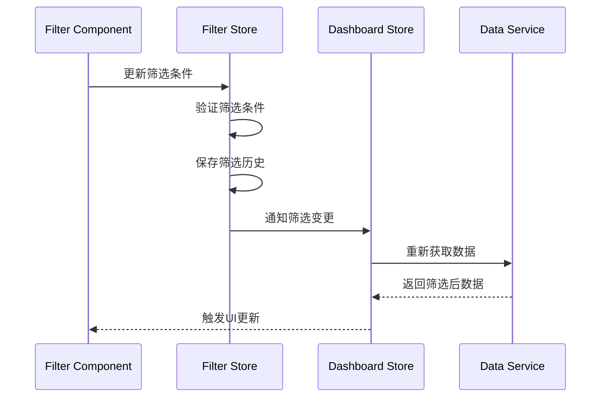
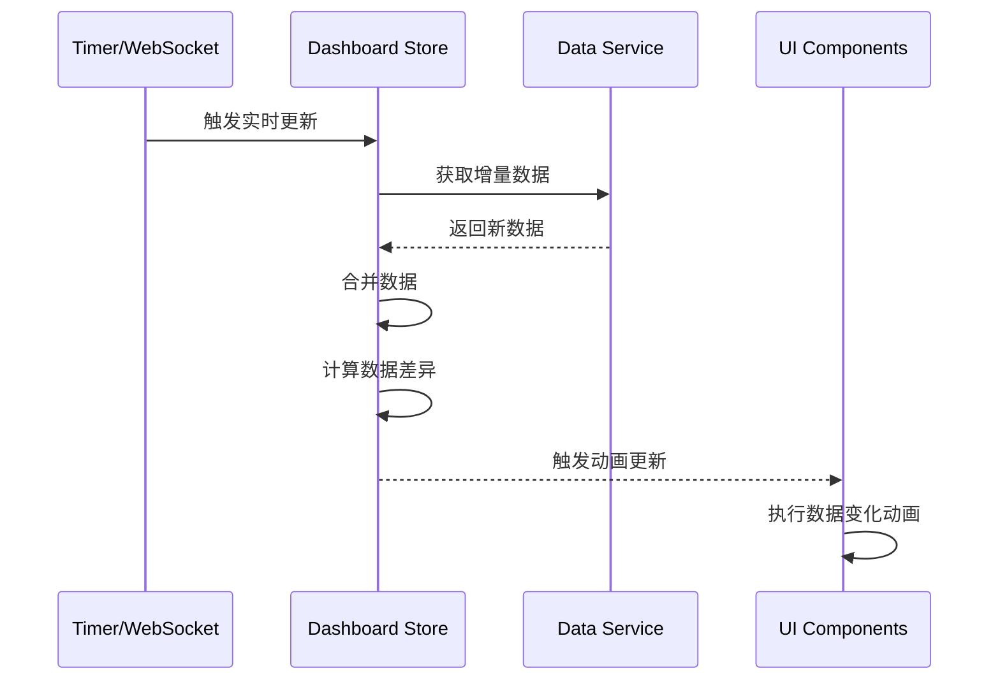

# 状态管理和数据流架构设计

## 架构设计原则

### 1. 状态管理原则
- **单一数据源**: 每个状态都有唯一的数据源
- **状态不可变**: 通过不可变更新保证状态一致性
- **最小化状态**: 只存储必要的状态，其他通过计算得出
- **状态分层**: 全局状态、页面状态、组件状态分层管理

### 2. 数据流设计原则
- **单向数据流**: 数据从上到下流动，事件从下到上传递
- **响应式更新**: 状态变化自动触发UI更新
- **异步处理**: 统一的异步操作处理机制
- **错误隔离**: 错误不影响其他状态的正常运行

## 状态管理架构图



## 全局状态设计

### 1. Dashboard Store (仪表板核心状态)
```typescript
interface DashboardState {
  // 数据状态
  data: DashboardData | null;
  loading: boolean;
  error: string | null;
  lastUpdateTime: Date | null;
  
  // 筛选状态
  filters: FilterState;
  
  // UI状态
  sidebarCollapsed: boolean;
  currentView: 'dashboard' | 'components';
  
  // 实时更新状态
  isRealTimeEnabled: boolean;
  realTimeInterval: number;
}

interface DashboardActions {
  // 数据操作
  fetchData: () => Promise<void>;
  refreshData: () => Promise<void>;
  setData: (data: DashboardData) => void;
  setLoading: (loading: boolean) => void;
  setError: (error: string | null) => void;
  
  // 筛选操作
  setFilters: (filters: Partial<FilterState>) => void;
  resetFilters: () => void;
  
  // UI操作
  toggleSidebar: () => void;
  setCurrentView: (view: 'dashboard' | 'components') => void;
  
  // 实时更新操作
  enableRealTime: () => void;
  disableRealTime: () => void;
  setRealTimeInterval: (interval: number) => void;
}

type DashboardStore = DashboardState & DashboardActions;
```

### 2. UI Store (全局UI状态)
```typescript
interface UIState {
  // 主题状态
  theme: 'dark' | 'light';
  
  // 布局状态
  layout: 'default' | 'compact' | 'wide';
  
  // 通知状态
  notifications: Notification[];
  
  // 模态框状态
  modals: ModalState[];
  
  // 加载状态
  globalLoading: boolean;
  
  // 网络状态
  isOnline: boolean;
}

interface UIActions {
  // 主题操作
  setTheme: (theme: 'dark' | 'light') => void;
  toggleTheme: () => void;
  
  // 布局操作
  setLayout: (layout: 'default' | 'compact' | 'wide') => void;
  
  // 通知操作
  addNotification: (notification: Omit<Notification, 'id'>) => void;
  removeNotification: (id: string) => void;
  clearNotifications: () => void;
  
  // 模态框操作
  openModal: (modal: Omit<ModalState, 'id'>) => void;
  closeModal: (id: string) => void;
  closeAllModals: () => void;
  
  // 加载状态操作
  setGlobalLoading: (loading: boolean) => void;
  
  // 网络状态操作
  setOnlineStatus: (isOnline: boolean) => void;
}

type UIStore = UIState & UIActions;
```

### 3. User Store (用户状态)
```typescript
interface UserState {
  // 用户信息
  user: User | null;
  isAuthenticated: boolean;
  
  // 权限信息
  permissions: Permission[];
  roles: Role[];
  
  // 用户偏好
  preferences: UserPreferences;
  
  // 会话状态
  sessionExpiry: Date | null;
}

interface UserActions {
  // 认证操作
  login: (credentials: LoginCredentials) => Promise<void>;
  logout: () => void;
  refreshToken: () => Promise<void>;
  
  // 用户信息操作
  updateUser: (user: Partial<User>) => void;
  updatePreferences: (preferences: Partial<UserPreferences>) => void;
  
  // 权限操作
  checkPermission: (permission: string) => boolean;
  hasRole: (role: string) => boolean;
}

type UserStore = UserState & UserActions;
```

## 页面级状态设计

### 1. Filter Store (筛选状态)
```typescript
interface FilterState {
  // 时间筛选
  timeRange: TimeRange;
  customDateRange: {
    startDate: Date | null;
    endDate: Date | null;
  };
  
  // 地域筛选
  selectedRegions: {
    provinces: string[];
    cities: string[];
    districts: string[];
  };
  
  // 角色筛选
  selectedRoles: RoleType[];
  
  // 分红轮次筛选
  selectedRounds: number[];
  
  // 高级筛选
  advancedFilters: {
    minRevenue?: number;
    maxRevenue?: number;
    storeTypes?: string[];
    userLevels?: string[];
  };
  
  // 筛选历史
  filterHistory: FilterState[];
  
  // 快速筛选预设
  quickFilters: QuickFilter[];
}

interface FilterActions {
  // 基础筛选操作
  setTimeRange: (range: TimeRange) => void;
  setCustomDateRange: (startDate: Date | null, endDate: Date | null) => void;
  setSelectedRegions: (regions: Partial<FilterState['selectedRegions']>) => void;
  setSelectedRoles: (roles: RoleType[]) => void;
  setSelectedRounds: (rounds: number[]) => void;
  
  // 高级筛选操作
  setAdvancedFilters: (filters: Partial<FilterState['advancedFilters']>) => void;
  
  // 筛选历史操作
  saveCurrentFilter: () => void;
  loadFilterFromHistory: (index: number) => void;
  clearFilterHistory: () => void;
  
  // 快速筛选操作
  applyQuickFilter: (filterId: string) => void;
  saveAsQuickFilter: (name: string) => void;
  deleteQuickFilter: (filterId: string) => void;
  
  // 重置操作
  resetFilters: () => void;
  resetToDefault: () => void;
}

type FilterStore = FilterState & FilterActions;
```

### 2. Chart Store (图表状态)
```typescript
interface ChartState {
  // 图表实例管理
  chartInstances: Map<string, EChartsInstance>;
  
  // 图表配置
  chartConfigs: Map<string, ChartConfig>;
  
  // 图表数据缓存
  chartDataCache: Map<string, ChartDataCache>;
  
  // 图表交互状态
  activeChart: string | null;
  selectedDataPoints: Map<string, any[]>;
  
  // 图表主题
  chartTheme: ChartTheme;
  
  // 图表性能监控
  performanceMetrics: Map<string, ChartPerformanceMetrics>;
}

interface ChartActions {
  // 图表实例管理
  registerChart: (chartId: string, instance: EChartsInstance) => void;
  unregisterChart: (chartId: string) => void;
  getChartInstance: (chartId: string) => EChartsInstance | null;
  
  // 图表配置管理
  setChartConfig: (chartId: string, config: ChartConfig) => void;
  updateChartConfig: (chartId: string, config: Partial<ChartConfig>) => void;
  
  // 图表数据管理
  setChartData: (chartId: string, data: any[], cacheKey?: string) => void;
  invalidateChartCache: (chartId: string) => void;
  
  // 图表交互管理
  setActiveChart: (chartId: string | null) => void;
  selectDataPoints: (chartId: string, dataPoints: any[]) => void;
  clearSelection: (chartId: string) => void;
  
  // 图表主题管理
  setChartTheme: (theme: ChartTheme) => void;
  
  // 性能监控
  recordPerformanceMetric: (chartId: string, metric: ChartPerformanceMetrics) => void;
}

type ChartStore = ChartState & ChartActions;
```

## 数据流设计

### 1. 数据获取流程


### 2. 筛选器数据流


### 3. 实时数据更新流程


## 状态持久化策略

### 1. 本地存储策略
```typescript
// 持久化配置
const persistConfig = {
  // 用户偏好持久化
  userPreferences: {
    storage: localStorage,
    key: 'dashboard-user-preferences',
    whitelist: ['theme', 'layout', 'language']
  },
  
  // 筛选状态持久化
  filterState: {
    storage: sessionStorage,
    key: 'dashboard-filters',
    whitelist: ['timeRange', 'selectedRegions', 'quickFilters']
  },
  
  // 图表配置持久化
  chartConfigs: {
    storage: localStorage,
    key: 'dashboard-chart-configs',
    whitelist: ['chartTheme', 'chartConfigs']
  }
};

// 持久化中间件
const createPersistMiddleware = <T>(config: PersistConfig) => 
  (set: SetState<T>, get: GetState<T>) => {
    // 从存储加载初始状态
    const loadPersistedState = () => {
      try {
        const stored = config.storage.getItem(config.key);
        if (stored) {
          const parsed = JSON.parse(stored);
          return pick(parsed, config.whitelist);
        }
      } catch (error) {
        console.warn('Failed to load persisted state:', error);
      }
      return {};
    };
    
    // 保存状态到存储
    const saveState = (state: T) => {
      try {
        const toSave = pick(state, config.whitelist);
        config.storage.setItem(config.key, JSON.stringify(toSave));
      } catch (error) {
        console.warn('Failed to save state:', error);
      }
    };
    
    return {
      ...loadPersistedState(),
      _persist: {
        save: () => saveState(get()),
        clear: () => config.storage.removeItem(config.key)
      }
    };
  };
```

### 2. 缓存策略
```typescript
// 多层缓存架构
interface CacheLayer {
  memory: MemoryCache;
  localStorage: LocalStorageCache;
  sessionStorage: SessionStorageCache;
}

// 缓存配置
const cacheConfig = {
  // 内存缓存 - 最快访问
  memory: {
    maxSize: 50, // 最大缓存项数
    ttl: 5 * 60 * 1000, // 5分钟过期
    strategy: 'LRU' // 最近最少使用淘汰
  },
  
  // 本地存储缓存 - 持久化
  localStorage: {
    maxSize: 100,
    ttl: 24 * 60 * 60 * 1000, // 24小时过期
    keyPrefix: 'dashboard-cache-'
  },
  
  // 会话存储缓存 - 会话级别
  sessionStorage: {
    maxSize: 200,
    ttl: 60 * 60 * 1000, // 1小时过期
    keyPrefix: 'dashboard-session-'
  }
};

// 智能缓存策略
class SmartCache {
  private layers: CacheLayer;
  
  async get<T>(key: string): Promise<T | null> {
    // 1. 先查内存缓存
    let result = await this.layers.memory.get<T>(key);
    if (result) return result;
    
    // 2. 查会话存储缓存
    result = await this.layers.sessionStorage.get<T>(key);
    if (result) {
      // 回填到内存缓存
      await this.layers.memory.set(key, result);
      return result;
    }
    
    // 3. 查本地存储缓存
    result = await this.layers.localStorage.get<T>(key);
    if (result) {
      // 回填到上层缓存
      await this.layers.sessionStorage.set(key, result);
      await this.layers.memory.set(key, result);
      return result;
    }
    
    return null;
  }
  
  async set<T>(key: string, value: T, options?: CacheOptions): Promise<void> {
    // 根据数据类型和重要性选择缓存层级
    if (options?.persistent) {
      await this.layers.localStorage.set(key, value, options);
    }
    
    if (options?.session !== false) {
      await this.layers.sessionStorage.set(key, value, options);
    }
    
    await this.layers.memory.set(key, value, options);
  }
}
```

## 错误处理和重试机制

### 1. 错误状态管理
```typescript
interface ErrorState {
  // 全局错误
  globalError: AppError | null;
  
  // 组件级错误
  componentErrors: Map<string, ComponentError>;
  
  // 网络错误
  networkErrors: NetworkError[];
  
  // 数据错误
  dataErrors: Map<string, DataError>;
}

interface ErrorActions {
  // 错误设置
  setGlobalError: (error: AppError | null) => void;
  setComponentError: (componentId: string, error: ComponentError | null) => void;
  addNetworkError: (error: NetworkError) => void;
  setDataError: (dataKey: string, error: DataError | null) => void;
  
  // 错误清理
  clearAllErrors: () => void;
  clearComponentErrors: () => void;
  clearNetworkErrors: () => void;
  clearDataErrors: () => void;
  
  // 错误重试
  retryFailedOperation: (operationId: string) => Promise<void>;
  retryAllFailedOperations: () => Promise<void>;
}
```

### 2. 重试机制
```typescript
// 重试配置
interface RetryConfig {
  maxAttempts: number;
  baseDelay: number;
  maxDelay: number;
  backoffFactor: number;
  retryCondition: (error: any) => boolean;
}

// 智能重试策略
class RetryManager {
  private retryConfigs: Map<string, RetryConfig> = new Map();
  private activeRetries: Map<string, RetryState> = new Map();
  
  async executeWithRetry<T>(
    operationId: string,
    operation: () => Promise<T>,
    config?: Partial<RetryConfig>
  ): Promise<T> {
    const finalConfig = {
      maxAttempts: 3,
      baseDelay: 1000,
      maxDelay: 10000,
      backoffFactor: 2,
      retryCondition: (error: any) => error.status >= 500,
      ...config
    };
    
    let lastError: any;
    
    for (let attempt = 1; attempt <= finalConfig.maxAttempts; attempt++) {
      try {
        const result = await operation();
        this.activeRetries.delete(operationId);
        return result;
      } catch (error) {
        lastError = error;
        
        // 检查是否应该重试
        if (attempt === finalConfig.maxAttempts || !finalConfig.retryCondition(error)) {
          this.activeRetries.delete(operationId);
          throw error;
        }
        
        // 计算延迟时间
        const delay = Math.min(
          finalConfig.baseDelay * Math.pow(finalConfig.backoffFactor, attempt - 1),
          finalConfig.maxDelay
        );
        
        // 记录重试状态
        this.activeRetries.set(operationId, {
          attempt,
          maxAttempts: finalConfig.maxAttempts,
          nextRetryAt: Date.now() + delay,
          lastError: error
        });
        
        // 等待重试
        await new Promise(resolve => setTimeout(resolve, delay));
      }
    }
    
    throw lastError;
  }
}
```

## 性能优化策略

### 1. 状态更新优化
```typescript
// 批量更新
const useBatchedUpdates = () => {
  const [pendingUpdates, setPendingUpdates] = useState<Array<() => void>>([]);
  
  const batchUpdate = useCallback((updateFn: () => void) => {
    setPendingUpdates(prev => [...prev, updateFn]);
  }, []);
  
  useEffect(() => {
    if (pendingUpdates.length > 0) {
      const timeoutId = setTimeout(() => {
        unstable_batchedUpdates(() => {
          pendingUpdates.forEach(updateFn => updateFn());
        });
        setPendingUpdates([]);
      }, 0);
      
      return () => clearTimeout(timeoutId);
    }
  }, [pendingUpdates]);
  
  return batchUpdate;
};

// 选择性订阅
const useSelectiveSubscription = <T, R>(
  store: UseBoundStore<StoreApi<T>>,
  selector: (state: T) => R,
  equalityFn?: (a: R, b: R) => boolean
) => {
  return store(selector, equalityFn || shallow);
};
```

### 2. 内存管理
```typescript
// 内存泄漏防护
const useMemoryLeakProtection = () => {
  const subscriptions = useRef<Array<() => void>>([]);
  const timers = useRef<Array<NodeJS.Timeout>>([]);
  
  const addSubscription = useCallback((unsubscribe: () => void) => {
    subscriptions.current.push(unsubscribe);
  }, []);
  
  const addTimer = useCallback((timer: NodeJS.Timeout) => {
    timers.current.push(timer);
  }, []);
  
  useEffect(() => {
    return () => {
      // 清理订阅
      subscriptions.current.forEach(unsubscribe => unsubscribe());
      subscriptions.current = [];
      
      // 清理定时器
      timers.current.forEach(timer => clearTimeout(timer));
      timers.current = [];
    };
  }, []);
  
  return { addSubscription, addTimer };
};
```

## 开发工具集成

### 1. Redux DevTools集成
```typescript
// Zustand DevTools集成
const createDevToolsStore = <T>(
  name: string,
  storeCreator: StateCreator<T>
) => {
  return create<T>()(
    devtools(
      storeCreator,
      {
        name,
        serialize: {
          options: {
            undefined: true,
            function: true,
            symbol: true
          }
        }
      }
    )
  );
};
```

### 2. 状态调试工具
```typescript
// 状态变化监控
const useStateMonitor = <T>(store: UseBoundStore<StoreApi<T>>, storeName: string) => {
  useEffect(() => {
    if (process.env.NODE_ENV === 'development') {
      const unsubscribe = store.subscribe((state, prevState) => {
        console.group(`🔄 ${storeName} State Change`);
        console.log('Previous:', prevState);
        console.log('Current:', state);
        console.log('Diff:', diff(prevState, state));
        console.groupEnd();
      });
      
      return unsubscribe;
    }
  }, [store, storeName]);
};
```

## 总结

状态管理和数据流架构设计的核心特点：

### 设计优势
1. **分层状态管理**: 全局、页面、组件三层状态清晰分离
2. **高性能**: 选择性订阅、批量更新、智能缓存
3. **可靠性**: 完善的错误处理和重试机制
4. **可维护性**: 清晰的数据流向和状态结构
5. **开发体验**: 完整的调试工具和开发支持

### 技术选型理由
1. **Zustand**: 轻量级、类型安全、易于使用
2. **多层缓存**: 内存、会话、本地存储三层缓存策略
3. **智能重试**: 指数退避算法和条件重试
4. **状态持久化**: 选择性持久化用户偏好和重要状态

### 实施建议
1. **渐进式迁移**: 从核心状态开始，逐步完善
2. **性能监控**: 建立状态更新性能监控机制
3. **错误监控**: 完善错误收集和分析系统
4. **文档完善**: 为每个Store编写详细的使用文档

这个状态管理架构为React Dashboard提供了高性能、可靠、易维护的状态管理解决方案。