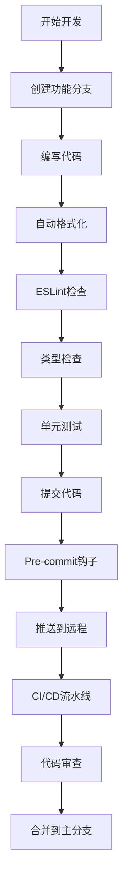

# 开发环境配置优化

## 当前环境分析

### 1. 现有配置评估

#### 优势
- **现代化技术栈**: React 19, TypeScript 5.8, Vite 7, ESLint 9
- **完整的测试环境**: Vitest + Testing Library + jsdom
- **类型安全**: 严格的TypeScript配置
- **代码质量**: ESLint + React Hooks规则
- **构建工具**: Vite提供快速的开发和构建体验

#### 需要优化的方面
- **路径别名不完整**: 只有`@/*`别名，缺少功能模块别名
- **ESLint规则不够完善**: 缺少代码风格和最佳实践规则
- **缺少代码格式化**: 没有Prettier配置
- **缺少Git钩子**: 没有pre-commit检查
- **缺少环境变量管理**: 没有.env配置
- **缺少性能监控**: 没有bundle分析工具
- **缺少开发工具**: 没有Storybook等组件开发工具

## 优化方案

### 1. Vite配置优化

#### 增强的vite.config.ts
```typescript
/// <reference types="vitest" />
import { defineConfig, loadEnv } from 'vite'
import react from '@vitejs/plugin-react'
import { resolve } from 'path'

// https://vite.dev/config/
export default defineConfig(({ command, mode }) => {
  // 加载环境变量
  const env = loadEnv(mode, process.cwd(), '')
  
  return {
    plugins: [
      react({
        // 启用React DevTools
        jsxImportSource: '@emotion/react',
        babel: {
          plugins: [
            // 开发环境启用React DevTools
            ...(command === 'serve' ? [['@babel/plugin-transform-react-jsx-development']] : [])
          ]
        }
      })
    ],
    
    // 路径别名优化
    resolve: {
      alias: {
        '@': resolve(__dirname, './src'),
        '@components': resolve(__dirname, './src/components'),
        '@pages': resolve(__dirname, './src/pages'),
        '@features': resolve(__dirname, './src/features'),
        '@shared': resolve(__dirname, './src/shared'),
        '@assets': resolve(__dirname, './src/assets'),
        '@styles': resolve(__dirname, './src/styles'),
        '@utils': resolve(__dirname, './src/utils'),
        '@hooks': resolve(__dirname, './src/hooks'),
        '@services': resolve(__dirname, './src/services'),
        '@stores': resolve(__dirname, './src/stores'),
        '@types': resolve(__dirname, './src/types'),
        '@constants': resolve(__dirname, './src/constants'),
      },
    },
    
    // 开发服务器配置
    server: {
      port: 3000,
      host: true, // 允许外部访问
      open: true, // 自动打开浏览器
      cors: true,
      // 代理配置（如果需要）
      proxy: {
        '/api': {
          target: env.VITE_API_BASE_URL || 'http://localhost:8080',
          changeOrigin: true,
          rewrite: (path) => path.replace(/^\/api/, '')
        }
      }
    },
    
    // 构建优化
    build: {
      target: 'esnext',
      minify: 'esbuild',
      sourcemap: command === 'serve',
      rollupOptions: {
        output: {
          // 代码分割策略
          manualChunks: {
            vendor: ['react', 'react-dom'],
            ui: ['@radix-ui/react-select', '@radix-ui/react-slot'],
            charts: ['echarts', 'echarts-for-react'],
            utils: ['clsx', 'tailwind-merge', 'dayjs'],
            animation: ['framer-motion'],
            state: ['zustand']
          }
        }
      },
      // 构建分析
      reportCompressedSize: true,
      chunkSizeWarningLimit: 1000
    },
    
    // 预构建优化
    optimizeDeps: {
      include: [
        'react',
        'react-dom',
        'echarts',
        'echarts-for-react',
        'framer-motion',
        'zustand',
        'dayjs'
      ]
    },
    
    // 测试配置
    test: {
      globals: true,
      environment: 'jsdom',
      setupFiles: ['./src/test/setup.ts'],
      css: true,
      coverage: {
        provider: 'v8',
        reporter: ['text', 'json', 'html'],
        exclude: [
          'node_modules/',
          'src/test/',
          '**/*.d.ts',
          '**/*.config.*',
          '**/dist/**'
        ]
      }
    },
    
    // 环境变量
    define: {
      __APP_VERSION__: JSON.stringify(process.env.npm_package_version),
      __BUILD_TIME__: JSON.stringify(new Date().toISOString()),
    }
  }
})
```

### 2. TypeScript配置优化

#### 增强的tsconfig.app.json
```json
{
  "compilerOptions": {
    "target": "ES2022",
    "useDefineForClassFields": true,
    "lib": ["ES2022", "DOM", "DOM.Iterable"],
    "module": "ESNext",
    "skipLibCheck": true,

    /* Bundler mode */
    "moduleResolution": "bundler",
    "allowImportingTsExtensions": true,
    "verbatimModuleSyntax": true,
    "moduleDetection": "force",
    "noEmit": true,
    "jsx": "react-jsx",

    /* Linting */
    "strict": true,
    "noUnusedLocals": true,
    "noUnusedParameters": true,
    "noFallthroughCasesInSwitch": true,
    "noImplicitReturns": true,
    "noUncheckedIndexedAccess": true,
    "exactOptionalPropertyTypes": true,

    /* Path mapping */
    "baseUrl": ".",
    "paths": {
      "@/*": ["./src/*"],
      "@components/*": ["./src/components/*"],
      "@pages/*": ["./src/pages/*"],
      "@features/*": ["./src/features/*"],
      "@shared/*": ["./src/shared/*"],
      "@assets/*": ["./src/assets/*"],
      "@styles/*": ["./src/styles/*"],
      "@utils/*": ["./src/utils/*"],
      "@hooks/*": ["./src/hooks/*"],
      "@services/*": ["./src/services/*"],
      "@stores/*": ["./src/stores/*"],
      "@types/*": ["./src/types/*"],
      "@constants/*": ["./src/constants/*"]
    },

    /* 类型检查增强 */
    "allowUnreachableCode": false,
    "allowUnusedLabels": false,
    "noImplicitOverride": true,
    "noPropertyAccessFromIndexSignature": true,
    "noUncheckedSideEffectImports": true
  },
  "include": [
    "src",
    "**/*.ts",
    "**/*.tsx"
  ],
  "exclude": [
    "node_modules",
    "dist",
    "**/*.test.ts",
    "**/*.test.tsx",
    "**/*.spec.ts",
    "**/*.spec.tsx"
  ]
}
```

### 3. ESLint配置优化

#### 增强的eslint.config.js
```javascript
import js from '@eslint/js'
import globals from 'globals'
import reactHooks from 'eslint-plugin-react-hooks'
import reactRefresh from 'eslint-plugin-react-refresh'
import tseslint from 'typescript-eslint'
import react from 'eslint-plugin-react'
import jsxA11y from 'eslint-plugin-jsx-a11y'
import importPlugin from 'eslint-plugin-import'

export default tseslint.config([
  // 全局忽略
  {
    ignores: [
      'dist/**',
      'build/**',
      'node_modules/**',
      '*.config.js',
      '*.config.ts',
      'coverage/**'
    ]
  },
  
  // 基础配置
  {
    files: ['**/*.{ts,tsx,js,jsx}'],
    extends: [
      js.configs.recommended,
      ...tseslint.configs.recommended,
      ...tseslint.configs.recommendedTypeChecked,
    ],
    languageOptions: {
      ecmaVersion: 2022,
      globals: {
        ...globals.browser,
        ...globals.es2022
      },
      parserOptions: {
        project: ['./tsconfig.app.json', './tsconfig.node.json'],
        tsconfigRootDir: import.meta.dirname,
      }
    },
    plugins: {
      'react-hooks': reactHooks,
      'react-refresh': reactRefresh,
      'react': react,
      'jsx-a11y': jsxA11y,
      'import': importPlugin
    },
    rules: {
      // React规则
      ...reactHooks.configs.recommended.rules,
      'react-refresh/only-export-components': [
        'warn',
        { allowConstantExport: true }
      ],
      'react/jsx-uses-react': 'off',
      'react/react-in-jsx-scope': 'off',
      'react/jsx-uses-vars': 'error',
      'react/jsx-no-undef': 'error',
      'react/jsx-fragments': ['error', 'syntax'],
      'react/jsx-boolean-value': ['error', 'never'],
      'react/jsx-curly-brace-presence': ['error', 'never'],
      'react/self-closing-comp': 'error',
      'react/jsx-sort-props': ['error', {
        'callbacksLast': true,
        'shorthandFirst': true,
        'reservedFirst': true
      }],

      // 可访问性规则
      ...jsxA11y.configs.recommended.rules,

      // TypeScript规则
      '@typescript-eslint/no-unused-vars': ['error', { 
        'argsIgnorePattern': '^_',
        'varsIgnorePattern': '^_'
      }],
      '@typescript-eslint/no-explicit-any': 'warn',
      '@typescript-eslint/prefer-const': 'error',
      '@typescript-eslint/no-inferrable-types': 'error',
      '@typescript-eslint/consistent-type-imports': ['error', {
        'prefer': 'type-imports',
        'disallowTypeAnnotations': false
      }],
      '@typescript-eslint/consistent-type-definitions': ['error', 'interface'],

      // 导入规则
      'import/order': ['error', {
        'groups': [
          'builtin',
          'external',
          'internal',
          'parent',
          'sibling',
          'index'
        ],
        'pathGroups': [
          {
            'pattern': 'react',
            'group': 'external',
            'position': 'before'
          },
          {
            'pattern': '@/**',
            'group': 'internal'
          }
        ],
        'pathGroupsExcludedImportTypes': ['react'],
        'newlines-between': 'always',
        'alphabetize': {
          'order': 'asc',
          'caseInsensitive': true
        }
      }],
      'import/no-duplicates': 'error',
      'import/no-unused-modules': 'error',

      // 代码质量规则
      'prefer-const': 'error',
      'no-var': 'error',
      'no-console': ['warn', { 'allow': ['warn', 'error'] }],
      'no-debugger': 'error',
      'no-alert': 'error',
      'eqeqeq': ['error', 'always'],
      'curly': ['error', 'all'],
      'brace-style': ['error', '1tbs'],
      'comma-dangle': ['error', 'always-multiline'],
      'semi': ['error', 'always'],
      'quotes': ['error', 'single', { 'avoidEscape': true }],
      'object-curly-spacing': ['error', 'always'],
      'array-bracket-spacing': ['error', 'never'],
      'indent': ['error', 2, { 'SwitchCase': 1 }],
      'max-len': ['error', { 
        'code': 100,
        'ignoreUrls': true,
        'ignoreStrings': true,
        'ignoreTemplateLiterals': true
      }]
    },
    settings: {
      react: {
        version: 'detect'
      },
      'import/resolver': {
        typescript: {
          alwaysTryTypes: true,
          project: './tsconfig.app.json'
        }
      }
    }
  },

  // 测试文件特殊配置
  {
    files: ['**/*.test.{ts,tsx}', '**/*.spec.{ts,tsx}'],
    rules: {
      '@typescript-eslint/no-explicit-any': 'off',
      'no-console': 'off'
    }
  }
])
```

### 4. Prettier配置

#### .prettierrc.json
```json
{
  "semi": true,
  "trailingComma": "es5",
  "singleQuote": true,
  "printWidth": 100,
  "tabWidth": 2,
  "useTabs": false,
  "bracketSpacing": true,
  "bracketSameLine": false,
  "arrowParens": "avoid",
  "endOfLine": "lf",
  "quoteProps": "as-needed",
  "jsxSingleQuote": true,
  "plugins": ["prettier-plugin-tailwindcss"]
}
```

#### .prettierignore
```
# 构建输出
dist/
build/
coverage/

# 依赖
node_modules/

# 配置文件
*.config.js
*.config.ts

# 自动生成的文件
*.d.ts

# 日志文件
*.log

# 环境变量文件
.env*

# 其他
.DS_Store
```

### 5. 环境变量配置

#### .env.example
```bash
# 应用配置
VITE_APP_TITLE=React Dashboard
VITE_APP_VERSION=1.0.0
VITE_APP_DESCRIPTION=Modern React Dashboard

# API配置
VITE_API_BASE_URL=http://localhost:8080
VITE_API_TIMEOUT=10000

# 功能开关
VITE_ENABLE_MOCK=true
VITE_ENABLE_DEVTOOLS=true
VITE_ENABLE_ANALYTICS=false

# 主题配置
VITE_DEFAULT_THEME=dark
VITE_ENABLE_THEME_SWITCH=true

# 性能配置
VITE_ENABLE_PERFORMANCE_MONITORING=true
VITE_BUNDLE_ANALYZER=false

# 开发配置
VITE_DEV_PORT=3000
VITE_DEV_HOST=localhost
VITE_DEV_OPEN=true
```

#### .env.development
```bash
# 开发环境配置
NODE_ENV=development
VITE_APP_ENV=development

# API配置
VITE_API_BASE_URL=http://localhost:8080
VITE_ENABLE_MOCK=true

# 开发工具
VITE_ENABLE_DEVTOOLS=true
VITE_ENABLE_PERFORMANCE_MONITORING=true

# 调试配置
VITE_DEBUG_MODE=true
VITE_LOG_LEVEL=debug
```

#### .env.production
```bash
# 生产环境配置
NODE_ENV=production
VITE_APP_ENV=production

# API配置
VITE_API_BASE_URL=https://api.yourdomain.com
VITE_ENABLE_MOCK=false

# 生产优化
VITE_ENABLE_DEVTOOLS=false
VITE_ENABLE_PERFORMANCE_MONITORING=false

# 安全配置
VITE_DEBUG_MODE=false
VITE_LOG_LEVEL=error
```

### 6. Git钩子配置

#### .husky/pre-commit
```bash
#!/usr/bin/env sh
. "$(dirname -- "$0")/_/husky.sh"

# 运行lint-staged
npx lint-staged

# 运行类型检查
npm run type-check

# 运行测试
npm run test:run
```

#### .husky/commit-msg
```bash
#!/usr/bin/env sh
. "$(dirname -- "$0")/_/husky.sh"

# 验证提交信息格式
npx commitlint --edit $1
```

#### lint-staged配置 (package.json)
```json
{
  "lint-staged": {
    "*.{ts,tsx}": [
      "eslint --fix",
      "prettier --write",
      "git add"
    ],
    "*.{js,jsx}": [
      "eslint --fix",
      "prettier --write",
      "git add"
    ],
    "*.{json,md,yml,yaml}": [
      "prettier --write",
      "git add"
    ],
    "*.{css,scss,less}": [
      "prettier --write",
      "git add"
    ]
  }
}
```

### 7. 提交信息规范

#### commitlint.config.js
```javascript
export default {
  extends: ['@commitlint/config-conventional'],
  rules: {
    'type-enum': [
      2,
      'always',
      [
        'feat',     // 新功能
        'fix',      // 修复bug
        'docs',     // 文档更新
        'style',    // 代码格式化
        'refactor', // 重构
        'perf',     // 性能优化
        'test',     // 测试相关
        'chore',    // 构建过程或辅助工具的变动
        'ci',       // CI配置文件和脚本的变动
        'build',    // 构建系统或外部依赖的变动
        'revert'    // 回滚
      ]
    ],
    'type-case': [2, 'always', 'lower-case'],
    'type-empty': [2, 'never'],
    'scope-case': [2, 'always', 'lower-case'],
    'subject-case': [2, 'never', ['sentence-case', 'start-case', 'pascal-case', 'upper-case']],
    'subject-empty': [2, 'never'],
    'subject-full-stop': [2, 'never', '.'],
    'header-max-length': [2, 'always', 100]
  }
};
```

### 8. 开发工具集成

#### VS Code配置 (.vscode/settings.json)
```json
{
  "typescript.preferences.importModuleSpecifier": "relative",
  "typescript.suggest.autoImports": true,
  "typescript.updateImportsOnFileMove.enabled": "always",
  
  "editor.formatOnSave": true,
  "editor.defaultFormatter": "esbenp.prettier-vscode",
  "editor.codeActionsOnSave": {
    "source.fixAll.eslint": "explicit",
    "source.organizeImports": "explicit"
  },
  
  "files.associations": {
    "*.css": "tailwindcss"
  },
  
  "tailwindCSS.includeLanguages": {
    "typescript": "javascript",
    "typescriptreact": "javascript"
  },
  
  "emmet.includeLanguages": {
    "typescript": "html",
    "typescriptreact": "html"
  },
  
  "search.exclude": {
    "**/node_modules": true,
    "**/dist": true,
    "**/coverage": true,
    "**/.git": true
  }
}
```

#### VS Code扩展推荐 (.vscode/extensions.json)
```json
{
  "recommendations": [
    "esbenp.prettier-vscode",
    "dbaeumer.vscode-eslint",
    "bradlc.vscode-tailwindcss",
    "ms-vscode.vscode-typescript-next",
    "formulahendry.auto-rename-tag",
    "christian-kohler.path-intellisense",
    "ms-vscode.vscode-json",
    "usernamehw.errorlens",
    "gruntfuggly.todo-tree",
    "ms-vscode.vscode-jest",
    "github.copilot"
  ]
}
```

### 9. 性能监控和分析

#### Bundle分析配置
```typescript
// vite.config.ts 中添加
import { defineConfig } from 'vite'
import { visualizer } from 'rollup-plugin-visualizer'

export default defineConfig({
  plugins: [
    // ... 其他插件
    process.env.ANALYZE && visualizer({
      filename: 'dist/stats.html',
      open: true,
      gzipSize: true,
      brotliSize: true
    })
  ]
})
```

#### package.json脚本增强
```json
{
  "scripts": {
    "dev": "vite",
    "build": "tsc -b && vite build",
    "build:analyze": "ANALYZE=true npm run build",
    "preview": "vite preview",
    "lint": "eslint . --ext ts,tsx --report-unused-disable-directives --max-warnings 0",
    "lint:fix": "eslint . --ext ts,tsx --fix",
    "format": "prettier --write \"src/**/*.{ts,tsx,js,jsx,json,css,md}\"",
    "format:check": "prettier --check \"src/**/*.{ts,tsx,js,jsx,json,css,md}\"",
    "type-check": "tsc --noEmit",
    "test": "vitest",
    "test:ui": "vitest --ui",
    "test:run": "vitest run",
    "test:coverage": "vitest run --coverage",
    "prepare": "husky install",
    "clean": "rm -rf dist coverage",
    "deps:update": "npm update",
    "deps:check": "npm outdated"
  }
}
```

## 开发工作流优化

### 1. 开发流程


### 2. 代码质量保证
- **静态分析**: ESLint + TypeScript
- **代码格式化**: Prettier
- **提交规范**: Commitlint + Husky
- **测试覆盖**: Vitest + Coverage
- **类型安全**: 严格的TypeScript配置

### 3. 性能监控
- **构建分析**: Bundle Analyzer
- **运行时监控**: Performance API
- **代码分割**: 自动和手动分割策略
- **缓存优化**: 浏览器和构建缓存

## 实施建议

### 1. 渐进式升级
1. **第一阶段**: 基础配置优化（ESLint, Prettier, 环境变量）
2. **第二阶段**: 开发工具集成（VS Code, Git钩子）
3. **第三阶段**: 性能监控和分析工具
4. **第四阶段**: 高级开发工具（Storybook, 自动化测试）

### 2. 团队协作
- **统一开发环境**: 通过配置文件确保一致性
- **代码规范**: 自动化的代码检查和格式化
- **文档完善**: 详细的开发指南和最佳实践
- **知识分享**: 定期的技术分享和代码审查

### 3. 持续改进
- **定期评估**: 开发效率和代码质量指标
- **工具更新**: 跟进最新的开发工具和最佳实践
- **反馈收集**: 开发者体验和痛点收集
- **优化迭代**: 基于反馈持续优化开发环境

这个开发环境优化方案将显著提升开发效率、代码质量和团队协作体验，为React Dashboard项目的成功实施提供坚实的基础。