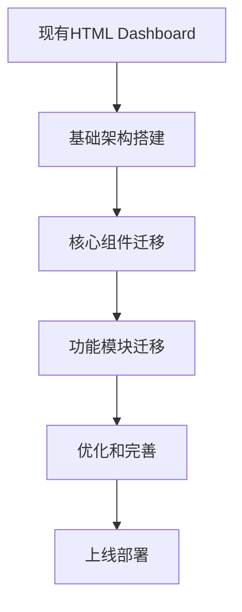
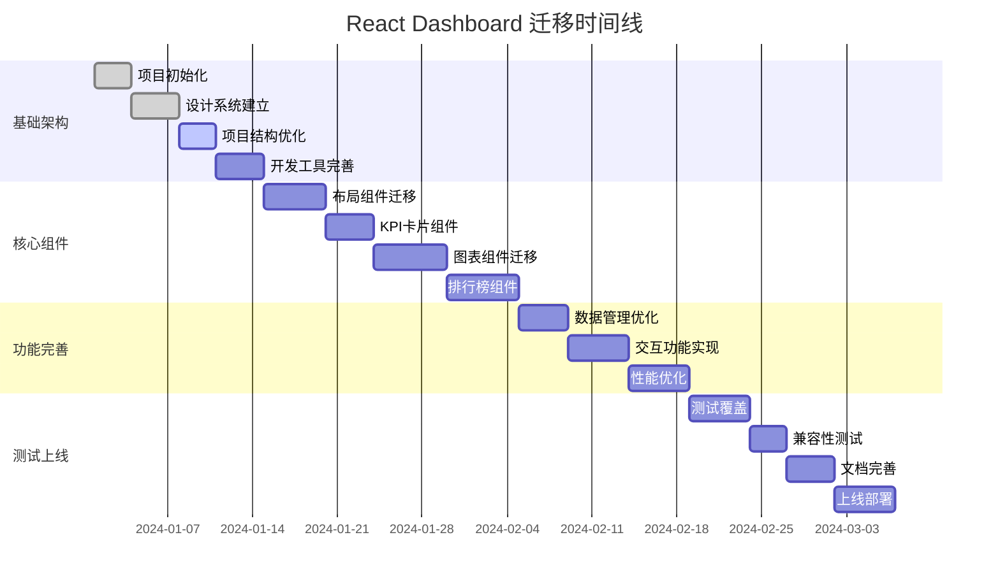

# 详细实施计划和里程碑

## 项目概述

### 项目目标
将现有HTML Dashboard迁移到React架构，实现：
- 像素级完美的UI还原
- 现代化的React架构
- 优秀的性能和用户体验
- 可维护和可扩展的代码结构

### 项目范围
- **前端迁移**: HTML/CSS/JS → React + TypeScript
- **架构升级**: 组件化、状态管理、性能优化
- **开发环境**: 现代化工具链和开发流程
- **质量保证**: 测试、文档、代码规范

## 实施策略

### 1. 迁移策略选择

#### 渐进式迁移 (推荐)


**优势:**
- 风险可控，可随时回滚
- 团队学习曲线平缓
- 可以并行开发和测试
- 业务影响最小

#### 一次性重写 (备选)
**适用场景:**
- 团队React经验丰富
- 有充足的开发时间
- 需要大幅架构调整

### 2. 技术栈确认

#### 核心技术
- **React 19**: 最新特性和性能优化
- **TypeScript 5.8**: 类型安全和开发体验
- **Vite 7**: 快速构建和开发
- **Tailwind CSS 4**: 样式系统
- **Zustand**: 状态管理

#### 支持工具
- **ECharts**: 图表库
- **Framer Motion**: 动画库
- **Radix UI**: 无障碍组件
- **Vitest**: 测试框架
- **ESLint + Prettier**: 代码质量

## 详细实施计划

### 阶段一：基础架构搭建 (2周)

#### 里程碑 1.1: 项目初始化 (3天)
**目标**: 建立基础开发环境

**任务清单:**
- [ ] 创建React项目脚手架
- [ ] 配置TypeScript和构建工具
- [ ] 设置代码规范和Git工作流
- [ ] 配置CI/CD基础流程

**交付物:**
- 可运行的React项目
- 完整的开发环境配置
- 代码规范文档

**验收标准:**
- 项目可以正常启动和构建
- 所有配置文件正确设置
- 团队成员可以正常开发

#### 里程碑 1.2: 设计系统建立 (4天)
**目标**: 建立统一的设计系统

**任务清单:**
- [ ] 分析现有HTML的设计元素
- [ ] 建立Tailwind CSS配置
- [ ] 创建基础UI组件库
- [ ] 实现玻璃态效果系统

**交付物:**
- Tailwind配置文件
- 基础UI组件 (Button, Card, Input等)
- 设计系统文档

**验收标准:**
- UI组件与原设计100%匹配
- 组件具有良好的可复用性
- 支持主题切换

#### 里程碑 1.3: 项目结构优化 (3天)
**目标**: 建立清晰的项目结构

**任务清单:**
- [ ] 实现feature-first目录结构
- [ ] 配置路径别名和导入规范
- [ ] 建立组件分层架构
- [ ] 设置状态管理基础

**交付物:**
- 完整的项目目录结构
- 导入/导出规范
- 状态管理配置

**验收标准:**
- 目录结构清晰易懂
- 模块导入路径简洁
- 状态管理正常工作

#### 里程碑 1.4: 开发工具完善 (4天)
**目标**: 完善开发和测试环境

**任务清单:**
- [ ] 配置ESLint和Prettier
- [ ] 设置Git hooks和提交规范
- [ ] 建立测试环境和工具
- [ ] 配置性能监控工具

**交付物:**
- 完整的开发工具配置
- 测试环境和示例
- 性能监控配置

**验收标准:**
- 代码质量检查正常工作
- 测试可以正常运行
- 性能监控数据可见

### 阶段二：核心组件迁移 (3周)

#### 里程碑 2.1: 布局组件迁移 (5天)
**目标**: 迁移页面布局和导航

**任务清单:**
- [ ] 迁移主布局组件
- [ ] 实现响应式导航
- [ ] 迁移侧边栏和头部
- [ ] 实现主题切换功能

**交付物:**
- Layout组件
- Navigation组件
- Header和Sidebar组件
- 主题切换功能

**验收标准:**
- 布局与原设计完全一致
- 响应式效果正常
- 主题切换流畅

#### 里程碑 2.2: KPI卡片组件 (4天)
**目标**: 迁移关键指标展示

**任务清单:**
- [ ] 分析KPI卡片设计和数据
- [ ] 实现KPI卡片组件
- [ ] 添加动画和交互效果
- [ ] 实现数据绑定和更新

**交付物:**
- KPICard组件
- 动画效果实现
- 数据接口集成

**验收标准:**
- 卡片样式完全匹配
- 动画效果流畅
- 数据更新正常

#### 里程碑 2.3: 图表组件迁移 (6天)
**目标**: 迁移所有图表组件

**任务清单:**
- [ ] 迁移收入趋势图表
- [ ] 迁移分红饼图和柱状图
- [ ] 实现地图可视化
- [ ] 添加图表交互功能

**交付物:**
- RevenueChart组件
- DividendCharts组件
- MapVisualization组件
- 图表交互功能

**验收标准:**
- 图表样式和数据完全匹配
- 交互功能正常
- 性能表现良好

#### 里程碑 2.4: 排行榜组件 (6天)
**目标**: 迁移排行榜功能

**任务清单:**
- [ ] 实现门店排行榜
- [ ] 实现商户排行榜
- [ ] 实现用户消费排行榜
- [ ] 添加排序和筛选功能

**交付物:**
- StoreRanking组件
- BusinessRanking组件
- UserRanking组件
- 排序筛选功能

**验收标准:**
- 排行榜数据显示正确
- 排序功能正常
- 样式与原设计一致

### 阶段三：功能模块完善 (2周)

#### 里程碑 3.1: 数据管理优化 (4天)
**目标**: 完善数据获取和状态管理

**任务清单:**
- [ ] 实现数据服务层
- [ ] 优化状态管理架构
- [ ] 添加数据缓存机制
- [ ] 实现错误处理

**交付物:**
- 数据服务API
- 状态管理优化
- 缓存机制
- 错误处理系统

**验收标准:**
- 数据获取稳定可靠
- 状态管理高效
- 错误处理完善

#### 里程碑 3.2: 交互功能实现 (5天)
**目标**: 实现用户交互功能

**任务清单:**
- [ ] 实现筛选和搜索功能
- [ ] 添加数据导出功能
- [ ] 实现实时数据更新
- [ ] 优化用户体验

**交付物:**
- 筛选搜索功能
- 数据导出功能
- 实时更新机制
- UX优化

**验收标准:**
- 交互功能流畅
- 数据操作准确
- 用户体验良好

#### 里程碑 3.3: 性能优化 (5天)
**目标**: 优化应用性能

**任务清单:**
- [ ] 实现代码分割和懒加载
- [ ] 优化图表渲染性能
- [ ] 实现虚拟滚动
- [ ] 优化包体积

**交付物:**
- 代码分割配置
- 性能优化方案
- 虚拟滚动实现
- 包体积优化

**验收标准:**
- 首屏加载时间 < 2s
- 图表渲染流畅
- 包体积合理

### 阶段四：测试和优化 (2周)

#### 里程碑 4.1: 测试覆盖 (5天)
**目标**: 建立完整的测试体系

**任务清单:**
- [ ] 编写单元测试
- [ ] 实现集成测试
- [ ] 进行端到端测试
- [ ] 建立测试自动化

**交付物:**
- 单元测试套件
- 集成测试用例
- E2E测试脚本
- 测试自动化配置

**验收标准:**
- 测试覆盖率 > 80%
- 所有测试通过
- 测试自动化正常

#### 里程碑 4.2: 兼容性测试 (3天)
**目标**: 确保跨浏览器兼容性

**任务清单:**
- [ ] 主流浏览器测试
- [ ] 移动端适配测试
- [ ] 性能基准测试
- [ ] 可访问性测试

**交付物:**
- 兼容性测试报告
- 移动端适配方案
- 性能测试报告
- 可访问性评估

**验收标准:**
- 主流浏览器正常运行
- 移动端体验良好
- 性能指标达标

#### 里程碑 4.3: 文档完善 (4天)
**目标**: 完善项目文档

**任务清单:**
- [ ] 编写用户使用文档
- [ ] 完善开发者文档
- [ ] 创建部署指南
- [ ] 建立维护手册

**交付物:**
- 用户手册
- 开发文档
- 部署指南
- 维护手册

**验收标准:**
- 文档内容完整准确
- 易于理解和使用
- 覆盖所有功能点

#### 里程碑 4.4: 上线准备 (2天)
**目标**: 准备生产环境部署

**任务清单:**
- [ ] 生产环境配置
- [ ] 部署流程测试
- [ ] 监控告警设置
- [ ] 回滚方案准备

**交付物:**
- 生产环境配置
- 部署脚本
- 监控配置
- 回滚方案

**验收标准:**
- 生产环境稳定
- 部署流程顺畅
- 监控正常工作

### 阶段五：上线和维护 (1周)

#### 里程碑 5.1: 灰度发布 (2天)
**目标**: 小范围验证系统稳定性

**任务清单:**
- [ ] 配置灰度发布环境
- [ ] 小范围用户测试
- [ ] 监控系统表现
- [ ] 收集用户反馈

**交付物:**
- 灰度发布配置
- 用户反馈报告
- 系统监控数据

**验收标准:**
- 系统运行稳定
- 用户反馈良好
- 无严重问题

#### 里程碑 5.2: 全量上线 (2天)
**目标**: 完成系统全面上线

**任务清单:**
- [ ] 执行全量部署
- [ ] 实时监控系统状态
- [ ] 处理突发问题
- [ ] 用户支持和培训

**交付物:**
- 全量部署完成
- 监控报告
- 问题处理记录

**验收标准:**
- 系统正常运行
- 用户使用顺畅
- 无重大故障

#### 里程碑 5.3: 项目总结 (3天)
**目标**: 项目复盘和知识沉淀

**任务清单:**
- [ ] 项目成果总结
- [ ] 经验教训整理
- [ ] 技术文档归档
- [ ] 团队能力评估

**交付物:**
- 项目总结报告
- 经验教训文档
- 技术文档库
- 团队评估报告

**验收标准:**
- 项目目标达成
- 文档完整归档
- 经验有效沉淀

## 资源分配计划

### 人员配置

#### 核心团队 (4-5人)
```
项目经理 (1人)
├── 负责项目协调和进度管理
├── 风险控制和质量把关
└── 与业务方沟通协调

前端架构师 (1人)
├── 技术方案设计和评审
├── 核心组件开发
└── 代码质量把关

高级前端工程师 (2人)
├── 组件开发和功能实现
├── 测试用例编写
└── 性能优化

UI/UX设计师 (1人)
├── 设计还原和优化
├── 用户体验改进
└── 视觉效果调优
```

#### 支持团队
- **后端工程师**: API接口支持
- **测试工程师**: 测试用例设计和执行
- **运维工程师**: 部署和监控支持

### 时间分配

#### 总体时间线 (10周)
```
阶段一: 基础架构搭建    ████████████████████ 2周 (20%)
阶段二: 核心组件迁移    ██████████████████████████████ 3周 (30%)
阶段三: 功能模块完善    ████████████████████ 2周 (20%)
阶段四: 测试和优化      ████████████████████ 2周 (20%)
阶段五: 上线和维护      ██████████ 1周 (10%)
```

#### 并行开发策略


## 风险管理

### 主要风险识别

#### 技术风险
1. **React 19新特性兼容性**
   - 风险等级: 中
   - 影响: 开发进度延迟
   - 应对: 提前验证，准备降级方案

2. **性能优化挑战**
   - 风险等级: 中
   - 影响: 用户体验下降
   - 应对: 分阶段优化，建立性能基准

3. **第三方库兼容性**
   - 风险等级: 低
   - 影响: 功能实现受限
   - 应对: 提前调研，准备替代方案

#### 项目风险
1. **需求变更**
   - 风险等级: 高
   - 影响: 进度和成本增加
   - 应对: 需求冻结，变更控制流程

2. **人员变动**
   - 风险等级: 中
   - 影响: 知识流失，进度延迟
   - 应对: 知识文档化，交接机制

3. **时间压力**
   - 风险等级: 中
   - 影响: 质量下降
   - 应对: 合理排期，质量门禁

### 风险应对策略

#### 预防措施
- 技术预研和原型验证
- 详细的项目计划和里程碑
- 定期的风险评估和调整
- 完善的文档和知识管理

#### 应急预案
- 技术方案降级策略
- 人员替补和培训计划
- 进度调整和优先级排序
- 质量保证和测试策略

## 质量保证

### 质量标准

#### 功能质量
- **功能完整性**: 100%功能点实现
- **业务逻辑正确性**: 零业务逻辑错误
- **数据准确性**: 数据展示100%准确

#### 性能质量
- **首屏加载时间**: < 2秒
- **页面切换响应**: < 500ms
- **图表渲染时间**: < 1秒
- **内存使用**: < 100MB

#### 代码质量
- **测试覆盖率**: > 80%
- **代码重复率**: < 5%
- **圈复杂度**: < 10
- **技术债务**: 零已知技术债务

#### 用户体验
- **可访问性**: WCAG 2.1 AA级
- **浏览器兼容**: 主流浏览器100%支持
- **移动端适配**: 完美响应式体验
- **加载体验**: 优雅的加载状态

### 质量控制流程

#### 开发阶段
1. **代码审查**: 所有代码必须经过审查
2. **单元测试**: 新功能必须有测试覆盖
3. **集成测试**: 模块集成必须通过测试
4. **性能测试**: 关键功能必须通过性能测试

#### 测试阶段
1. **功能测试**: 全面的功能验证
2. **兼容性测试**: 多浏览器和设备测试
3. **性能测试**: 负载和压力测试
4. **安全测试**: 基础安全漏洞检查

#### 上线阶段
1. **预发布验证**: 生产环境验证
2. **灰度发布**: 小范围用户验证
3. **监控告警**: 实时系统监控
4. **快速响应**: 问题快速定位和修复

## 成功标准

### 项目成功指标

#### 技术指标
- [ ] 所有功能点100%实现
- [ ] 性能指标全部达标
- [ ] 代码质量指标达标
- [ ] 测试覆盖率达标

#### 业务指标
- [ ] 用户体验满意度 > 90%
- [ ] 系统稳定性 > 99.9%
- [ ] 页面加载速度提升 > 50%
- [ ] 开发效率提升 > 30%

#### 团队指标
- [ ] 团队技能提升达成
- [ ] 知识文档完整建立
- [ ] 开发流程标准化
- [ ] 技术债务清零

### 验收标准

#### 功能验收
- 所有原有功能完整迁移
- 新增功能按需求实现
- 用户操作流程保持一致
- 数据展示完全准确

#### 性能验收
- 首屏加载时间达标
- 交互响应时间达标
- 内存使用合理
- 网络请求优化

#### 质量验收
- 代码规范100%遵循
- 测试用例全部通过
- 文档完整准确
- 部署流程顺畅

## 后续维护计划

### 维护策略

#### 日常维护
- **监控告警**: 7x24小时系统监控
- **问题响应**: 4小时内响应，24小时内解决
- **性能优化**: 月度性能评估和优化
- **安全更新**: 及时的安全补丁更新

#### 功能迭代
- **需求收集**: 定期用户反馈收集
- **功能规划**: 季度功能规划和评审
- **版本发布**: 月度版本发布节奏
- **技术升级**: 年度技术栈升级评估

#### 团队建设
- **技能培训**: 定期技术培训和分享
- **知识管理**: 持续的文档更新和维护
- **最佳实践**: 经验总结和标准化
- **工具优化**: 开发工具和流程持续改进

这个详细的实施计划为React Dashboard迁移项目提供了完整的路线图，确保项目能够按时、按质、按预算完成，并为后续的维护和发展奠定坚实基础。