# 架构设计文档和图表

## 架构概览

### 系统架构图
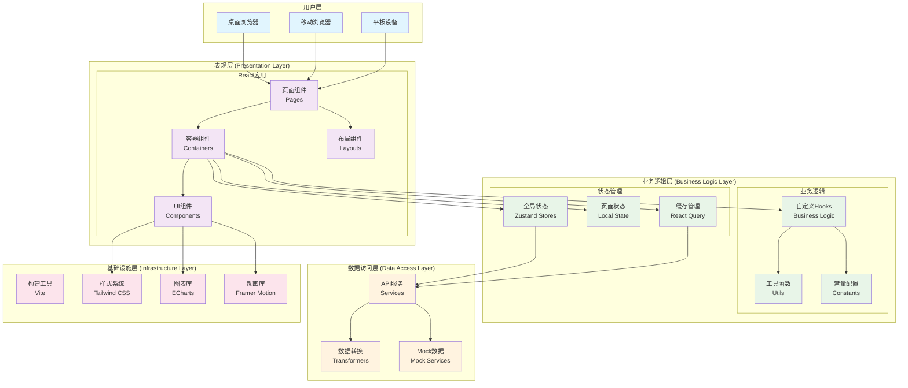
```mermaid
graph TB
    subgraph "用户层"
        U1[桌面浏览器]
        U2[移动浏览器]
        U3[平板设备]
    end
    
    subgraph "表现层 (Presentation Layer)"
        subgraph "React应用"
            P1[页面组件<br/>Pages]
            P2[容器组件<br/>Containers]
            P3[UI组件<br/>Components]
            P4[布局组件<br/>Layouts]
        end
    end
    
    subgraph "业务逻辑层 (Business Logic Layer)"
        subgraph "状态管理"
            B1[全局状态<br/>Zustand Stores]
            B2[页面状态<br/>Local State]
            B3[缓存管理<br/>React Query]
        end
        
        subgraph "业务逻辑"
            B4[自定义Hooks<br/>Business Logic]
            B5[工具函数<br/>Utils]
            B6[常量配置<br/>Constants]
        end
    end
    
    subgraph "数据访问层 (Data Access Layer)"
        D1[API服务<br/>Services]
        D2[数据转换<br/>Transformers]
        D3[Mock数据<br/>Mock Services]
    end
    
    subgraph "基础设施层 (Infrastructure Layer)"
        I1[构建工具<br/>Vite]
        I2[样式系统<br/>Tailwind CSS]
        I3[图表库<br/>ECharts]
        I4[动画库<br/>Framer Motion]
    end
    
    U1 --> P1
    U2 --> P1
    U3 --> P1
    
    P1 --> P2
    P2 --> P3
    P1 --> P4
    
    P2 --> B1
    P2 --> B2
    P2 --> B3
    P2 --> B4
    
    B4 --> B5
    B4 --> B6
    B1 --> D1
    B3 --> D1
    
    D1 --> D2
    D1 --> D3
    
    P3 --> I2
    P3 --> I3
    P3 --> I4
    
    classDef userLayer fill:#e1f5fe
    classDef presentationLayer fill:#f3e5f5
    classDef businessLayer fill:#e8f5e8
    classDef dataLayer fill:#fff3e0
    classDef infraLayer fill:#fce4ec
    
    class U1,U2,U3 userLayer
    class P1,P2,P3,P4 presentationLayer
    class B1,B2,B3,B4,B5,B6 businessLayer
    class D1,D2,D3 dataLayer
    class I1,I2,I3,I4 infraLayer
```

### 技术栈架构
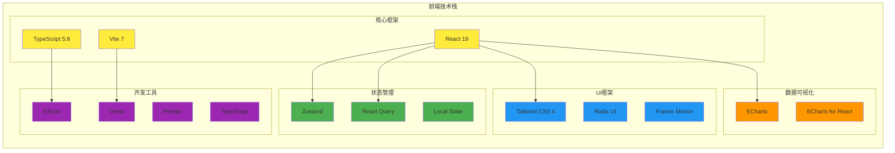
```mermaid
graph LR
    subgraph "前端技术栈"
        subgraph "核心框架"
            A1[React 19]
            A2[TypeScript 5.8]
            A3[Vite 7]
        end
        
        subgraph "状态管理"
            B1[Zustand]
            B2[React Query]
            B3[Local State]
        end
        
        subgraph "UI框架"
            C1[Tailwind CSS 4]
            C2[Radix UI]
            C3[Framer Motion]
        end
        
        subgraph "数据可视化"
            D1[ECharts]
            D2[ECharts for React]
        end
        
        subgraph "开发工具"
            E1[ESLint]
            E2[Prettier]
            E3[Vitest]
            E4[TypeScript]
        end
    end
    
    A1 --> B1
    A1 --> B2
    A1 --> C1
    A1 --> D1
    A2 --> E1
    A3 --> E3
    
    classDef core fill:#ffeb3b
    classDef state fill:#4caf50
    classDef ui fill:#2196f3
    classDef viz fill:#ff9800
    classDef tools fill:#9c27b0
    
    class A1,A2,A3 core
    class B1,B2,B3 state
    class C1,C2,C3 ui
    class D1,D2 viz
    class E1,E2,E3,E4 tools
```

## 组件架构设计

### 组件层次结构
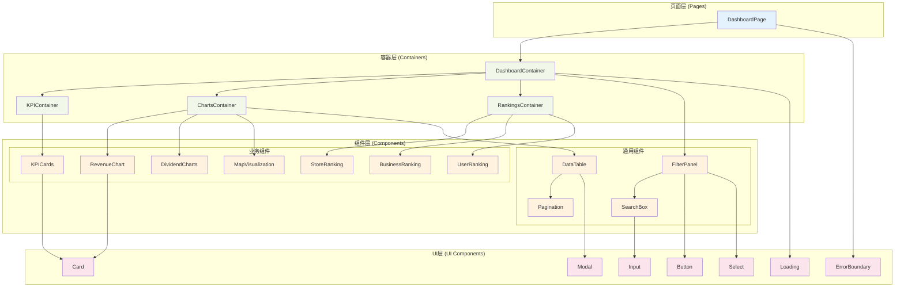
```mermaid
graph TD
    subgraph "页面层 (Pages)"
        P1[DashboardPage]
    end
    
    subgraph "容器层 (Containers)"
        C1[DashboardContainer]
        C2[KPIContainer]
        C3[ChartsContainer]
        C4[RankingsContainer]
    end
    
    subgraph "组件层 (Components)"
        subgraph "业务组件"
            BC1[KPICards]
            BC2[RevenueChart]
            BC3[DividendCharts]
            BC4[MapVisualization]
            BC5[StoreRanking]
            BC6[BusinessRanking]
            BC7[UserRanking]
        end
        
        subgraph "通用组件"
            GC1[FilterPanel]
            GC2[DataTable]
            GC3[SearchBox]
            GC4[Pagination]
        end
    end
    
    subgraph "UI层 (UI Components)"
        UI1[Card]
        UI2[Button]
        UI3[Input]
        UI4[Select]
        UI5[Modal]
        UI6[Loading]
        UI7[ErrorBoundary]
    end
    
    P1 --> C1
    C1 --> C2
    C1 --> C3
    C1 --> C4
    
    C2 --> BC1
    C3 --> BC2
    C3 --> BC3
    C3 --> BC4
    C4 --> BC5
    C4 --> BC6
    C4 --> BC7
    
    C1 --> GC1
    C3 --> GC2
    GC1 --> GC3
    GC2 --> GC4
    
    BC1 --> UI1
    BC2 --> UI1
    GC1 --> UI2
    GC3 --> UI3
    GC1 --> UI4
    GC2 --> UI5
    C1 --> UI6
    P1 --> UI7
    
    classDef pageLayer fill:#e3f2fd
    classDef containerLayer fill:#f1f8e9
    classDef componentLayer fill:#fff3e0
    classDef uiLayer fill:#fce4ec
    
    class P1 pageLayer
    class C1,C2,C3,C4 containerLayer
    class BC1,BC2,BC3,BC4,BC5,BC6,BC7,GC1,GC2,GC3,GC4 componentLayer
    class UI1,UI2,UI3,UI4,UI5,UI6,UI7 uiLayer
```

### 组件通信模式
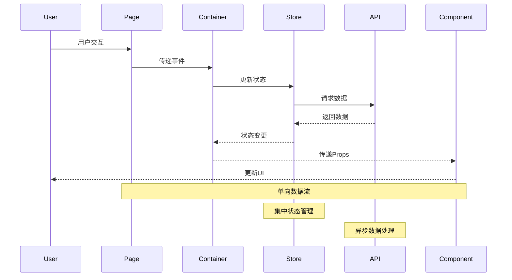
```mermaid
sequenceDiagram
    participant U as User
    participant P as Page
    participant C as Container
    participant S as Store
    participant A as API
    participant Comp as Component
    
    U->>P: 用户交互
    P->>C: 传递事件
    C->>S: 更新状态
    S->>A: 请求数据
    A-->>S: 返回数据
    S-->>C: 状态变更
    C-->>Comp: 传递Props
    Comp-->>U: 更新UI
    
    Note over P,Comp: 单向数据流
    Note over S: 集中状态管理
    Note over A: 异步数据处理
```

## 状态管理架构

### 状态管理层次
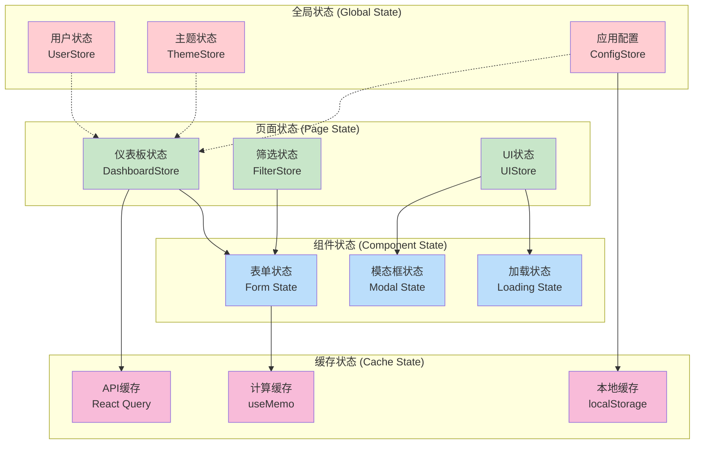
```mermaid
graph TB
    subgraph "全局状态 (Global State)"
        GS1[用户状态<br/>UserStore]
        GS2[主题状态<br/>ThemeStore]
        GS3[应用配置<br/>ConfigStore]
    end
    
    subgraph "页面状态 (Page State)"
        PS1[仪表板状态<br/>DashboardStore]
        PS2[筛选状态<br/>FilterStore]
        PS3[UI状态<br/>UIStore]
    end
    
    subgraph "组件状态 (Component State)"
        CS1[表单状态<br/>Form State]
        CS2[模态框状态<br/>Modal State]
        CS3[加载状态<br/>Loading State]
    end
    
    subgraph "缓存状态 (Cache State)"
        Cache1[API缓存<br/>React Query]
        Cache2[计算缓存<br/>useMemo]
        Cache3[本地缓存<br/>localStorage]
    end
    
    GS1 -.-> PS1
    GS2 -.-> PS1
    GS3 -.-> PS1
    
    PS1 --> CS1
    PS2 --> CS1
    PS3 --> CS2
    PS3 --> CS3
    
    PS1 --> Cache1
    CS1 --> Cache2
    GS3 --> Cache3
    
    classDef global fill:#ffcdd2
    classDef page fill:#c8e6c9
    classDef component fill:#bbdefb
    classDef cache fill:#f8bbd9
    
    class GS1,GS2,GS3 global
    class PS1,PS2,PS3 page
    class CS1,CS2,CS3 component
    class Cache1,Cache2,Cache3 cache
```

### 数据流架构
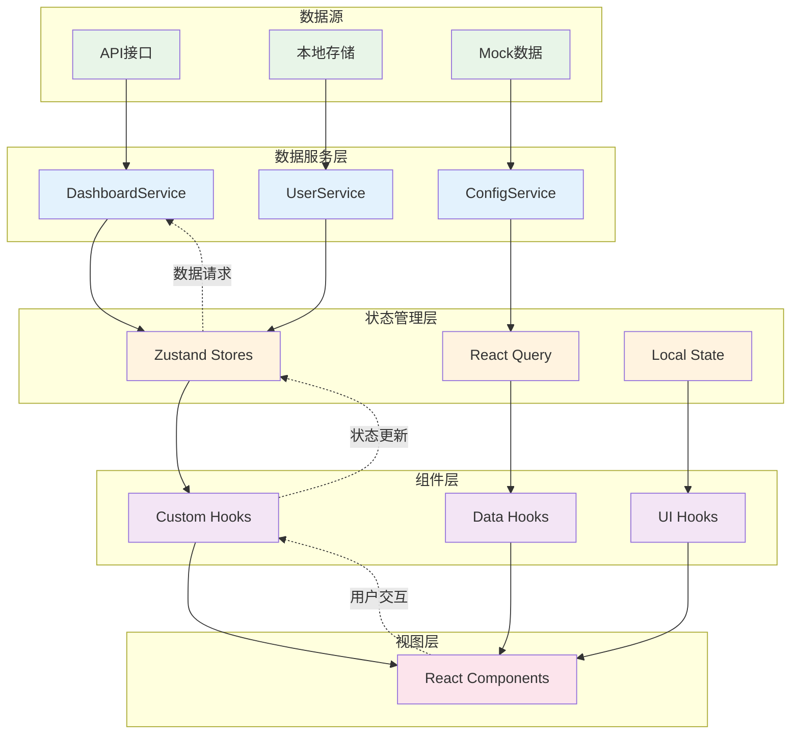
```mermaid
flowchart TD
    subgraph "数据源"
        DS1[API接口]
        DS2[本地存储]
        DS3[Mock数据]
    end
    
    subgraph "数据服务层"
        Service1[DashboardService]
        Service2[UserService]
        Service3[ConfigService]
    end
    
    subgraph "状态管理层"
        Store1[Zustand Stores]
        Store2[React Query]
        Store3[Local State]
    end
    
    subgraph "组件层"
        Hook1[Custom Hooks]
        Hook2[Data Hooks]
        Hook3[UI Hooks]
    end
    
    subgraph "视图层"
        View1[React Components]
    end
    
    DS1 --> Service1
    DS2 --> Service2
    DS3 --> Service3
    
    Service1 --> Store1
    Service2 --> Store1
    Service3 --> Store2
    
    Store1 --> Hook1
    Store2 --> Hook2
    Store3 --> Hook3
    
    Hook1 --> View1
    Hook2 --> View1
    Hook3 --> View1
    
    View1 -.->|用户交互| Hook1
    Hook1 -.->|状态更新| Store1
    Store1 -.->|数据请求| Service1
    
    classDef dataSource fill:#e8f5e8
    classDef service fill:#e3f2fd
    classDef state fill:#fff3e0
    classDef hook fill:#f3e5f5
    classDef view fill:#fce4ec
    
    class DS1,DS2,DS3 dataSource
    class Service1,Service2,Service3 service
    class Store1,Store2,Store3 state
    class Hook1,Hook2,Hook3 hook
    class View1 view
```

## 项目结构设计

### 目录结构图
```
src/
├── app/                          # 应用入口和配置
│   ├── App.tsx                   # 根组件
│   ├── main.tsx                  # 应用入口
│   └── providers/                # 全局Provider
│       ├── QueryProvider.tsx
│       ├── ThemeProvider.tsx
│       └── index.ts
│
├── pages/                        # 页面组件
│   ├── Dashboard/
│   │   ├── DashboardPage.tsx
│   │   ├── index.ts
│   │   └── __tests__/
│   └── index.ts
│
├── features/                     # 功能模块
│   ├── dashboard/
│   │   ├── components/           # 功能组件
│   │   │   ├── KPICards/
│   │   │   ├── Charts/
│   │   │   └── Rankings/
│   │   ├── containers/           # 容器组件
│   │   │   ├── DashboardContainer.tsx
│   │   │   └── index.ts
│   │   ├── hooks/                # 业务Hook
│   │   │   ├── useDashboardData.ts
│   │   │   └── index.ts
│   │   ├── services/             # 数据服务
│   │   │   ├── dashboardService.ts
│   │   │   └── index.ts
│   │   ├── stores/               # 状态管理
│   │   │   ├── dashboardStore.ts
│   │   │   └── index.ts
│   │   ├── types/                # 类型定义
│   │   │   ├── dashboard.ts
│   │   │   └── index.ts
│   │   └── index.ts
│   └── index.ts
│
├── shared/                       # 共享资源
│   ├── components/               # 通用组件
│   │   ├── ui/                   # UI组件
│   │   │   ├── Button/
│   │   │   ├── Card/
│   │   │   ├── Input/
│   │   │   └── index.ts
│   │   ├── layout/               # 布局组件
│   │   │   ├── Header/
│   │   │   ├── Sidebar/
│   │   │   └── index.ts
│   │   └── common/               # 通用组件
│   │       ├── LoadingSpinner/
│   │       ├── ErrorBoundary/
│   │       └── index.ts
│   ├── hooks/                    # 通用Hook
│   │   ├── useLocalStorage.ts
│   │   ├── useDebounce.ts
│   │   └── index.ts
│   ├── services/                 # 通用服务
│   │   ├── api.ts
│   │   ├── storage.ts
│   │   └── index.ts
│   ├── stores/                   # 全局状态
│   │   ├── userStore.ts
│   │   ├── themeStore.ts
│   │   └── index.ts
│   ├── types/                    # 全局类型
│   │   ├── api.ts
│   │   ├── common.ts
│   │   └── index.ts
│   ├── utils/                    # 工具函数
│   │   ├── cn.ts
│   │   ├── format.ts
│   │   └── index.ts
│   └── constants/                # 常量定义
│       ├── api.ts
│       ├── theme.ts
│       └── index.ts
│
├── assets/                       # 静态资源
│   ├── images/
│   ├── icons/
│   └── fonts/
│
└── styles/                       # 样式文件
    ├── globals.css
    ├── components.css
    └── variables.css
```

### 模块依赖关系
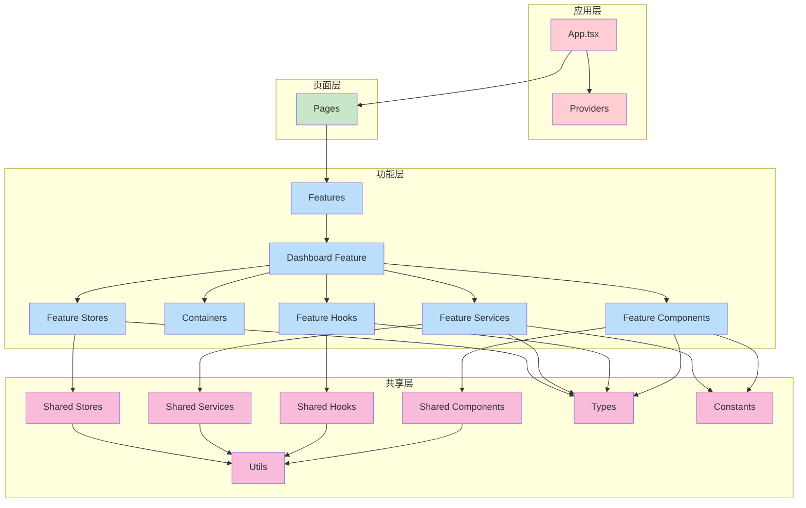
```mermaid
graph TD
    subgraph "应用层"
        App[App.tsx]
        Providers[Providers]
    end
    
    subgraph "页面层"
        Pages[Pages]
    end
    
    subgraph "功能层"
        Features[Features]
        Dashboard[Dashboard Feature]
        Components[Feature Components]
        Containers[Containers]
        Hooks[Feature Hooks]
        Services[Feature Services]
        Stores[Feature Stores]
    end
    
    subgraph "共享层"
        SharedComponents[Shared Components]
        SharedHooks[Shared Hooks]
        SharedServices[Shared Services]
        SharedStores[Shared Stores]
        Utils[Utils]
        Types[Types]
        Constants[Constants]
    end
    
    App --> Providers
    App --> Pages
    Pages --> Features
    Features --> Dashboard
    Dashboard --> Components
    Dashboard --> Containers
    Dashboard --> Hooks
    Dashboard --> Services
    Dashboard --> Stores
    
    Components --> SharedComponents
    Hooks --> SharedHooks
    Services --> SharedServices
    Stores --> SharedStores
    
    SharedComponents --> Utils
    SharedHooks --> Utils
    SharedServices --> Utils
    SharedStores --> Utils
    
    Components --> Types
    Hooks --> Types
    Services --> Types
    Stores --> Types
    
    Components --> Constants
    Services --> Constants
    
    classDef appLayer fill:#ffcdd2
    classDef pageLayer fill:#c8e6c9
    classDef featureLayer fill:#bbdefb
    classDef sharedLayer fill:#f8bbd9
    
    class App,Providers appLayer
    class Pages pageLayer
    class Features,Dashboard,Components,Containers,Hooks,Services,Stores featureLayer
    class SharedComponents,SharedHooks,SharedServices,SharedStores,Utils,Types,Constants sharedLayer
```

## 性能架构设计

### 性能优化策略
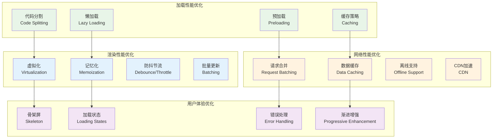
```mermaid
graph TB
    subgraph "加载性能优化"
        L1[代码分割<br/>Code Splitting]
        L2[懒加载<br/>Lazy Loading]
        L3[预加载<br/>Preloading]
        L4[缓存策略<br/>Caching]
    end
    
    subgraph "渲染性能优化"
        R1[虚拟化<br/>Virtualization]
        R2[记忆化<br/>Memoization]
        R3[防抖节流<br/>Debounce/Throttle]
        R4[批量更新<br/>Batching]
    end
    
    subgraph "网络性能优化"
        N1[请求合并<br/>Request Batching]
        N2[数据缓存<br/>Data Caching]
        N3[离线支持<br/>Offline Support]
        N4[CDN加速<br/>CDN]
    end
    
    subgraph "用户体验优化"
        U1[骨架屏<br/>Skeleton]
        U2[加载状态<br/>Loading States]
        U3[错误处理<br/>Error Handling]
        U4[渐进增强<br/>Progressive Enhancement]
    end
    
    L1 --> R1
    L2 --> R2
    L3 --> N1
    L4 --> N2
    
    R1 --> U1
    R2 --> U2
    N1 --> U3
    N2 --> U4
    
    classDef loading fill:#e8f5e8
    classDef rendering fill:#e3f2fd
    classDef network fill:#fff3e0
    classDef ux fill:#f3e5f5
    
    class L1,L2,L3,L4 loading
    class R1,R2,R3,R4 rendering
    class N1,N2,N3,N4 network
    class U1,U2,U3,U4 ux
```

### 性能监控架构
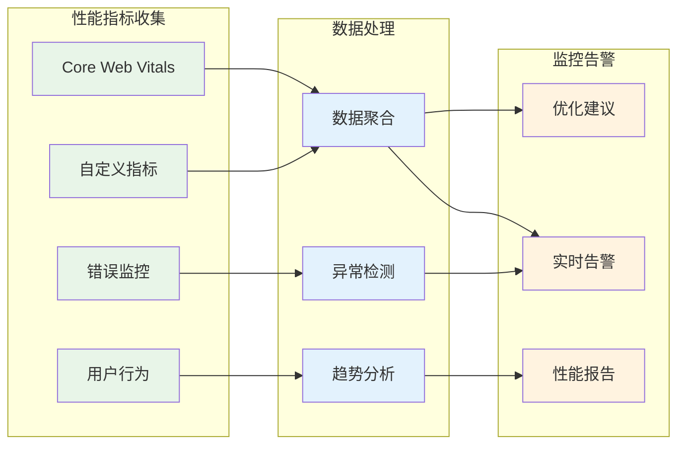
```mermaid
graph LR
    subgraph "性能指标收集"
        M1[Core Web Vitals]
        M2[自定义指标]
        M3[错误监控]
        M4[用户行为]
    end
    
    subgraph "数据处理"
        P1[数据聚合]
        P2[异常检测]
        P3[趋势分析]
    end
    
    subgraph "监控告警"
        A1[实时告警]
        A2[性能报告]
        A3[优化建议]
    end
    
    M1 --> P1
    M2 --> P1
    M3 --> P2
    M4 --> P3
    
    P1 --> A1
    P2 --> A1
    P3 --> A2
    P1 --> A3
    
    classDef metrics fill:#e8f5e8
    classDef processing fill:#e3f2fd
    classDef alerting fill:#fff3e0
    
    class M1,M2,M3,M4 metrics
    class P1,P2,P3 processing
    class A1,A2,A3 alerting
```

## 安全架构设计

### 安全防护层次
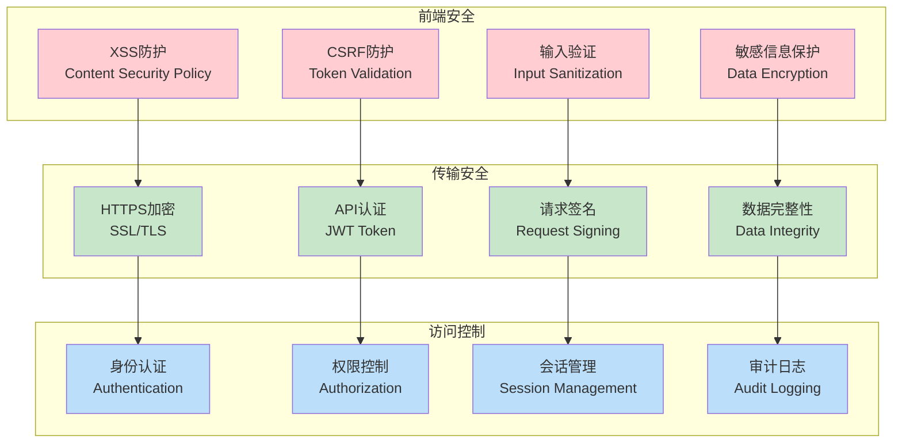
```mermaid
graph TB
    subgraph "前端安全"
        F1[XSS防护<br/>Content Security Policy]
        F2[CSRF防护<br/>Token Validation]
        F3[输入验证<br/>Input Sanitization]
        F4[敏感信息保护<br/>Data Encryption]
    end
    
    subgraph "传输安全"
        T1[HTTPS加密<br/>SSL/TLS]
        T2[API认证<br/>JWT Token]
        T3[请求签名<br/>Request Signing]
        T4[数据完整性<br/>Data Integrity]
    end
    
    subgraph "访问控制"
        A1[身份认证<br/>Authentication]
        A2[权限控制<br/>Authorization]
        A3[会话管理<br/>Session Management]
        A4[审计日志<br/>Audit Logging]
    end
    
    F1 --> T1
    F2 --> T2
    F3 --> T3
    F4 --> T4
    
    T1 --> A1
    T2 --> A2
    T3 --> A3
    T4 --> A4
    
    classDef frontend fill:#ffcdd2
    classDef transport fill:#c8e6c9
    classDef access fill:#bbdefb
    
    class F1,F2,F3,F4 frontend
    class T1,T2,T3,T4 transport
    class A1,A2,A3,A4 access
```

## 测试架构设计

### 测试金字塔
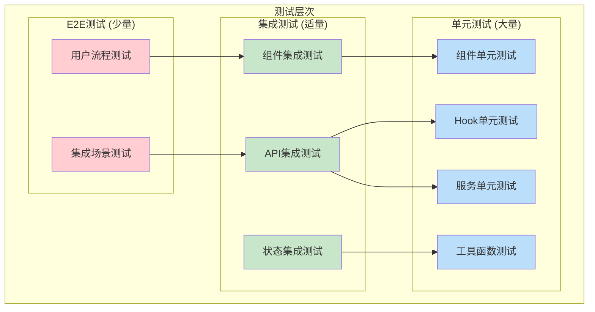
```mermaid
graph TB
    subgraph "测试层次"
        subgraph "E2E测试 (少量)"
            E1[用户流程测试]
            E2[集成场景测试]
        end
        
        subgraph "集成测试 (适量)"
            I1[组件集成测试]
            I2[API集成测试]
            I3[状态集成测试]
        end
        
        subgraph "单元测试 (大量)"
            U1[组件单元测试]
            U2[Hook单元测试]
            U3[工具函数测试]
            U4[服务单元测试]
        end
    end
    
    E1 --> I1
    E2 --> I2
    I1 --> U1
    I2 --> U2
    I3 --> U3
    I2 --> U4
    
    classDef e2e fill:#ffcdd2
    classDef integration fill:#c8e6c9
    classDef unit fill:#bbdefb
    
    class E1,E2 e2e
    class I1,I2,I3 integration
    class U1,U2,U3,U4 unit
```

### 测试工具链
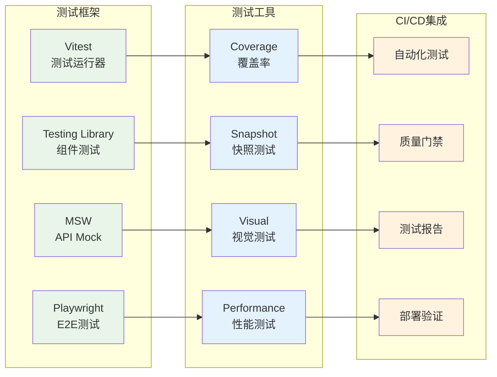
```mermaid
graph LR
    subgraph "测试框架"
        T1[Vitest<br/>测试运行器]
        T2[Testing Library<br/>组件测试]
        T3[MSW<br/>API Mock]
        T4[Playwright<br/>E2E测试]
    end
    
    subgraph "测试工具"
        Tool1[Coverage<br/>覆盖率]
        Tool2[Snapshot<br/>快照测试]
        Tool3[Visual<br/>视觉测试]
        Tool4[Performance<br/>性能测试]
    end
    
    subgraph "CI/CD集成"
        CI1[自动化测试]
        CI2[质量门禁]
        CI3[测试报告]
        CI4[部署验证]
    end
    
    T1 --> Tool1
    T2 --> Tool2
    T3 --> Tool3
    T4 --> Tool4
    
    Tool1 --> CI1
    Tool2 --> CI2
    Tool3 --> CI3
    Tool4 --> CI4
    
    classDef framework fill:#e8f5e8
    classDef tools fill:#e3f2fd
    classDef ci fill:#fff3e0
    
    class T1,T2,T3,T4 framework
    class Tool1,Tool2,Tool3,Tool4 tools
    class CI1,CI2,CI3,CI4 ci
```

## 部署架构设计

### 部署流水线

```mermaid
graph LR
    subgraph "开发阶段"
        D1[代码提交]
        D2[代码审查]
        D3[自动化测试]
        D4[构建打包]
    end
    
    subgraph "测试阶段"
        T1[测试环境部署]
        T2[自动化测试]
        T3[性能测试]
        T4[安全扫描]
    end
    
    subgraph "预发布阶段"
        S1[预发布部署]
        S2[集成测试]
        S3[用户验收测试]
        S4[性能验证]
    end
    
    subgraph "生产阶段"
        P1[灰度发布]
        P2[全量部署]
        P3[监控告警]
        P4[回滚机制]
    end
    
    D1 --> D2 --> D3 --> D4
    D4 --> T1 --> T2 --> T3 --> T4
    T4 --> S1 --> S2 --> S3 --> S4
    S4 --> P1 --> P2 --> P3 --> P4
    
    classDef dev fill:#e8f5e8
    classDef test fill:#e3f2fd
    classDef staging fill:#fff3e0
    classDef prod fill:#ffcdd2
    
    class D1,D2,D3,D4 dev
    class T1,T2,T3,T4 test
    class S1,S2,S3,S4 staging
    class P1,P2,P3,P4 prod
```

### 环境架构
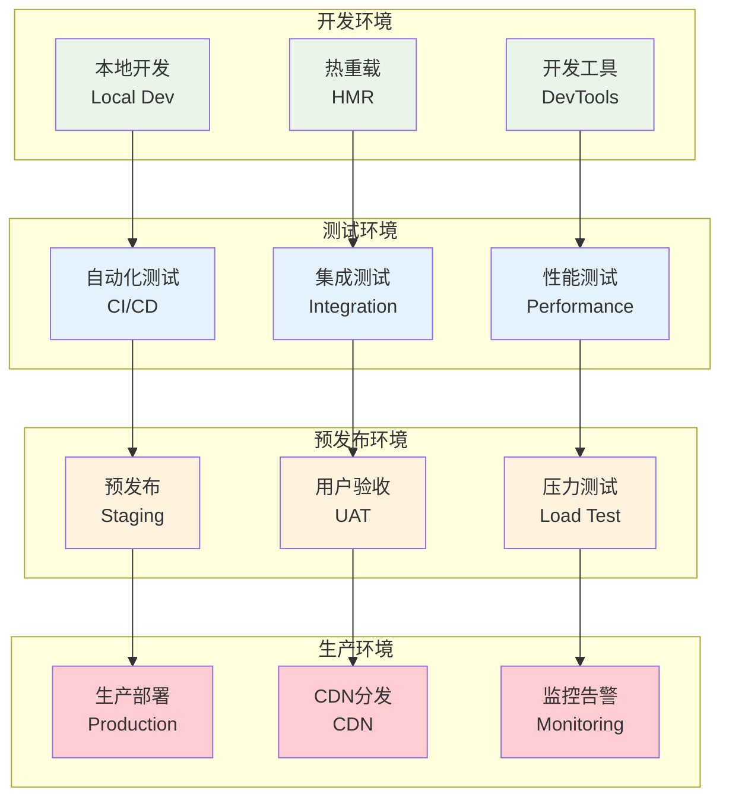
```mermaid
graph TB
    subgraph "开发环境"
        Dev1[本地开发<br/>Local Dev]
        Dev2[热重载<br/>HMR]
        Dev3[开发工具<br/>DevTools]
    end
    
    subgraph "测试环境"
        Test1[自动化测试<br/>CI/CD]
        Test2[集成测试<br/>Integration]
        Test3[性能测试<br/>Performance]
    end
    
    subgraph "预发布环境"
        Stage1[预发布<br/>Staging]
        Stage2[用户验收<br/>UAT]
        Stage3[压力测试<br/>Load Test]
    end
    
    subgraph "生产环境"
        Prod1[生产部署<br/>Production]
        Prod2[CDN分发<br/>CDN]
        Prod3[监控告警<br/>Monitoring]
    end
    
    Dev1 --> Test1
    Dev2 --> Test2
    Dev3 --> Test3
    
    Test1 --> Stage1
    Test2 --> Stage2
    Test3 --> Stage3
    
    Stage1 --> Prod1
    Stage2 --> Prod2
    Stage3 --> Prod3
    
    classDef dev fill:#e8f5e8
    classDef test fill:#e3f2fd
    classDef staging fill:#fff3e0
    classDef prod fill:#ffcdd2
    
    class Dev1,Dev2,Dev3 dev
    class Test1,Test2,Test3 test
    class Stage1,Stage2,Stage3 staging
    class Prod1,Prod2,Prod3 prod
```

## 监控和运维架构

### 监控体系
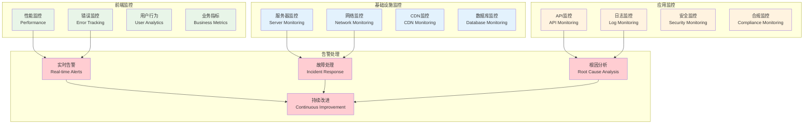
```mermaid
graph TB
    subgraph "前端监控"
        F1[性能监控<br/>Performance]
        F2[错误监控<br/>Error Tracking]
        F3[用户行为<br/>User Analytics]
        F4[业务指标<br/>Business Metrics]
    end
    
    subgraph "基础设施监控"
        I1[服务器监控<br/>Server Monitoring]
        I2[网络监控<br/>Network Monitoring]
        I3[CDN监控<br/>CDN Monitoring]
        I4[数据库监控<br/>Database Monitoring]
    end
    
    subgraph "应用监控"
        A1[API监控<br/>API Monitoring]
        A2[日志监控<br/>Log Monitoring]
        A3[安全监控<br/>Security Monitoring]
        A4[合规监控<br/>Compliance Monitoring]
    end
    
    subgraph "告警处理"
        Alert1[实时告警<br/>Real-time Alerts]
        Alert2[故障处理<br/>Incident Response]
        Alert3[根因分析<br/>Root Cause Analysis]
        Alert4[持续改进<br/>Continuous Improvement]
    end
    
    F1 --> Alert1
    F2 --> Alert1
    I1 --> Alert2
    I2 --> Alert2
    A1 --> Alert3
    A2 --> Alert3
    
    Alert1 --> Alert4
    Alert2 --> Alert4
    Alert3 --> Alert4
    
    classDef frontend fill:#e8f5e8
    classDef infrastructure fill:#e3f2fd
    classDef application fill:#fff3e0
    classDef alerting fill:#ffcdd2
    
    class F1,F2,F3,F4 frontend
    class I1,I2,I3,I4 infrastructure
    class A1,A2,A3,A4 application
    class Alert1,Alert2,Alert3,Alert4 alerting
```

### 运维自动化
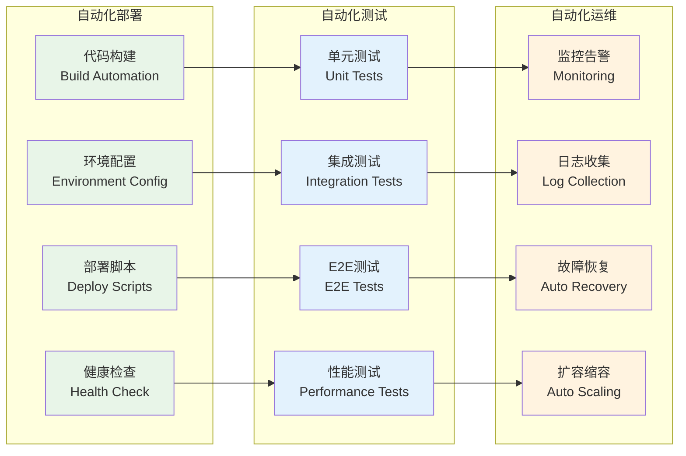
```mermaid
graph LR
    subgraph "自动化部署"
        Auto1[代码构建<br/>Build Automation]
        Auto2[环境配置<br/>Environment Config]
        Auto3[部署脚本<br/>Deploy Scripts]
        Auto4[健康检查<br/>Health Check]
    end
    
    subgraph "自动化测试"
        Test1[单元测试<br/>Unit Tests]
        Test2[集成测试<br/>Integration Tests]
        Test3[E2E测试<br/>E2E Tests]
        Test4[性能测试<br/>Performance Tests]
    end
    
    subgraph "自动化运维"
        Ops1[监控告警<br/>Monitoring]
        Ops2[日志收集<br/>Log Collection]
        Ops3[故障恢复<br/>Auto Recovery]
        Ops4[扩容缩容<br/>Auto Scaling]
    end
    
    Auto1 --> Test1
    Auto2 --> Test2
    Auto3 --> Test3
    Auto4 --> Test4
    
    Test1 --> Ops1
    Test2 --> Ops2
    Test3 --> Ops3
    Test4 --> Ops4
    
    classDef deploy fill:#e8f5e8
    classDef test fill:#e3f2fd
    classDef ops fill:#fff3e0
    
    class Auto1,Auto2,Auto3,Auto4 deploy
    class Test1,Test2,Test3,Test4 test
    class Ops1,Ops2,Ops3,Ops4 ops
```

## 数据架构设计

### 数据模型设计
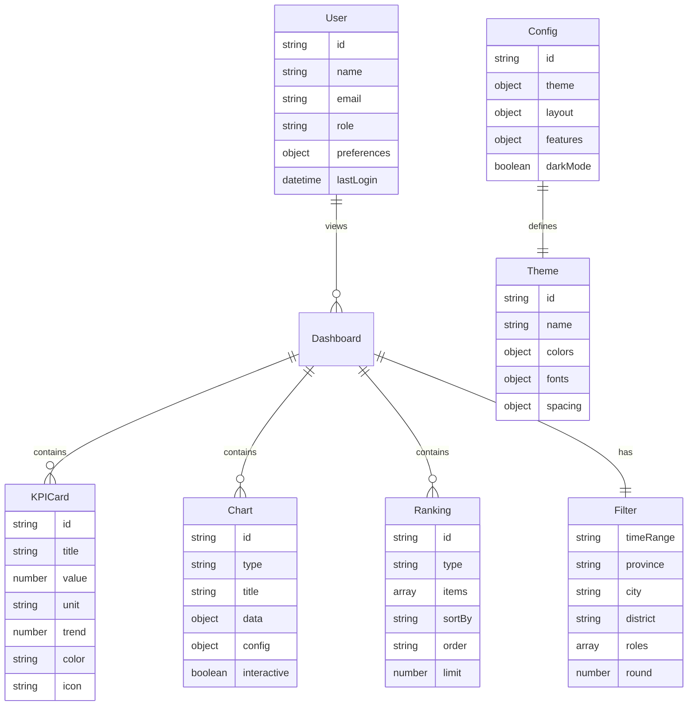
```mermaid
erDiagram
    Dashboard ||--o{ KPICard : contains
    Dashboard ||--o{ Chart : contains
    Dashboard ||--o{ Ranking : contains
    Dashboard ||--|| Filter : has
    
    KPICard {
        string id
        string title
        number value
        string unit
        number trend
        string color
        string icon
    }
    
    Chart {
        string id
        string type
        string title
        object data
        object config
        boolean interactive
    }
    
    Ranking {
        string id
        string type
        array items
        string sortBy
        string order
        number limit
    }
    
    Filter {
        string timeRange
        string province
        string city
        string district
        array roles
        number round
    }
    
    User ||--o{ Dashboard : views
    User {
        string id
        string name
        string email
        string role
        object preferences
        datetime lastLogin
    }
    
    Config ||--|| Theme : defines
    Config {
        string id
        object theme
        object layout
        object features
        boolean darkMode
    }
    
    Theme {
        string id
        string name
        object colors
        object fonts
        object spacing
    }
```

### 数据流设计
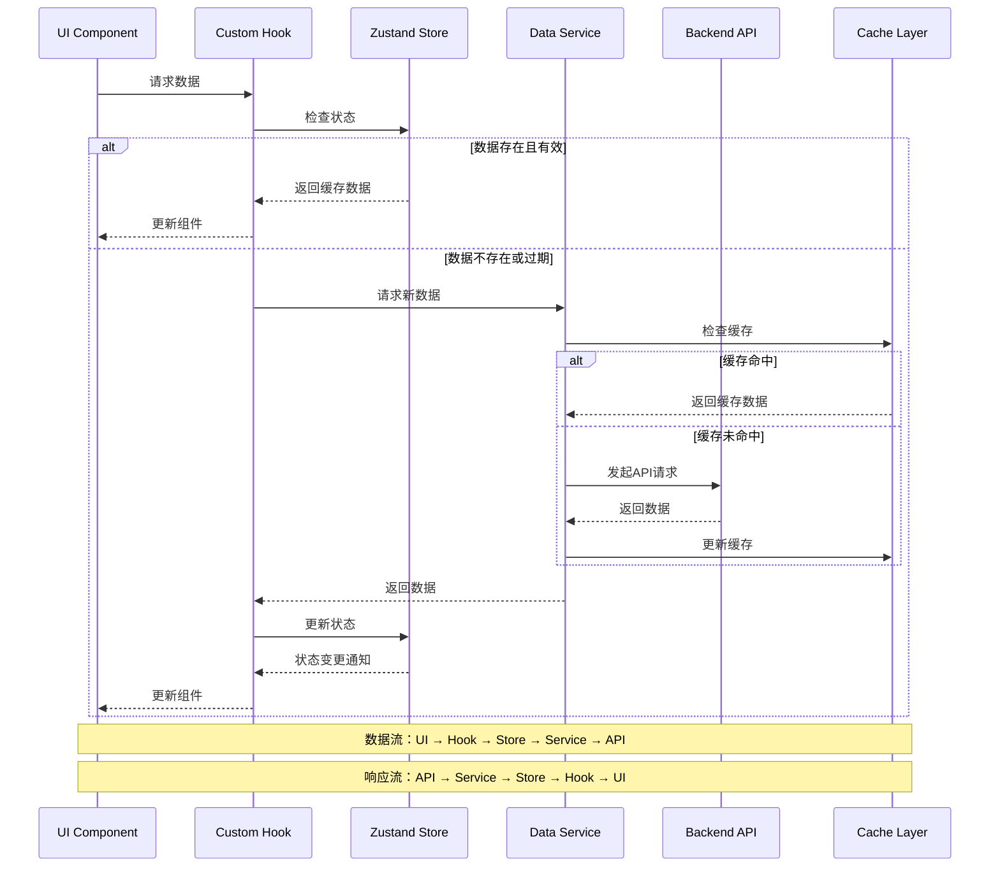
```mermaid
sequenceDiagram
    participant UI as UI Component
    participant Hook as Custom Hook
    participant Store as Zustand Store
    participant Service as Data Service
    participant API as Backend API
    participant Cache as Cache Layer
    
    UI->>Hook: 请求数据
    Hook->>Store: 检查状态
    
    alt 数据存在且有效
        Store-->>Hook: 返回缓存数据
        Hook-->>UI: 更新组件
    else 数据不存在或过期
        Hook->>Service: 请求新数据
        Service->>Cache: 检查缓存
        
        alt 缓存命中
            Cache-->>Service: 返回缓存数据
        else 缓存未命中
            Service->>API: 发起API请求
            API-->>Service: 返回数据
            Service->>Cache: 更新缓存
        end
        
        Service-->>Hook: 返回数据
        Hook->>Store: 更新状态
        Store-->>Hook: 状态变更通知
        Hook-->>UI: 更新组件
    end
    
    Note over UI,Cache: 数据流：UI → Hook → Store → Service → API
    Note over Cache,UI: 响应流：API → Service → Store → Hook → UI
```

## 安全架构详细设计

### 前端安全防护
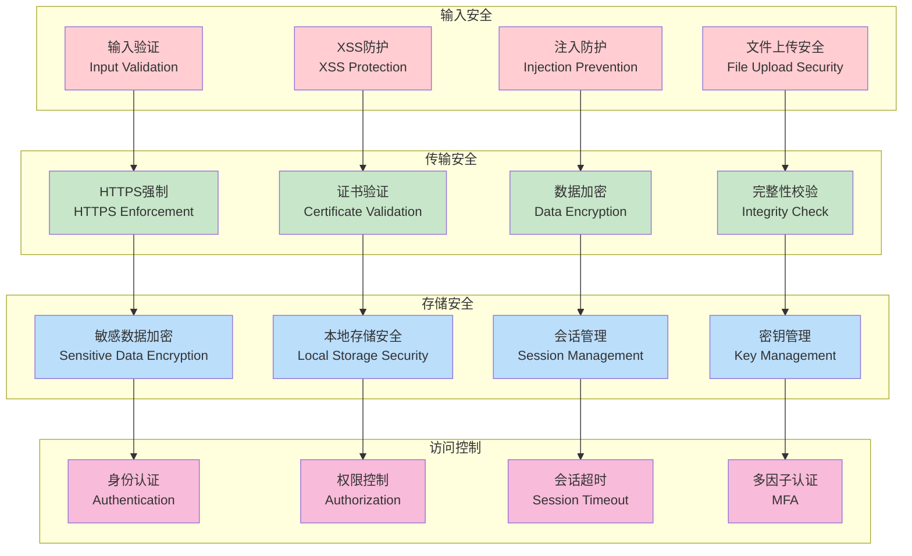
```mermaid
graph TB
    subgraph "输入安全"
        Input1[输入验证<br/>Input Validation]
        Input2[XSS防护<br/>XSS Protection]
        Input3[注入防护<br/>Injection Prevention]
        Input4[文件上传安全<br/>File Upload Security]
    end
    
    subgraph "传输安全"
        Trans1[HTTPS强制<br/>HTTPS Enforcement]
        Trans2[证书验证<br/>Certificate Validation]
        Trans3[数据加密<br/>Data Encryption]
        Trans4[完整性校验<br/>Integrity Check]
    end
    
    subgraph "存储安全"
        Store1[敏感数据加密<br/>Sensitive Data Encryption]
        Store2[本地存储安全<br/>Local Storage Security]
        Store3[会话管理<br/>Session Management]
        Store4[密钥管理<br/>Key Management]
    end
    
    subgraph "访问控制"
        Access1[身份认证<br/>Authentication]
        Access2[权限控制<br/>Authorization]
        Access3[会话超时<br/>Session Timeout]
        Access4[多因子认证<br/>MFA]
    end
    
    Input1 --> Trans1
    Input2 --> Trans2
    Input3 --> Trans3
    Input4 --> Trans4
    
    Trans1 --> Store1
    Trans2 --> Store2
    Trans3 --> Store3
    Trans4 --> Store4
    
    Store1 --> Access1
    Store2 --> Access2
    Store3 --> Access3
    Store4 --> Access4
    
    classDef input fill:#ffcdd2
    classDef transport fill:#c8e6c9
    classDef storage fill:#bbdefb
    classDef access fill:#f8bbd9
    
    class Input1,Input2,Input3,Input4 input
    class Trans1,Trans2,Trans3,Trans4 transport
    class Store1,Store2,Store3,Store4 storage
    class Access1,Access2,Access3,Access4 access
```

### 安全检查流程
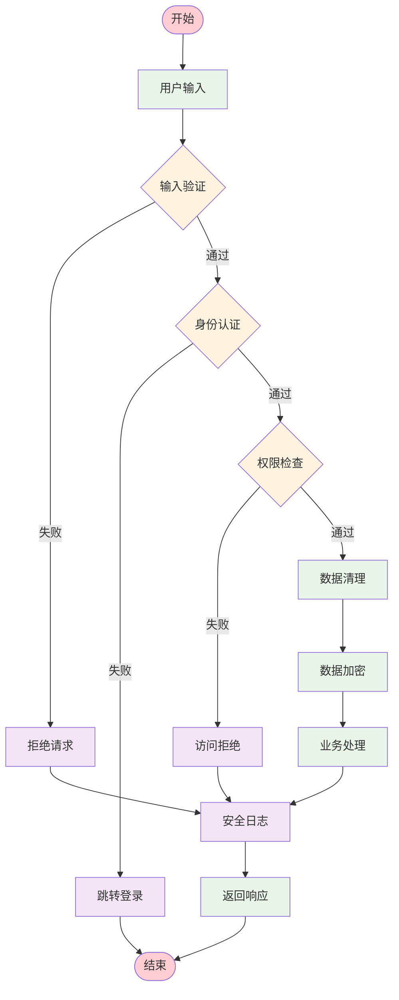
```mermaid
flowchart TD
    Start([开始]) --> Input[用户输入]
    Input --> Validate{输入验证}
    
    Validate -->|失败| Reject[拒绝请求]
    Validate -->|通过| Auth{身份认证}
    
    Auth -->|失败| Login[跳转登录]
    Auth -->|通过| Authz{权限检查}
    
    Authz -->|失败| Forbidden[访问拒绝]
    Authz -->|通过| Sanitize[数据清理]
    
    Sanitize --> Encrypt[数据加密]
    Encrypt --> Process[业务处理]
    Process --> Log[安全日志]
    Log --> Response[返回响应]
    Response --> End([结束])
    
    Reject --> Log
    Login --> End
    Forbidden --> Log
    
    classDef process fill:#e8f5e8
    classDef decision fill:#fff3e0
    classDef terminal fill:#ffcdd2
    classDef security fill:#f3e5f5
    
    class Input,Sanitize,Encrypt,Process,Response process
    class Validate,Auth,Authz decision
    class Start,End terminal
    class Reject,Login,Forbidden,Log security
```

## 可扩展性架构设计

### 水平扩展架构
```mermaid
graph TB
    subgraph "负载均衡层"
        LB[负载均衡器<br/>Load Balancer]
    end
    
    subgraph "应用服务层"
        App1[应用实例1<br/>App Instance 1]
        App2[应用实例2<br/>App Instance 2]
        App3[应用实例3<br/>App Instance 3]
        AppN[应用实例N<br/>App Instance N]
    end
    
    subgraph "缓存层"
        Cache1[Redis集群<br/>Redis Cluster]
        Cache2[CDN缓存<br/>CDN Cache]
        Cache3[浏览器缓存<br/>Browser Cache]
    end
    
    subgraph "数据层"
        DB1[主数据库<br/>Primary DB]
        DB2[从数据库1<br/>Replica DB 1]
        DB3[从数据库2<br/>Replica DB 2]
    end
    
    LB --> App1
    LB --> App2
    LB --> App3
    LB --> AppN
    
    App1 --> Cache1
    App2 --> Cache1
    App3 --> Cache2
    AppN --> Cache3
    
    App1 --> DB1
    App2 --> DB2
    App3 --> DB3
    AppN --> DB1
    
    DB1 --> DB2
    DB1 --> DB3
    
    classDef lb fill:#ffcdd2
    classDef app fill:#c8e6c9
    classDef cache fill:#bbdefb
    classDef db fill:#f8bbd9
    
    class LB lb
    class App1,App2,App3,AppN app
    class Cache1,Cache2,Cache3 cache
    class DB1,DB2,DB3 db
```

### 微前端架构
```mermaid
graph TB
    subgraph "主应用 (Shell App)"
        Shell[主应用容器<br/>Main Container]
        Router[路由管理<br/>Route Manager]
        Auth[认证模块<br/>Auth Module]
        Layout[布局组件<br/>Layout Components]
    end
    
    subgraph "微应用 (Micro Apps)"
        Dashboard[仪表板应用<br/>Dashboard App]
        Analytics[分析应用<br/>Analytics App]
        Reports[报表应用<br/>Reports App]
        Settings[设置应用<br/>Settings App]
    end
    
    subgraph "共享资源 (Shared Resources)"
        SharedUI[共享UI组件<br/>Shared UI Components]
        SharedUtils[共享工具<br/>Shared Utils]
        SharedStore[共享状态<br/>Shared Store]
        SharedAPI[共享API<br/>Shared API]
    end
    
    Shell --> Router
    Shell --> Auth
    Shell --> Layout
    
    Router --> Dashboard
    Router --> Analytics
    Router --> Reports
    Router --> Settings
    
    Dashboard --> SharedUI
    Analytics --> SharedUtils
    Reports --> SharedStore
    Settings --> SharedAPI
    
    classDef shell fill:#ffcdd2
    classDef micro fill:#c8e6c9
    classDef shared fill:#bbdefb
    
    class Shell,Router,Auth,Layout shell
    class Dashboard,Analytics,Reports,Settings micro
    class SharedUI,SharedUtils,SharedStore,SharedAPI shared
```

## 总结

### 架构设计原则
1. **模块化设计**: 清晰的模块边界和职责分离
2. **可扩展性**: 支持水平和垂直扩展
3. **高可用性**: 容错机制和故障恢复
4. **安全性**: 多层次安全防护
5. **性能优化**: 全方位性能优化策略
6. **可维护性**: 标准化的开发和运维流程

### 技术选型优势
1. **React 19**: 最新特性和性能优化
2. **TypeScript**: 类型安全和开发体验
3. **Vite**: 快速构建和开发
4. **Zustand**: 轻量级状态管理
5. **Tailwind CSS**: 高效的样式开发
6. **现代工具链**: 完整的开发生态

### 实施保障
1. **详细的架构文档**: 完整的设计说明和图表
2. **标准化流程**: 开发、测试、部署标准化
3. **质量保证**: 多层次的质量控制
4. **监控运维**: 全面的监控和运维体系
5. **团队协作**: 清晰的角色分工和协作流程

这个架构设计为React Dashboard项目提供了完整的技术蓝图，确保项目能够高质量、高效率地完成迁移，并为未来的扩展和维护奠定坚实基础。
    