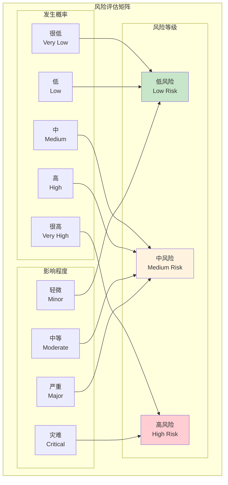
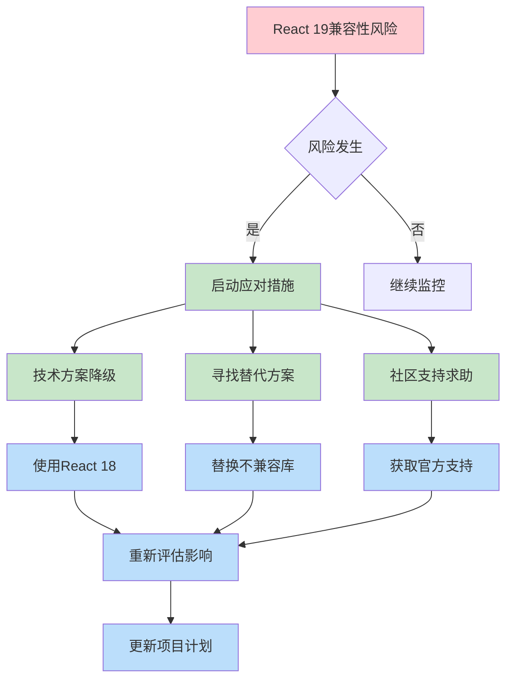
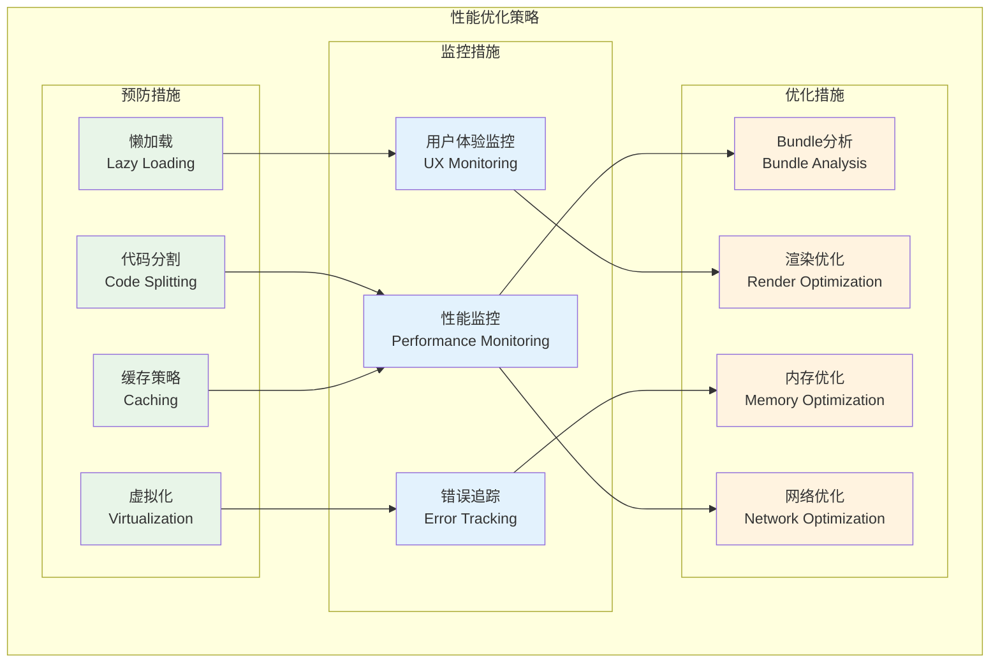
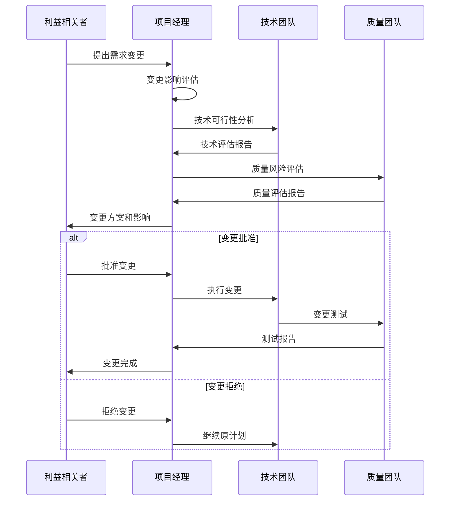
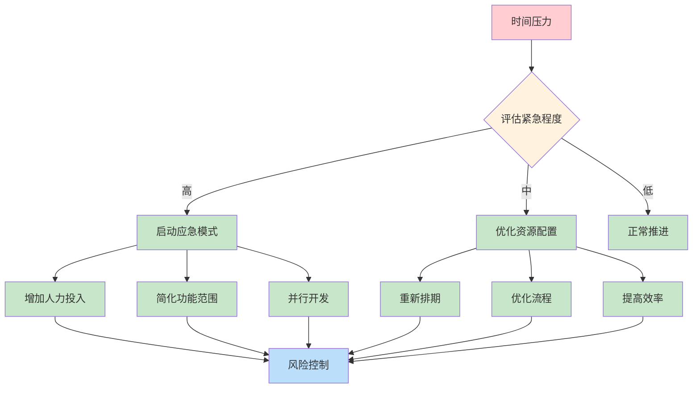
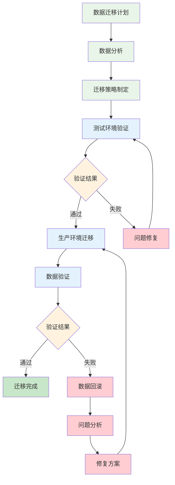
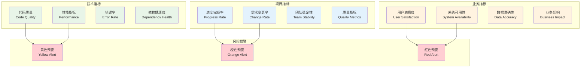
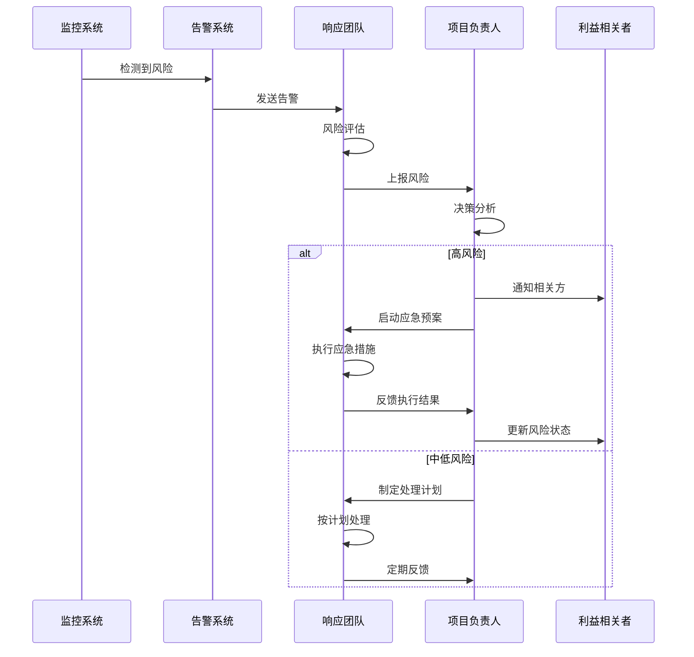

# 风险评估和应对策略制定

## 风险评估概述

### 风险评估方法
本次风险评估采用定量和定性相结合的方法，从技术、项目、业务三个维度进行全面分析。

#### 风险等级定义
- **高风险 (High)**: 概率高且影响严重，需要立即关注和处理
- **中风险 (Medium)**: 概率中等或影响中等，需要制定应对计划
- **低风险 (Low)**: 概率低且影响轻微，需要监控但不需要特殊处理

#### 风险评估矩阵

## 技术风险评估

### 1. React 19 兼容性风险

#### 风险描述
React 19 作为最新版本，可能存在以下兼容性问题：
- 第三方库兼容性问题
- 新特性稳定性问题
- 生态系统适配滞后

#### 风险等级
**中风险** - 概率：中等，影响：中等

#### 影响分析
- **开发进度**: 可能延迟2-4周
- **技术债务**: 需要额外的兼容性处理
- **团队学习**: 需要时间适应新特性

#### 应对策略

#### 预防措施
1. **技术预研**: 提前验证关键依赖的兼容性
2. **渐进升级**: 分阶段升级，降低风险
3. **备选方案**: 准备React 18的降级方案
4. **社区跟踪**: 密切关注社区反馈和更新

#### 应急预案
1. **立即降级**: 如遇严重问题，立即回退到React 18
2. **替代方案**: 寻找功能相似的替代库
3. **自定义实现**: 对于关键功能，考虑自定义实现
4. **延期发布**: 必要时调整项目时间线

### 2. 性能优化风险

#### 风险描述
大型Dashboard应用可能面临的性能问题：
- 图表渲染性能瓶颈
- 大数据量处理延迟
- 内存泄漏问题
- 首屏加载时间过长

#### 风险等级
**中风险** - 概率：中等，影响：中等

#### 影响分析
- **用户体验**: 页面响应缓慢，用户满意度下降
- **业务影响**: 可能影响数据分析效率
- **技术债务**: 需要额外的优化工作

#### 应对策略

#### 预防措施
1. **性能基准**: 建立性能基准和监控体系
2. **渐进优化**: 分阶段进行性能优化
3. **最佳实践**: 遵循React性能优化最佳实践
4. **工具支持**: 使用专业的性能分析工具

### 3. 第三方依赖风险

#### 风险描述
项目依赖的第三方库可能存在的问题：
- 库版本不兼容
- 安全漏洞
- 维护停止
- 功能缺陷

#### 风险等级
**中风险** - 概率：中等，影响：中等

#### 关键依赖分析
| 依赖库 | 风险等级 | 主要风险 | 替代方案 |
|--------|----------|----------|----------|
| ECharts | 低 | 版本兼容性 | Chart.js, D3.js |
| Framer Motion | 中 | 性能影响 | React Spring, CSS动画 |
| Radix UI | 低 | 功能限制 | Headless UI, Ariakit |
| Zustand | 低 | 生态支持 | Redux Toolkit, Jotai |
| Tailwind CSS | 低 | 构建配置 | Styled Components, CSS Modules |

#### 应对策略
1. **依赖审计**: 定期进行依赖安全审计
2. **版本锁定**: 锁定关键依赖版本，避免意外升级
3. **替代方案**: 为关键依赖准备替代方案
4. **自主可控**: 对于核心功能，考虑自主实现

## 项目风险评估

### 1. 需求变更风险

#### 风险描述
项目过程中可能出现的需求变更：
- 业务需求调整
- UI设计变更
- 功能范围扩大
- 技术要求变化

#### 风险等级
**高风险** - 概率：高，影响：严重

#### 影响分析
- **项目进度**: 可能导致项目延期1-3个月
- **资源消耗**: 增加开发成本20-50%
- **团队士气**: 频繁变更影响团队积极性
- **质量风险**: 匆忙变更可能引入缺陷

#### 应对策略

#### 预防措施
1. **需求冻结**: 在开发开始前冻结核心需求
2. **变更控制**: 建立严格的变更控制流程
3. **原型验证**: 通过原型提前验证需求
4. **分阶段交付**: 采用敏捷开发，分阶段交付

#### 应急预案
1. **优先级排序**: 对变更需求进行优先级排序
2. **影响评估**: 详细评估变更对项目的影响
3. **资源调整**: 根据变更调整项目资源和时间
4. **质量保证**: 确保变更不影响整体质量

### 2. 人员流动风险

#### 风险描述
项目团队可能面临的人员变动：
- 核心开发人员离职
- 技术专家调岗
- 新人加入适应期
- 团队协作问题

#### 风险等级
**中风险** - 概率：中等，影响：中等

#### 影响分析
- **知识流失**: 核心技术知识可能流失
- **进度延迟**: 人员变动导致进度延迟
- **质量下降**: 新人经验不足影响质量
- **团队稳定**: 影响团队整体稳定性

#### 应对策略
1. **知识管理**: 建立完善的知识文档体系
2. **技能备份**: 确保关键技能有多人掌握
3. **快速上手**: 建立新人快速上手机制
4. **团队建设**: 加强团队凝聚力建设

### 3. 时间压力风险

#### 风险描述
项目可能面临的时间压力：
- 上线时间紧迫
- 里程碑节点固定
- 并行任务冲突
- 测试时间不足

#### 风险等级
**中风险** - 概率：中等，影响：中等

#### 应对策略

## 业务风险评估

### 1. 用户接受度风险

#### 风险描述
新系统可能面临的用户接受度问题：
- 界面变化适应困难
- 功能操作习惯改变
- 性能体验不如预期
- 培训成本高

#### 风险等级
**中风险** - 概率：中等，影响：中等

#### 影响分析
- **用户满意度**: 用户满意度可能下降
- **使用效率**: 短期内使用效率可能降低
- **培训成本**: 需要额外的用户培训
- **推广阻力**: 可能遇到推广阻力

#### 应对策略
1. **用户参与**: 让用户参与设计和测试过程
2. **渐进迁移**: 采用渐进式迁移策略
3. **培训支持**: 提供充分的培训和支持
4. **反馈机制**: 建立用户反馈收集机制

### 2. 数据迁移风险

#### 风险描述
从旧系统迁移到新系统可能面临的数据问题：
- 数据格式不兼容
- 数据完整性问题
- 历史数据丢失
- 迁移过程中断

#### 风险等级
**高风险** - 概率：中等，影响：严重

#### 应对策略

### 3. 业务连续性风险

#### 风险描述
系统迁移过程中可能影响业务连续性：
- 服务中断时间过长
- 功能不可用
- 数据不一致
- 回滚困难

#### 风险等级
**高风险** - 概率：低，影响：严重

#### 应对策略
1. **灰度发布**: 采用灰度发布策略
2. **快速回滚**: 准备快速回滚机制
3. **监控告警**: 建立实时监控和告警
4. **应急预案**: 制定详细的应急预案

## 综合风险管控

### 风险监控体系

#### 风险监控指标

#### 风险报告机制
1. **日报**: 每日风险状态更新
2. **周报**: 每周风险趋势分析
3. **月报**: 每月风险评估报告
4. **专项报告**: 重大风险专项报告

### 应急响应机制

#### 应急响应流程

#### 应急响应团队
- **技术负责人**: 技术风险处理
- **项目经理**: 项目风险协调
- **业务代表**: 业务风险评估
- **质量工程师**: 质量风险控制

### 风险沟通机制

#### 沟通策略
1. **透明沟通**: 及时、准确地沟通风险信息
2. **分层沟通**: 根据受众不同调整沟通内容
3. **定期沟通**: 建立定期的风险沟通机制
4. **双向沟通**: 鼓励团队成员主动报告风险

#### 沟通渠道
- **项目会议**: 在项目会议中讨论风险
- **风险报告**: 定期发布风险评估报告
- **即时通讯**: 使用即时通讯工具快速沟通
- **邮件通知**: 重要风险通过邮件正式通知

## 风险应对总结

### 风险管理原则
1. **预防为主**: 重点关注风险预防
2. **早期识别**: 尽早识别和评估风险
3. **持续监控**: 持续监控风险状态变化
4. **快速响应**: 建立快速响应机制
5. **经验积累**: 积累风险管理经验

### 成功关键因素
1. **团队意识**: 全团队的风险意识
2. **工具支持**: 完善的风险管理工具
3. **流程规范**: 标准化的风险管理流程
4. **资源保障**: 充足的应急资源
5. **持续改进**: 不断优化风险管理体系

### 预期效果
通过实施这套风险管理体系，预期能够：
- 降低项目失败风险50%以上
- 减少因风险导致的延期30%以上
- 提高团队风险应对能力
- 确保项目质量和进度目标达成

这个全面的风险评估和应对策略为React Dashboard迁移项目提供了完整的风险管控框架，确保项目能够在可控的风险范围内顺利完成。